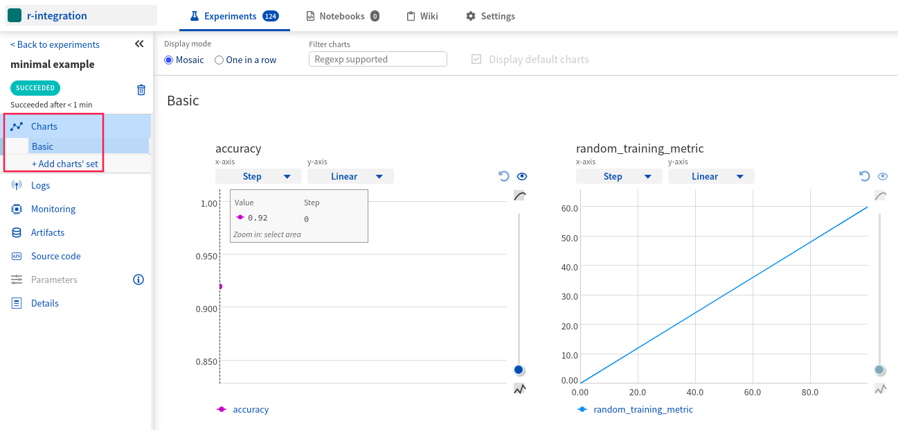
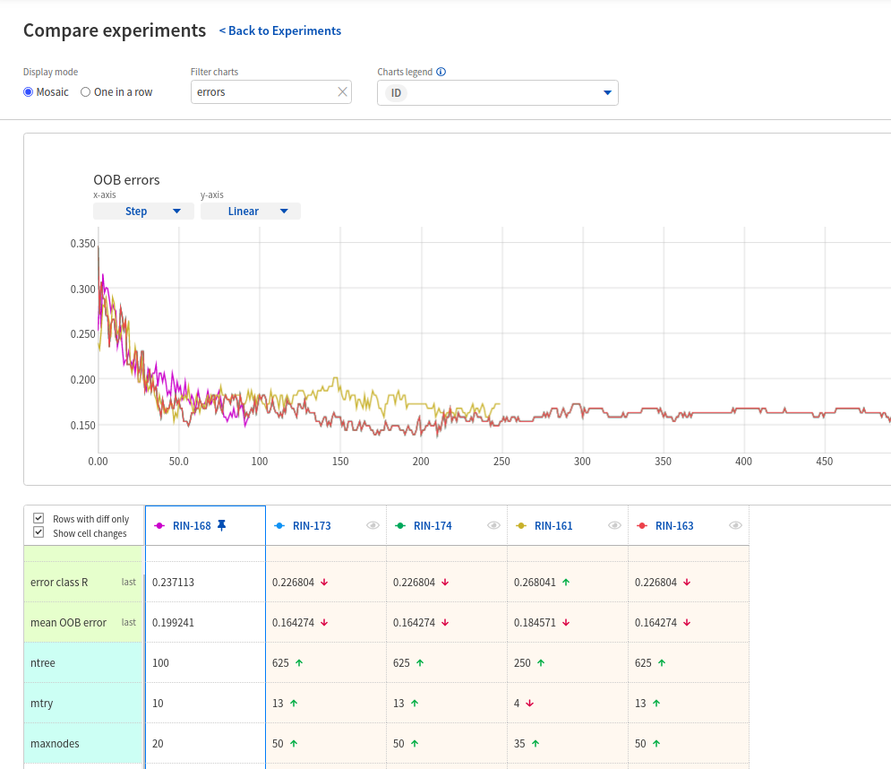
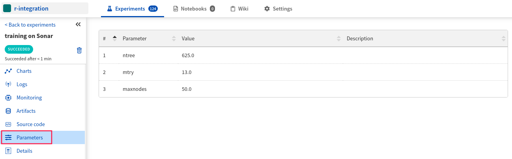
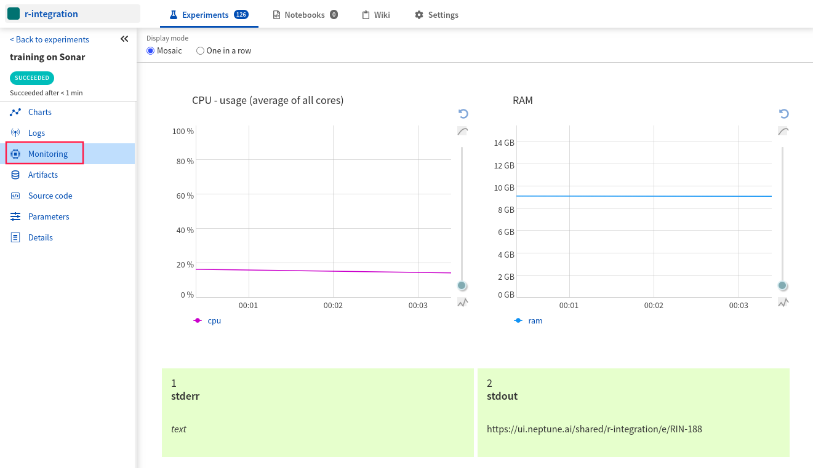
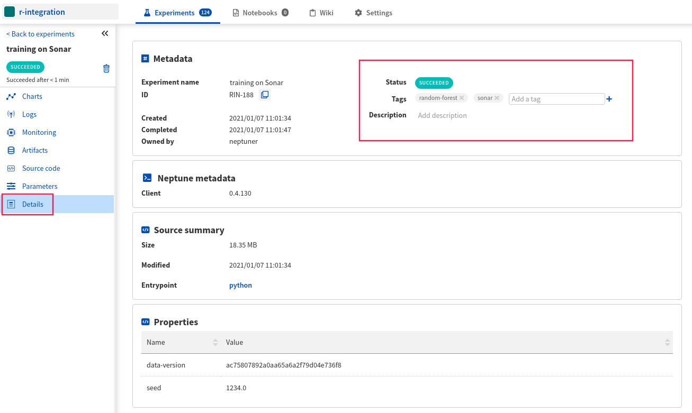
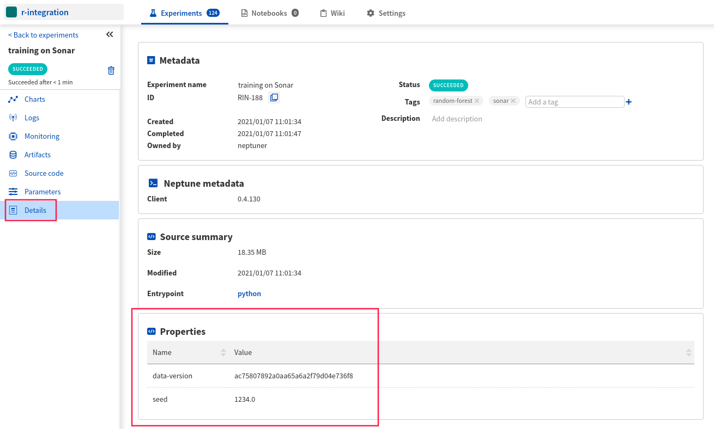
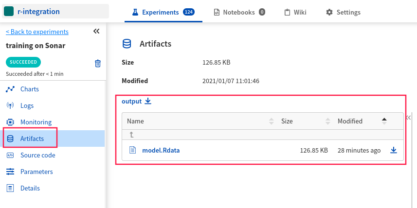
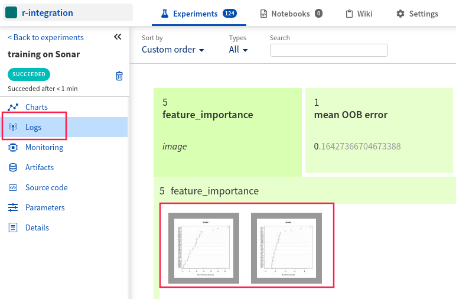

.. _integrations-r:

Neptune client for R
====================

|colab-script-neptune|

What will you get with Neptune client for R?
--------------------------------------------

|r-tour-loom|

You can interact with Neptune from R and enjoy almost the same functionality that is available in Python.
The Neptune client for R is available as a |CRAN package| and a |Github project|.

With Neptune client for R you can:

- save model hyperparameters for every experiment you run
- see learning curves for losses and metrics during training
- see hardware consumption and stdout/stderr output during training
- log data versions and other properties
- log model weights and other artifacts
- log performance charts
- tage experiments to organize them

.. note::

    This integration is tested with ``R version 3.6.3``, ``neptune_0.1.0``, and ``Python 3.6.12``.

    Remember that even if you are using R you still need to have Python installed on your system.

Where to start?
---------------
To get started with using Neptune client for R, follow the :ref:`quickstart <r-quickstart>` below.

You can also skip the basics and take a look at how to log model weights and performance charts in the :ref:`more options <r-more-options>` section.

If you want to try things out right away you can either:

|colab-script-neptune|

.. _r-quickstart:

Quickstart
----------
This quickstart will show you how to:

* Install the necessary Neptune package from CRAN
* Connect Neptune to your training code and create the first experiment
* Log metrics and hardware consumption to Neptune
* Explore learning curves in the Neptune UI

.. _r-before-you-start:

Before you start
^^^^^^^^^^^^^^^^
To log experiments to Neptune from R you need to satisfy the following prerequisites:

* Have ``Python 3.x`` installed. The easiest way to |install Python environment is with Conda|.

.. tip::

    If you are using R studio you can just follow along and you will be prompted by the console to install miniconda.

Step 1: Install Neptune package
^^^^^^^^^^^^^^^^^^^^^^^^^^^^^^^
Install ``neptune`` package for R from CRAN by running the following code in your R console or script.

.. code-block:: R

    install.packages('neptune', dependencies = TRUE)

.. note::

    See :ref:`neptune client for R installation guide <installation-neptune-r>`.

Step 2: Import neptune package and initialize Neptune
^^^^^^^^^^^^^^^^^^^^^^^^^^^^^^^^^^^^^^^^^^^^^^^^^^^^^
Add the following snippet at the top of your script.

.. code-block:: R

    library(neptune)

    init_neptune(project_name = 'shared/r-integration', api_token = 'ANONYMOUS')

.. tip::

    You can also use your personal API token. Read more about how to :ref:`find your Neptune API token <how-to-setup-api-token>`.

.. note::

    This will use your default Python. If you are hitting ``Error: could not find a Python environment`` error or you want to use some other Python version you have on your system :ref:`jump to this section and read how<r-non-default-python>`.

Step 3: Create an experiment
^^^^^^^^^^^^^^^^^^^^^^^^^^^^
Run the code below to create a Neptune experiment:

.. code-block:: R

    create_experiment(name='minimal example')

This also creates a link to the experiment. Open the link in a new tab.
The charts will currently be empty, but keep the window open. You will be able to see live metrics once logging starts.

Step 4: Log metrics
^^^^^^^^^^^^^^^^^^^
Log your performance metrics during or after training with the ``log_metric`` function.

.. code-block:: R

    log_metric('accuracy', 0.92)

    for (i in 0:100){
      log_metric('random_training_metric', i * 0.6)
    }

|example-charts|

Step 5: Stop experiment
^^^^^^^^^^^^^^^^^^^^^^^
When you are finished logging you should stop your current Neptune experiment.

.. code-block:: R

    stop_experiment()

Step 6: Run your training script
^^^^^^^^^^^^^^^^^^^^^^^^^^^^^^^^
Run your script as you normally would. Neptune works with Rstudio, R notebooks or R scripts.

For example:

.. code-block:: bash

    Rscript train.R

Step 7: Go to Neptune see your training live and compare experiment runs
^^^^^^^^^^^^^^^^^^^^^^^^^^^^^^^^^^^^^^^^^^^^^^^^^^^^^^^^^^^^^^^^^^^^^^^^

|example-compare|

.. _r-more-options:

More Options
------------

In this section you will see how to:

- :ref:`Log hyperparameters <r-more-options-log-hyperparameters>`
- :ref:`Log hardware consumption and console outputs <r-more-options-log-hardware>`
- :ref:`Tag your experiment <r-more-options-tag-experiment>`
- :ref:`Log data versions and other properties <r-more-options-log-data-versions>`
- :ref:`Log model weights and other files <r-more-options-log-artifacts>`
- :ref:`Log performance charts and images <r-more-options-log-images>`
- :ref:`Use a non default Python path <r-non-default-python>`

.. _r-more-options-log-hyperparameters:

Log hyperparameters
^^^^^^^^^^^^^^^^^^^
You can log training and model hyperparameters.
To do that just pass the parameter list to the ``params`` argument of the ``create_experiment`` function:

.. code-block:: R

    params = list(ntree=625,
                  mtry=13,
                  maxnodes=50
                  )

    create_experiment(name='training on Sonar',
                      params = params
    )

|example-hyperparameters|

.. _r-more-options-log-hardware:

Log hardware consumption and console outputs
^^^^^^^^^^^^^^^^^^^^^^^^^^^^^^^^^^^^^^^^^^^^
Neptune logs your hardware consumption and console outputs automatically if the python package ``psutil`` is installed on your system.

.. note::

    ``psutil`` should be installed automatically when you install the ``neptune`` package but you can always do it manually with:

    .. code-block:: R

        reticulate::py_install(packages = 'psutil')

Go to the ``Monitoring`` in your Neptune experiment to see it.

|example-hardware|

.. _r-more-options-tag-experiment:

Tag your experiment
^^^^^^^^^^^^^^^^^^^
You can add tags to your experiments to organize them.

To do that just pass an array of tags to the ``tags`` argument of the ``create_experiment`` function:

.. code-block:: R

    create_experiment(name='training on Sonar',
                      tags = c('random-forest','sonar')
    )

or use the ``append_tag`` function:

.. code-block:: R

    append_tag(c('random-forest','sonar'))

|example-details|

.. _r-more-options-log-data-versions:

Log data versions and other properties
^^^^^^^^^^^^^^^^^^^^^^^^^^^^^^^^^^^^^^
Keeping track of your data is an important part of the job. With Neptune, you can log a fingerprint (hash) of your data for every experiment.

Add a property to your experiment:

.. code:: R

    library(digest)
    set_property(property = 'data-version', value = digest(dataset))

    SEED=1234
    set.seed(SEED)
    set_property(property = 'seed', value = SEED)

|example-details|

.. _r-more-options-log-artifacts:

Log model weights and other files
^^^^^^^^^^^^^^^^^^^^^^^^^^^^^^^^^
You can also save your model files, PDF report files or other objects in Neptune.

All you need to do is pass the filepath to the ``log_artifact()`` method and it will be logged to your experiment.

.. code:: R

    save(model, file="model.Rdata")
    log_artifact('model.Rdata')

|example-model-files|

.. _r-more-options-log-images:

Log images and charts
^^^^^^^^^^^^^^^^^^^^^
Logging images and charts to Neptune is very simple, as well.

Just use the ``log_image()`` method that takes the name of the logging channel and a path to image as arguments. You can log more than one chart to the same channel to organize things - just send another image to the same channel.

.. code:: R

    for (t in c(1,2)){
      jpeg('importance_plot.jpeg')
      varImpPlot(model,type=t)
      dev.off()
      log_image('feature_importance', 'importance_plot.jpeg')
    }

|example-images|

.. _r-non-default-python:

Use a non default Python path
^^^^^^^^^^^^^^^^^^^^^^^^^^^^^

If you don't want to use default Python you can customize it with ``python`` and ``python_path`` arguments.

* Python

.. code:: R

    init_neptune(project_name = 'shared/r-integration',
                 api_token = 'ANONYMOUS'
                 python='python',
                 python_path='/usr/bin/python3')

* venv

    .. code:: R

        init_neptune(project_name = 'shared/r-integration',
                     api_token = 'ANONYMOUS'
                     python='venv',
                     python_path='my_venv')

* conda

    .. code:: R

        init_neptune(project_name = 'shared/r-integration',
                     api_token = 'ANONYMOUS'
                     python='conda',
                     python_path='my_conda_env')

* miniconda

    .. code:: R

        init_neptune(project_name = 'shared/r-integration',
                     api_token = 'ANONYMOUS'
                     python='miniconda',
                     python_path='my_miniconda_env')

Remember that you can try it out with zero setup:

|colab-script-neptune|

How to ask for help?
--------------------
Please visit the :ref:`Getting help <getting-help>` page. Everything regarding support is there.

Other pages you may like
------------------------
You may also find the following pages useful:

- :ref:`Comparing experiments in the UI <guides-compare-experiments-ui>`
- :ref:`Organizing experiments in the experiment table <guides-experiment-dashboard>`
- :ref:`Organizing charts of a single experiment <organizing-experiments-charts>`
- :ref:`Sharing results with your team <guides-share-results-with-team>`

.. External links

.. |example-project| raw:: html

    

        <a target="_blank"  href="https://ui.neptune.ai/o/shared/org/pytorch-integration/experiments?viewId=5bf0532a-c0f3-454e-be97-fa24899a82fe">
            
            See example in Neptune
        </a>
    

.. |example-compare| raw:: html

    

        <a target="_blank"  href="https://ui.neptune.ai/shared/r-integration/compare?shortId=%5B%22RIN-168%22%2C%22RIN-173%22%2C%22RIN-174%22%2C%22RIN-161%22%2C%22RIN-163%22%5D&viewId=fa3b57a5-77fb-4edb-83fc-505014d3649d&chartFilter=errors">
            
            See example in Neptune
        </a>
    

.. |example-charts| raw:: html

    

        <a target="_blank"  href="https://ui.neptune.ai/shared/r-integration/e/RIN-187/charts">
            
            See example in Neptune
        </a>
    

.. |example-hardware| raw:: html

    

        <a target="_blank"  href="https://ui.neptune.ai/shared/r-integration/e/RIN-188/monitoring">
            
            See example in Neptune
        </a>
    

.. |example-hyperparameters| raw:: html

    

        <a target="_blank"  href="https://ui.neptune.ai/shared/r-integration/e/RIN-188/parameters">
            
            See example in Neptune
        </a>
    

.. |example-details| raw:: html

    

        <a target="_blank"  href="https://ui.neptune.ai/shared/r-integration/e/RIN-188/details">
            
            See example in Neptune
        </a>
    

.. |example-images| raw:: html

    

        <a target="_blank"  href="https://ui.neptune.ai/shared/r-integration/e/RIN-188/logs">
            
            See example in Neptune
        </a>
    

.. |example-model-files| raw:: html

    

        <a target="_blank"  href="https://ui.neptune.ai/shared/r-integration/e/RIN-188/artifacts">
            
            See example in Neptune
        </a>
    

.. |colab-script-neptune| raw:: html

    

        <a target="_blank" href="https://github.com/neptune-ai/neptune-examples/blob/master/integrations/r/Neptune-R.r">
            
            View source on GitHub
        </a>
        <a target="_blank" href="https://ui.neptune.ai/shared/r-integration/experiments?viewId=fa3b57a5-77fb-4edb-83fc-505014d3649d">
            
            See example in Neptune
        </a>
    

.. |install Python environment is with Conda| raw:: html

    <a href="https://docs.conda.io/projects/conda/en/latest/user-guide/install/" target="_blank">install Python environment is with Conda</a>

.. |CRAN package| raw:: html

    <a href="https://cran.r-project.org/web/packages/neptune/index.html" target="_blank">CRAN package</a>

.. |Github project| raw:: html

    <a href="https://github.com/neptune-ai/neptune-r" target="_blank">Github project</a>

.. |r-tour-loom| raw:: html

    
<iframe src="https://www.loom.com/embed/b3b2a519f4b2443faa86745a83d8fadd" frameborder="0" webkitallowfullscreen mozallowfullscreen allowfullscreen style="position: absolute; top: 0; left: 0; width: 100%; height: 100%;"></iframe>

