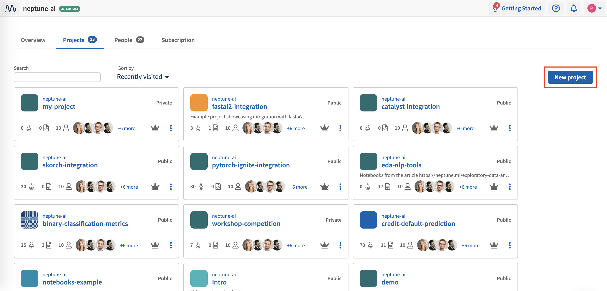

How to connect Neptune to your Python codebase step by step
===========================================================

Adding Neptune is a simple process that takes only a few steps.
We'll go through those step by step.

Introduction
------------

Before you start
----------------

Step 1: Create a project in Neptune
-----------------------------------

Neptune lets you create a project.

1. Click **Project** at the top-left of the window.

2. In the pane that appears, click **New project**.

3. Set a name, color, description and :ref:`project type <core-concepts_project-types>` (Public or Private).

.. image:: ../../_static/images/how-to/team-management/create-project-2.png
   :target: ../../_static/images/how-to/team-management/create-project-2.png
   :alt: Create new project

4. Click **Apply**.

The new project is created.

Step 2: Find and setup Neptune API token
----------------------------------------

1. Copy API token

``NEPTUNE_API_TOKEN`` is located under your user menu (top right side of the screen):

2. Set to environment variable

Assign it to the bash environment variable:

Linux/IOS:

.. code:: bash

    export NEPTUNE_API_TOKEN='YOUR_LONG_API_TOKEN'

or append this line to your ``~/.bashrc`` or ``~/.bash_profile`` files **(recommended)**.

Windows:

.. code-block:: bat

    set NEPTUNE_API_TOKEN="YOUR_LONG_API_TOKEN"

.. warning::

    Always keep your API token secret - it is like a password to the application.
    Appending the "export NEPTUNE_API_TOKEN='YOUR_LONG_API_TOKEN'" line to your ``~/.bashrc`` or ``~/.bash_profile``
    file is the recommended method to ensure it remains secret.

Step 3: Not using Python?
-------------------------

   R <../../integrations/r-support.rst>
   Any other language <../../integrations/any-language-support.rst>

Step 4: See if Neptune integrates with your current experiment tracking tool
----------------------------------------------------------------------------

   MLflow <../../integrations/mlflow.rst>
   TensorBoard <../../integrations/tensorboard.rst>
   Sacred <../../integrations/sacred.rst>

Step 5: See if Neptune integrates with your ML framework
--------------------------------------------------------

   Deep learning frameworks <../../integrations/deep_learning_frameworks.rst>
   Machine learning frameworks <../../integrations/machine_learning_frameworks.rst>
   Hyperparmeter optimization frameworks <../../integrations/hyperparams_opt_frameworks.rst>

Step 6: Add Neptune logging explicitly
--------------------------------------

1. Connect Neptune to your script

2. Create experiment

3. Add logging of parameters

4. Add logging of training metrics

5. Add logging of test metrics

6. Add logging of performance charts

7. Add logging of model binary

Run your script and see your experiment in Neptune UI
-----------------------------------------------------

