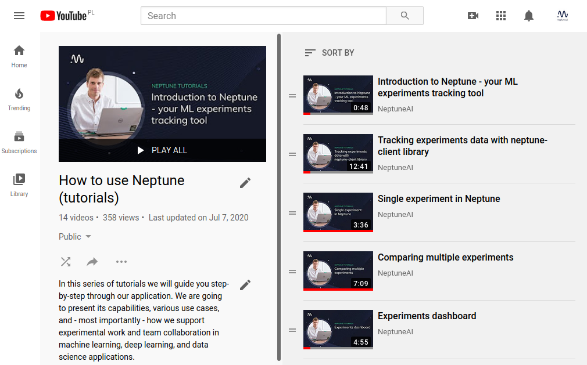
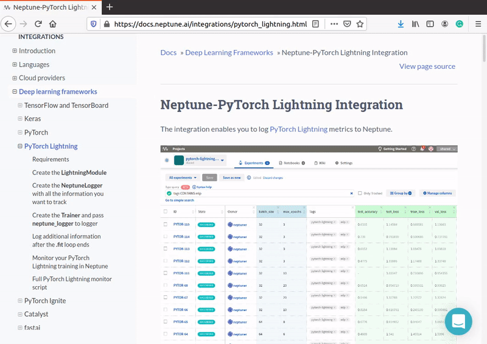

Getting help
============

If you got stuck or simply want to talk to us about something here are your options (in the preferred order :))

FAQ
---

Perhaps the answer to your question is already there!

Check out the |Frequently Asked Questions|.

Youtube channel
---------------

We have a lot of video tutorials on our Youtube channel.

See how to get your problem solved in the |Video Tutorials|.

Chat
----

You can always talk to us!

Click on the blue message icon in the bottom-right corner and send a message.
A real person will talk to you ASAP (typically very ASAP).

Preferred topics:

- "Can't find it anywhere: can I do XYZ?"
- bugs and feature ideas (that you don't want to discuss too much)
- feedback about the tool
- questions about the product

Community
---------

We have a Discourse community forum where you can find:

- quick fixes to bugs
- discussions around new features

Preferred topics:

- bugs and feature ideas (that you would like discuss too much)

Go to |Neptune community forum|.

GitHub
------

You can submit bug reports, feature requests or PRs with improvements directly to our repositories:

- |neptune-client|: Neptune client for Python
- |neptune-contrib|: A library with community extensions
- |neptune-notebooks|: Neptune JupyterLab extension for versioning notebooks
- |neptune-tensorboard|: Neptune integration with TensorBoard
- |neptune-mlflow|: Neptune integration with MLflow
- |neptune-r|: Neptune client for R

Email
-----

You can just shoot us an email at contact@neptune.ai

.. |Video Tutorials| raw:: html

    <a href="https://www.youtube.com/playlist?list=PLKePQLVx9tOd8TEGdG4PAKz0Owqdv1aaw" target="_blank">Video Tutorials</a>

.. |Frequently Asked Questions| raw:: html

    <a href="/faq/index.html">Frequently Asked Questions</a>

.. |Neptune Blog|  raw:: html

    <a href="https://neptune.ai/blog/category/machine-learning-model-management" target="_blank">Neptune blog</a>

.. |Neptune community forum| raw:: html

    <a href="https://community.neptune.ai/" target="_blank">Neptune community forum</a>

.. |neptune-client| raw:: html

    <a href="https://github.com/neptune-ai/neptune-client" target="_blank">neptune-client</a>

.. |neptune-contrib|  raw:: html

    <a href="https://neptune-contrib.readthedocs.io/index.html" target="_blank">neptune-contrib</a>

.. |neptune-r|  raw:: html

    <a href="https://github.com/neptune-ai/neptune-r" target="_blank">neptune-r</a>

.. |neptune-tensorboard|  raw:: html

    <a href="https://github.com/neptune-ai/neptune-tensorboard" target="_blank">neptune-tensorboard</a>

.. |neptune-mlflow|  raw:: html

    <a href="https://github.com/neptune-ai/neptune-mlflow" target="_blank">neptune-mlflow</a>

.. |neptune-notebooks|  raw:: html

    <a href="https://github.com/neptune-ai/neptune-notebooks" target="_blank">neptune-notebooks</a>