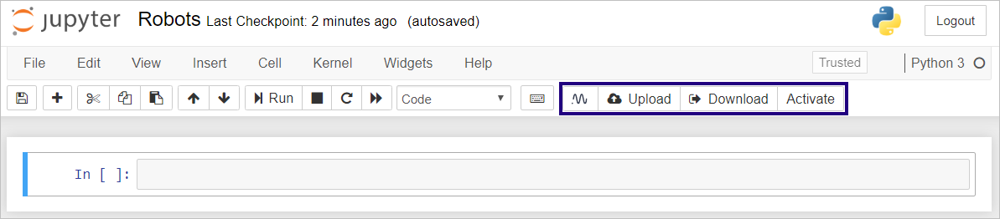

Install neptune-notebooks: Jupyter extension (3 min)
====================================================

This page provides instructions for installing neptune-notebooks -- the Neptune Jupyter extension.

The extension enables the integration of Neptune and Jupyter or JupyterLab.

When the extension is successfully installed,
you will be able to upload notebooks to Neptune, check out previously uploaded Notebooks,
and track experiments and metrics directly from the Jupyter UI.

Neptune versions the Notebook automatically once an experiment has started.

About neptune-notebooks
-----------------------

neptune-notebooks is a Python package hosted on pip. It includes:

- A very basic CLI (command line interface) for uploading notebooks.
- Standard Jupyter extension. The extension is written in Javascript and is visible in the web-based Jupyter UI. It is not hosted anywhere separately, only as part of the python package.
- JupyterLab extension. The extension is written in Javascript and is visible in the web-based Jupyter UI. It is hosted |on the npm|.

Installation for Jupyter
------------------------

.. tip:: When installing Python packages, it is best practice to work in a `virtual environment <https://virtualenv.pypa.io/en/latest/>`_.

Procedure

1. Install neptune-notebooks extension:

.. code-block:: bash

   pip install neptune-notebooks

2. Enable the extension for Jupyter:

.. code-block:: bash

   jupyter nbextension enable --py neptune-notebooks

3. Install Neptune client, if you did not do so already:

.. code-block:: bash

   pip install neptune-client

Installation for JupyterLab
---------------------------

JupyterLab is the next-generation web-based UI for Project Jupyter.

When you install JupyterLab using ``pip install jupyterlab``, the standard Jupyter is also installed, as a dependency.

**Installation methods**

You can install the extension using any of the following three methods:

- Through the command line (full neptune-notebooks package)
- Through the command line (JupyterLab extension only)
- Using the Extension Manager (JupyterLab extension only)

Details for these methods follow below.

**Requirements**

Irrespective of which method you use, the following must be preinstalled on your system before you begin.

- |Node.js|
- |npm|
- |JupyterLab|

Method 1: Install the full neptune-notebooks package through the command line
^^^^^^^^^^^^^^^^^^^^^^^^^^^^^^^^^^^^^^^^^^^^^^^^^^^^^^^^^^^^^^^^^^^^^^^^^^^^^

**Pros**

This is the most comprehensive type of installation:

- It includes extensions for both standard Jupyter and JupyterLab.
- It also installs a CLI for uploading Notebook files.
- The the neptune-client package is a dependency.

**Cons**

- After the installation, you still have to perform some manual actions in JupyterLab.
- This method may not be the easiest way of installing extensions in JupyterLab.

**Procedure**

1. In the console, run:

.. code-block:: bash

    pip install neptune-notebooks

2. Start JupyterLab by running:

.. code-block:: bash

    jupyter lab

3. In the "Build Recommended" notification that is displayed, click **Build**.

.. note:: The build process takes up to several minutes.

4. In the "Build Complete" notification that is displayed, click **Reload**.

The extension is loaded.

Method 2: Install the JupyterLab extension only through the command line
^^^^^^^^^^^^^^^^^^^^^^^^^^^^^^^^^^^^^^^^^^^^^^^^^^^^^^^^^^^^^^^^^^^^^^^^

This method installs only the extension to JupyterLab.

**Cons**

The neptune-notebooks pip package, neptune-client pip package and extension to the standard Jupyter are not installed.

**Pros**

This method gives you more flexibility. For example, the extension can be running on a
different machine than your code that is executed from the Notebook.

**Procedure**

1. In the console, run:

.. code-block:: bash

    jupyter labextension install neptune-notebooks

2. Start JupyterLab by running:

.. code-block:: bash

    jupyter lab

3. In the "Build Recommended" notification that is displayed, click **Build**.
4. In the "Build Complete" notification that is displayed, click **Reload**.

Method 3: Install the JupyterLab extension only, using the JupyterLab Extension Manager
^^^^^^^^^^^^^^^^^^^^^^^^^^^^^^^^^^^^^^^^^^^^^^^^^^^^^^^^^^^^^^^^^^^^^^^^^^^^^^^^^^^^^^^

**Procedure**

1. In JupyterLab, enable Extension Manager, by clicking **Settings** > **Enable Extension Manager (experimental)**.

2. Find neptune-notebooks and click **Install**.

.. image:: ../../_static/images/getting-started/installation/ext-manager-2.png
   :target: ../../_static/images/getting-started/installation/ext-manager-2.png
   :alt: go to extension manager and search for neptune-notebooks

Checking if the Installation was Successful
-------------------------------------------

Provided you have configured Jupyter correctly, the following Neptune buttons appear in Jupyter notebooks:

- **Neptune**: For modifying configuration.
- **Upload**: For creating a new checkpoint in Neptune.
- **Download**: For downloading a specific checkpoint from Neptune.
- **Activate**: Associates experiments you will be running with this Notebook.

Connecting the Jupyter Extension to Your Neptune Account
--------------------------------------------------------

After you have successfully installed the Jupyter extension for Neptune, you connect it to your Neptune account.

**Procedure**

1. In Jupyter, click **Connect to Neptune**.

The **Configure your connection to Neptune** dialog appears.

2. Leave the dialog open and switch to the Neptune UI.

3. In the Neptune UI, obtain your API Token and copy it to the clipboard.

   a. In the upper right corner, click the avatar, and then click **Get API Token**.

    .. image:: ../../_static/images/getting-started/installation/get_api_token.png
        :target: ../../_static/images/getting-started/installation/get_api_token.png
        :alt: image

   b. In the dialog that appears, click the **Copy to clipboard** button on the right. Then click **Close**.

4. Switch back to Jupyter. In the dialog you left open, paste the token you copied to the clipboard. Click **Connect**.

   A confirmation message is displayed. It contains a link through which you can go directly to this Notebook in Neptune.

.. warning:: Your *API Token* is private and unique. Never share it. It's like sharing password.

5. To conclude, to see experiments that you will run associated with this Notebook, click **Activate**.
In the dialog that appears, click **Activate**.

.. External links

.. |on the npm|  raw:: html

    <a href="https://www.npmjs.com/package/neptune-notebooks" target="_blank">on the npm</a>

.. |Node.js|  raw:: html

    <a href="https://nodejs.org/en" target="_blank">Node.js</a>

.. |npm|  raw:: html

    <a href="https://www.npmjs.com/get-npm" target="_blank">npm</a>

.. |JupyterLab|  raw:: html

    <a href="https://jupyterlab.readthedocs.io/en/stable/getting_started/installation.html" target="_blank">JupyterLab</a>
