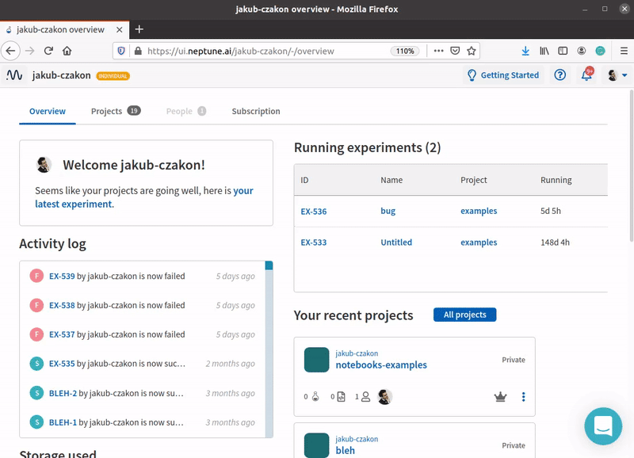

Use Neptune Jupyter extension to log your first notebook checkpoint
===================================================================

Introduction
------------

This guide will show you how to:

* Install neptune-notebook extension for Jupyter Notebook or JupyterLab
* Connect Neptune to your Jupyter environment
* Log your first notebook checkpoint to Neptune and see it in the UI

By the end of it, you will see your first notebook checkpoint in Neptune!

Before you start
----------------

Make sure you meet the following prerequisites before starting:

* Have Python 3.x installed
* Have Jupyter Notebook or JupyterLab installed
* Have node.js installed if you are using JupyterLab

    .. note::

        If you are using conda you can install node with:

        .. code:: bash

            conda install -c conda-forge nodejs

Step 1 - Install neptune-notebooks
----------------------------------

**Jupyter Notebook**

To install neptune-notebooks on Jupyter Notebook:

1. Install neptune-notebooks extension:

.. code:: bash

    pip install neptune-notebooks

2. Enable the extension for Jupyter Notebook:

.. code::

    jupyter nbextension enable --py neptune-notebooks

**JupyterLab**

To install neptune-notebooks on JupyterLab go to your terminal and run:

.. code::

    jupyter labextension install neptune-notebooks

.. note:: Remember that you need to have node.js installed to use JupyterLab extensions.

Step 2 - Create some Notebook
-----------------------------

Create a notebook with some analysis in it.

For example, you can use this code to create an interactive Altair chart of the cars dataset:

1. Add installation command in the first cell

    .. code:: bash

        pip install altair vega_datasets

2. Create Altair chart in the second cell

    .. code:: python

        import altair as alt
        from vega_datasets import data

        source = data.cars()

        brush = alt.selection(type='interval')

        points = alt.Chart(source).mark_point().encode(
            x='Horsepower:Q',
            y='Miles_per_Gallon:Q',
            color=alt.condition(brush, 'Origin:N', alt.value('lightgray'))
        ).add_selection(
            brush
        )

        bars = alt.Chart(source).mark_bar().encode(
            y='Origin:N',
            color='Origin:N',
            x='count(Origin):Q'
        ).transform_filter(
            brush
        )

        chart = points & bars

        chart

3. Run both cells and see the interactive Altair visualization.

|Create Exploration|

Step 3 - Configure Neptune API token
------------------------------------

Now, you need to connect your notebook to Neptune.

1. Copy your Neptune API token.

2. Click on the Neptune icon and paste your API token there.

|Configure Notebook|

Step 4 - Save Notebook Checkpoint to Neptune
--------------------------------------------

1. Click on the `Upload` button.

You will be prompted to:

* Choose which project you want to send this notebook to
* Add a description of the notebook

Step 5 - See your notebook checkpoint in Neptune
------------------------------------------------

Click on the green link that was created at the bottom of your notebook or go directly to the `Notebooks` section of your Neptune project.

Your notebook checkpoint was tracked and you can explore it now or later.

|Save Notebook checkpoint|

Conclusion
----------

You’ve learned how to:

* Install neptune-notebook extension for Jupyter Notebook or JupyterLab
* Connect Neptune to your Jupyter environment
* Log your first notebook checkpoint to Neptune and see it in the UI

What's next
-----------

Now that you know how to save notebook checkpoints to Neptune you can learn:

- |learn how to see checkpoint diffs, download notebooks and share with Neptune|

.. External links

.. |learn how to see checkpoint diffs, download notebooks and share with Neptune| raw:: html

    <a href="/working-with-neptune-ui/guides/notebooks.html" target="_blank">Learn how to see checkpoint diffs, download notebooks and share with Neptune</a>

.. |Create Exploration| raw:: html

    <iframe width="560" height="315" src="https://www.youtube.com/embed/oMT3djePjw4" frameborder="0" allow="accelerometer; autoplay; encrypted-media; gyroscope; picture-in-picture" allowfullscreen></iframe>

.. |Configure Notebook| raw:: html

    <iframe width="560" height="315" src="https://www.youtube.com/embed/3IbLpotwHEc" frameborder="0" allow="accelerometer; autoplay; encrypted-media; gyroscope; picture-in-picture" allowfullscreen></iframe>

.. |Save Notebook checkpoint| raw:: html

    <iframe width="560" height="315" src="https://www.youtube.com/embed/N_RTyqGmRmg" frameborder="0" allow="accelerometer; autoplay; encrypted-media; gyroscope; picture-in-picture" allowfullscreen></iframe>

