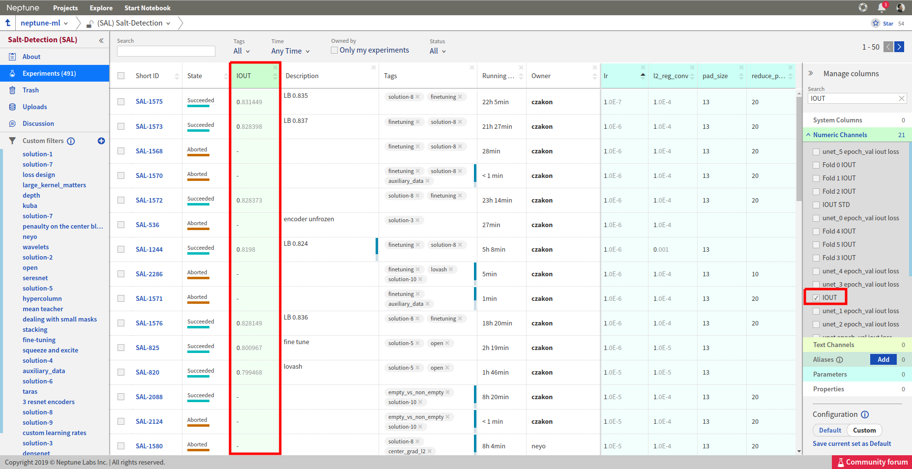
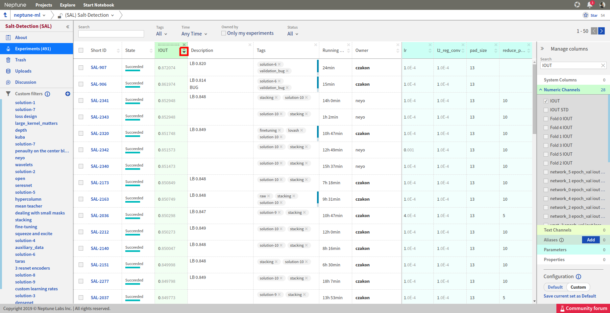
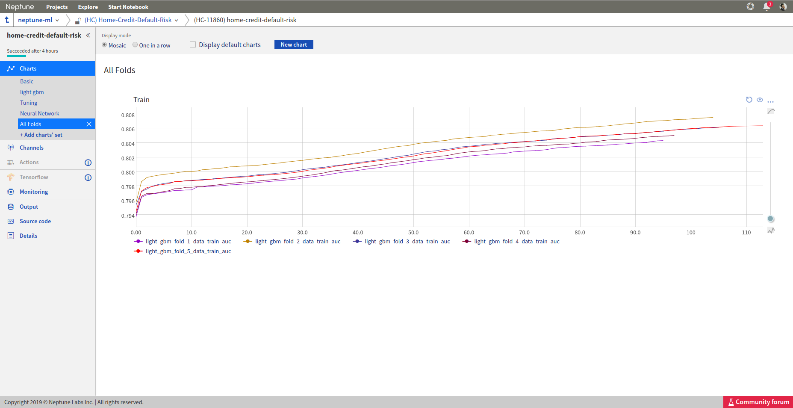
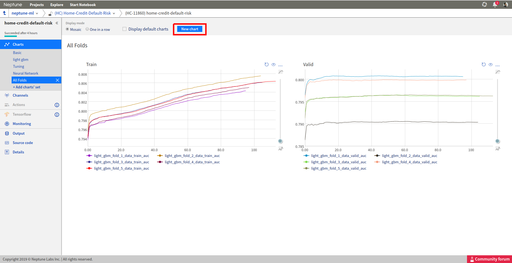

Organize
========

How to add tags to experiments?
-------------------------------
I want to add tags to the experiments. What are the options?

Solution
^^^^^^^^
**In the code**

You can add or remove tags directly from your script.

.. code-block:: python

   import neptune

   # This function assumes that NEPTUNE_API_TOKEN environment variable is defined.
   neptune.init(project_qualified_name='shared/onboadring')

   with neptune.create_experiment() as exp:
       exp.append_tag('resnet18')
       exp.append_tag('dev_mode')

**Web application**

Finally, you can always go to your project dashboard, and add/remove tags by clicking on a chosen cell.

.. image:: ../_images/how-to/ht-tags-1.png
   :target: ../_images/how-to/ht-tags-1.png
   :alt: tags management in web application

How to sort experiments dashboard?
----------------------------------
How can I sort experiments dashboard by a chosen metric?

Solution
^^^^^^^^
**Step 1**

Add a column for the chosen metric by searching for it in the ``Manage columns`` section on the right.

**Step 2**

Sort the chosen column by using the arrow buttons:

You can now explore the best/worst experiments.

How to organize charts?
-----------------------
I am creating many charts for my experiments but they all end up in the ``Basic`` group like this:

.. image:: ../_images/how-to/ht-chartsets-basic-1.png
   :target: ../_images/how-to/ht-chartsets-basic-1.png
   :alt: image

How can I organize my charts?

Solution
^^^^^^^^
You can organize your charts by creating different groups/views of charts, called chart-sets.

**Step 1**

Click on ``+ Add charts' set`` on the left and choose a name for it.

.. image:: ../_images/how-to/ht-chartsets-basic-2.png
   :target: ../_images/how-to/ht-chartsets-basic-2.png
   :alt: image

**Step 2**

Click on ``New chart`` button on the top and choose series which you want to plot on one chart.

**Step 3**

Click on ``create`` and you have your first chart ready!

**Step 4**

You can always add new charts by clicking on the ``New chart`` button on the top.

Neptune will remember your chart set for this project so all your experiments charts can be now organized in the same way!
