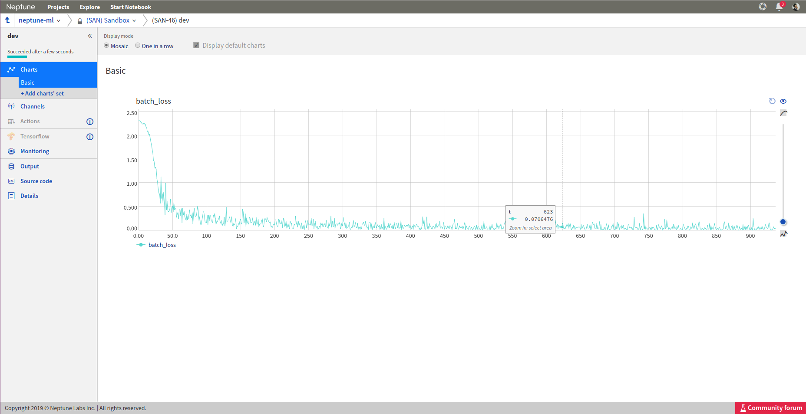
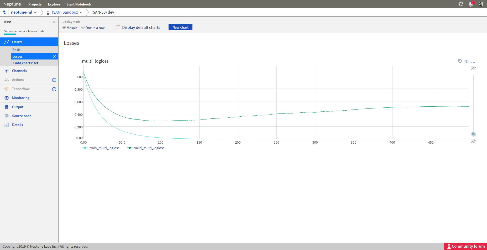
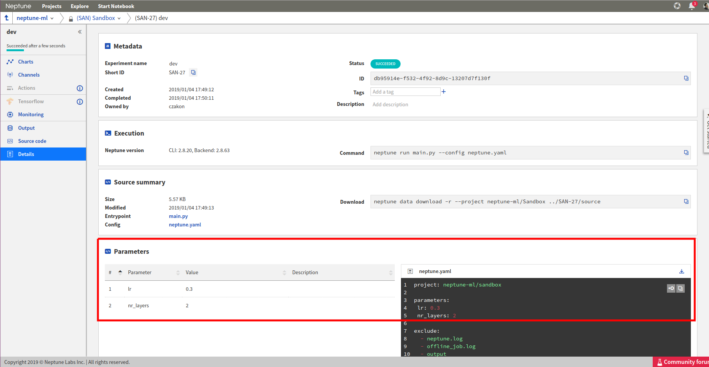
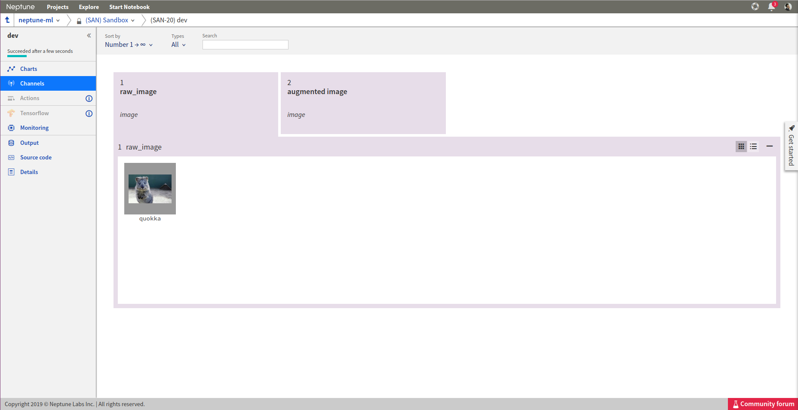
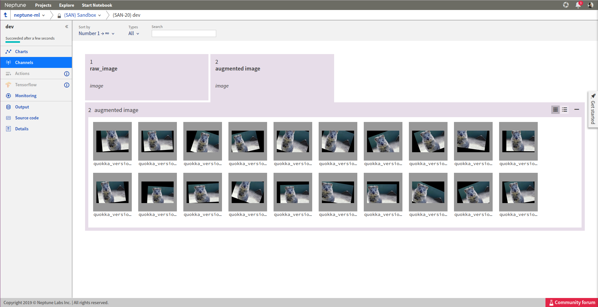

Track
=====

How to log keras metrics?
-------------------------
I have a training script written in `keras <https://keras.io>`_. How do I adjust it to log metrics to Neptune?

Solution
^^^^^^^^
**Step 1**

Say your training script looks like this:

.. code-block:: python

   import keras
   from keras import backend as K

   mnist = keras.datasets.mnist
   (x_train, y_train),(x_test, y_test) = mnist.load_data()
   x_train, x_test = x_train / 255.0, x_test / 255.0

   model = keras.models.Sequential([
     keras.layers.Flatten(),
     keras.layers.Dense(512, activation=K.relu),
     keras.layers.Dropout(0.2),
     keras.layers.Dense(10, activation=K.softmax)
   ])
   model.compile(optimizer='adam',
                 loss='sparse_categorical_crossentropy',
                 metrics=['accuracy'])

   model.fit(x_train, y_train, epochs=5)

**Step 2**

Now let's use Keras Callback

.. code-block:: python

   from keras.callbacks import Callback

   class NeptuneMonitor(Callback):
       def on_epoch_end(self, epoch, logs={}):
           innovative_metric = logs['acc'] - 2 * logs['loss']
           neptune.send_metric('innovative_metric', epoch, innovative_metric)

**Step 3**

Instantiate it and add it to your callbacks list:

.. code-block:: python

   with neptune.create_experiment():
       neptune_monitor = NeptuneMonitor()
       model.fit(x_train, y_train, epochs=5, callbacks=[neptune_monitor])

All your metrics are now logged to Neptune:

.. image:: ../_images/how-to/ht-log-keras-1.png
   :target: ../_images/how-to/ht-log-keras-1.png
   :alt: image

How to log PyTorch metrics?
---------------------------
I have a training script written in `PyTorch <https://pytorch.org>`_. How do I adjust it to log metrics to Neptune?

Solution
^^^^^^^^
Say your training script looks like this:

.. code-block:: python

   import torch
   import torch.nn as nn
   import torch.nn.functional as F
   import torch.optim as optim
   from torchvision import datasets, transforms

   DEVICE = torch.device("cuda" if torch.cuda.is_available() else "cpu")
   ITERATIONS = 10000

   class Net(nn.Module):
       def __init__(self):
           super(Net, self).__init__()
           self.conv1 = nn.Conv2d(1, 20, 5, 1)
           self.conv2 = nn.Conv2d(20, 50, 5, 1)
           self.fc1 = nn.Linear(4*4*50, 500)
           self.fc2 = nn.Linear(500, 10)

       def forward(self, x):
           x = F.relu(self.conv1(x))
           x = F.max_pool2d(x, 2, 2)
           x = F.relu(self.conv2(x))
           x = F.max_pool2d(x, 2, 2)
           x = x.view(-1, 4*4*50)
           x = F.relu(self.fc1(x))
           x = self.fc2(x)
           return F.log_softmax(x, dim=1)

   train_loader = torch.utils.data.DataLoader(
       datasets.MNIST('../data',
                      train=True,
                      download=True,
                      transform=transforms.Compose([
                          transforms.ToTensor(),
                          transforms.Normalize((0.1307,), (0.3081,))])
                      ),
       batch_size=64,
       shuffle=True)

   model = Net().to(DEVICE)

   optimizer = optim.SGD(model.parameters(), lr=0.01, momentum=0.9)

   for batch_idx, (data, target) in enumerate(train_loader):
       data, target = data.to(DEVICE), target.to(DEVICE)
       optimizer.zero_grad()
       output = model(data)
       loss = F.nll_loss(output, target)
       loss.backward()
       optimizer.step()

       if batch_idx == ITERATIONS:
           break

Add a snippet to the training loop, that sends your loss or metric to Neptune:

.. code-block:: python

   import neptune

   neptune.init('shared/onboarding')
   neptune.create_experiment()
   ...
   for batch_idx, (data, target) in enumerate(train_loader):
       ...
       neptune.send_metric('batch_loss', batch_idx, loss.data.cpu().numpy())

Your loss is now logged to Neptune:

How to log LightGBM metrics?
----------------------------
I have a training script written in `LightGBM <https://lightgbm.readthedocs.io>`_. How do I adjust it to log metrics to Neptune?

Solution
^^^^^^^^
Say your training script looks like this:

.. code-block:: python

   import lightgbm as lgb
   from sklearn.model_selection import train_test_split
   from sklearn.datasets import load_wine

   data = load_wine()

   X_train, X_test, y_train, y_test = train_test_split(data.data, data.target, test_size=0.1)
   lgb_train = lgb.Dataset(X_train, y_train)
   lgb_eval = lgb.Dataset(X_test, y_test, reference=lgb_train)

   params = {
       'boosting_type': 'gbdt',
       'objective': 'multiclass',
       'num_class': 3,
       'num_leaves': 31,
       'learning_rate': 0.05,
       'feature_fraction': 0.9,
   }

   gbm = lgb.train(params,
                   lgb_train,
                   num_boost_round=500,
                   valid_sets=[lgb_train, lgb_eval],
                   valid_names=['train','valid'],
                   )

Now, you need to use lightGBM callbacks to pass log metrics to Neptune:

**Step 1**

Take this callback:

.. code-block:: python

   import neptune

   neptune.init('shared/onboarding')
   neptune.create_experiment()

   def neptune_monitor():
       def callback(env):
           for name, loss_name, loss_value, _ in env.evaluation_result_list:
               neptune.send_metric('{}_{}'.format(name, loss_name), x=env.iteration, y=loss_value)
       return callback

**Step 2**

Pass it to ``lgb.train`` object via ``callbacks`` parameter:

.. code-block:: python

   gbm = lgb.train(params,
                   lgb_train,
                   num_boost_round=500,
                   valid_sets=[lgb_train, lgb_eval],
                   valid_names=['train','valid'],
                   callbacks=[neptune_monitor()],
                   )

All your metrics are now logged to Neptune

How to log matplotlib figure to Neptune?
----------------------------------------
How to log charts generated in `matplotlib <https://matplotlib.org/>`_, like confusion matrix or distribution in Neptune?

Solution
^^^^^^^^
**Step 1**

Create matplotlib figure

.. code-block:: python

   import matplotlib.pyplot as plt
   import seaborn as sns

   fig = plt.figure()
   sns.distplot(np.random.random(100))

**Step 2**

Convert your matplotlib figure object into PIL image.

For example you could use the following function, taken from `here <http://www.icare.univ-lille1.fr/wiki/index.php/How_to_convert_a_matplotlib_figure_to_a_numpy_array_or_a_PIL_image>`_, and adjusted slightly:

.. code-block:: python

   import numpy as np
   from PIL import Image

   def fig2pil(fig):
       fig.canvas.draw()

       w, h = fig.canvas.get_width_height()
       buf = np.fromstring(fig.canvas.tostring_argb(), dtype=np.uint8)
       buf.shape = (w, h, 4)
       buf = np.roll(buf, 3, axis=2)

       w, h, d = buf.shape
       return Image.frombytes("RGBA", (w, h), buf.tostring())

   pil_image = fig2pil(fig)

**Step 3**

Send it to Neptune!

.. code-block:: python

   neptune.create_experiment()
   neptune.send_image('distplot', pil_image)

**Step 5**

Explore it in the browser:

.. image:: ../_images/how-to/ht-matplotlib-1.png
   :target: ../_images/how-to/ht-matplotlib-1.png
   :alt: image

.. image:: ../_images/how-to/ht-matplotlib-2.png
   :target: ../_images/how-to/ht-matplotlib-2.png
   :alt: image

How specify experiment parameters?
----------------------------------
I saw that Neptune logs experiment parameters.

But I don't know how to specify parameters for my experiments.

Solution
^^^^^^^^
You define your parameters at experiment creation, like this:

.. code-block::

   import neptune

   # This function assumes that NEPTUNE_API_TOKEN environment variable is defined.
   neptune.init('username/my_project')

   # check params argument
   with neptune.create_experiment(name='first-pytorch-ever',
                                  params={'dropout': 0.3,
                                          'lr': 0.01,
                                          'nr_epochs': 10}):
   # your training script

Where ``params`` is standard Python dict.

How to log images to Neptune?
-----------------------------
I generate model predictions after every epoch. How can I log them as images to Neptune?

Solution
^^^^^^^^
**Log single image to Neptune**

Create PIL image that you want to log. For example:

.. code-block:: python

   import imgaug as ia
   from PIL import Image

   img = ia.quokka()
   img_pil = Image.fromarray(img)

Log it to Neptune:

.. code-block:: python

   import neptune

   # This function assumes that NEPTUNE_API_TOKEN environment variable is defined.
   neptune.init(project_qualified_name='shared/onboarding')

   with neptune.create_experiment() as exp:
       exp.send_image('quokka', img_pil)

As a result, quokka image is associated with the experiment

**Log multiple images to neptune**

You can log images in a loop. For example, you can augment your image and log it to Neptune:

.. code-block:: python

   from imgaug import augmenters as iaa

   aug_seq = iaa.Affine(scale={"x": (0.8, 1.2), "y": (0.8, 1.2)},
                        translate_percent={"x": (-0.2, 0.2), "y": (-0.2, 0.2)},
                        rotate=(-25, 25),
                        )

   exp2 = neptune.create_experiment()
   for run in range(20):
       img_aug= aug_seq.augment_image(img)
       img_pil_aug = Image.fromarray(img_aug)
       exp2.send_image('quokka_version_{}'.format(run), img_pil_aug)

   exp2.close()

How to log metrics to Neptune?
-------------------------------
How to track multiple metrics (loss, scores) in the experiment?

Solution
^^^^^^^^
**Step 1: Log**

In order to log metrics to Neptune, you simply need to:

.. code-block:: python

   import neptune

   neptune.init('shared/onboarding')
   with neptune.create_experiment():
       # 'log_loss' is User defined metric name
       neptune.send_metric('log_loss', 0.753)
       neptune.send_metric('AUC', 0.95)

Another option is to log `key: value` pair like this:

.. code-block::

   neptune.set_property('model_score', '0.871')

.. note:: You can create as many metrics as you wish.

**Step 2: Analyze**

Browse and analyse your metrics on the dashboard (`example <https://app.neptune.ml/neptune-ml/Home-Credit-Default-Risk/experiments>`_) or in the particular experiment (`example experiment <https://app.neptune.ml/neptune-ml/Home-Credit-Default-Risk/e/HC-11860/channels>`_).
