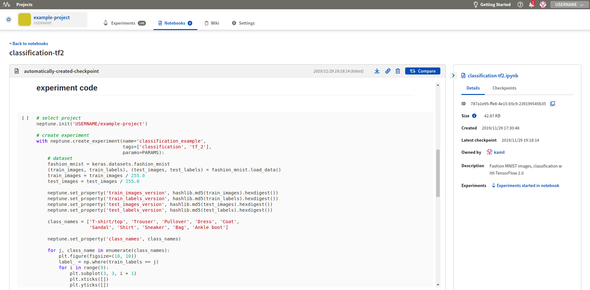
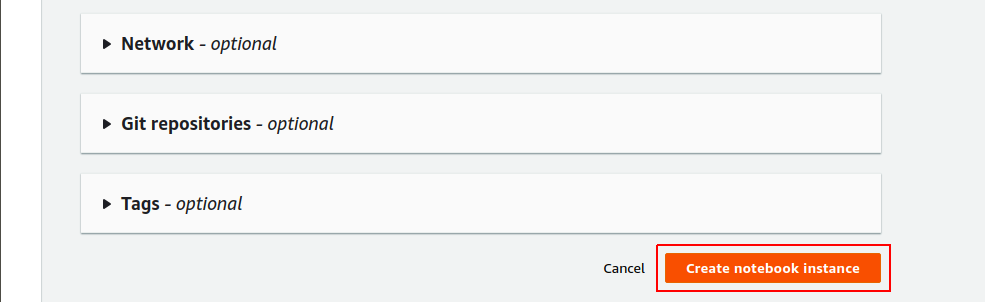

Track
=====

Log metrics to Neptune
----------------------
How to track multiple metrics (loss, scores) in the experiment?

Solution
^^^^^^^^
**Step 1: Log**

In order to log metrics to Neptune, you simply need to:

.. code-block::

   import neptune

   neptune.init('shared/onboarding')
   with neptune.create_experiment():
       # 'log_loss' is User defined metric name
       neptune.send_metric('log_loss', 0.753)
       neptune.send_metric('AUC', 0.95)

Another option is to log `key: value` pair like this:

.. code-block::

   neptune.set_property('model_score', '0.871')

.. note:: You can create as many metrics as you wish.

**Step 2: Analyze**

Browse and analyse your metrics on the dashboard (`example <https://app.neptune.ml/neptune-ml/Home-Credit-Default-Risk/experiments>`_) or in the particular experiment (`example experiment <https://app.neptune.ml/neptune-ml/Home-Credit-Default-Risk/e/HC-11860/channels>`_).

Save experiment output
----------------------
I can run my experiment but I am struggling to save the model weights and the ``csv`` file with the results when it completes. How can I do that in Neptune?

Solution
^^^^^^^^
Save everything as you go! For example:

.. code-block::

   with neptune.create_experiment() as exp:
       exp.send_artifact('/path/to/model_weights.h5')
       ...
       exp.send_artifact('/path/to/results.csv')

Your results will be available for you to download in the ``Output`` section of your experiment.

.. image:: ../_static/images/how-to/ht-output-download-1.png
   :target: ../_static/images/how-to/ht-output-download-1.png
   :alt: image

Specify experiment parameters
-----------------------------
I saw that Neptune logs experiment parameters.

.. image:: ../_static/images/how-to/ht-specify-params-1.png
   :target: ../_static/images/how-to/ht-specify-params-1.png
   :alt: image

But I don't know how to specify parameters for my experiments.

Solution
^^^^^^^^
You define your parameters at experiment creation, like this:

.. code-block::

   import neptune

   # This function assumes that NEPTUNE_API_TOKEN environment variable is defined.
   neptune.init('username/my_project')

   # check params argument
   with neptune.create_experiment(name='first-pytorch-ever',
                                  params={'dropout': 0.3,
                                          'lr': 0.01,
                                          'nr_epochs': 10}):
   # your training script

Where ``params`` is standard Python dict.

Log images to Neptune
---------------------
I generate model predictions after every epoch. How can I log them as images to Neptune?

Solution
^^^^^^^^
**Log single image to Neptune**

Create PIL image that you want to log. For example:

.. code-block::

   import imgaug as ia
   from PIL import Image

   img = ia.quokka()
   img_pil = Image.fromarray(img)

Log it to Neptune:

.. code-block::

   import neptune

   # This function assumes that NEPTUNE_API_TOKEN environment variable is defined.
   neptune.init(project_qualified_name='shared/onboarding')

   with neptune.create_experiment() as exp:
       exp.send_image('quokka', img_pil)

As a result, quokka image is associated with the experiment

.. image:: ../_static/images/how-to/ht-img-channel-1.png
   :target: ../_static/images/how-to/ht-img-channel-1.png
   :alt: image

**Log multiple images to neptune**

You can log images in a loop. For example, you can augment your image and log it to Neptune:

.. code-block::

   from imgaug import augmenters as iaa

   aug_seq = iaa.Affine(scale={"x": (0.8, 1.2), "y": (0.8, 1.2)},
                        translate_percent={"x": (-0.2, 0.2), "y": (-0.2, 0.2)},
                        rotate=(-25, 25),
                        )

   exp2 = neptune.create_experiment()
   for run in range(20):
       img_aug= aug_seq.augment_image(img)
       img_pil_aug = Image.fromarray(img_aug)
       exp2.send_image('quokka_version_{}'.format(run), img_pil_aug)

   exp2.close()

Version datasets
----------------
When working on a project, it is not unusual that I change the datasets on which I train my models. How can I keep track of that in Neptune?

Solution
^^^^^^^^
Under many circumstances it is possible to calculate a hash of your dataset. Even if you are working with large image datasets, you have some sort of a smaller metadata file, that points to image paths. If this is the case you should:

**Step 1**

Create hashing function. For example:

.. code-block::

   import hashlib

   def md5(fname):
       hash_md5 = hashlib.md5()
       with open(fname, "rb") as f:
           for chunk in iter(lambda: f.read(4096), b""):
               hash_md5.update(chunk)
       return hash_md5.hexdigest()

**Step 2**

Calculate the hash of your training data and send it to Neptune as text:

.. code-block::

   TRAIN_FILEPATH = 'PATH/TO/TRAIN/DATA'
   train_hash = md5(TRAIN_FILEPATH)

   neptune.send_text('train_data_version', train_hash)
   ...

**Step 3**

Add data version column to your project dashboard:

.. image:: ../_static/images/how-to/ht-data-version-1.png
   :target: ../_static/images/how-to/ht-data-version-1.png
   :alt: image

.. note:: If your dataset is too large for fast hashing you could think about rearranging your data to have a light-weight metadata file.

Keep my code private
--------------------
My code is proprietary, so I do not want to send any sources to Neptune, while training locally. How to do it?

Solution
^^^^^^^^
All you need to do it to pass empty list ``[]`` to the ``upload_source_files`` parameter, like this:

.. code-block::

   import neptune

   # This function assumes that NEPTUNE_API_TOKEN environment variable is defined.
   neptune.init(project_qualified_name='shared/onboarding')

   with neptune.create_experiment(upload_source_files=[]) as exp:
       ...

As a result you will not send sources to Neptune, so they will not be available in the Source Code tab in the Web app.

Upload notebook checkpoint
--------------------------
I want to add Notebook checkpoint to my project. How to do it?

Solution
^^^^^^^^
Go to your Jupyter, where you can see two Neptune buttons:

* **n** button is for configuration changes
* **Upload** button is for making checkpoint in Neptune

.. image:: ../_static/images/notebooks/buttons_02_1.png
   :target: ../_static/images/notebooks/buttons_02_1.png
   :alt: image

Click **Upload**, whenever you want to create new checkpoint in Neptune. You will see tooltip with link as a confirmation.

.. note:: You can use **Upload** as many times as you want.

How to setup Neptune-enabled JupyterLab on AWS?
-----------------------------------------------
I would like to run Neptune and track experiments that I run on AWS cloud.
How do I do that?

.. image:: ../_static/images/others/aws_neptuneml.png
   :target: ../_static/images/others/aws_neptuneml.png
   :alt: AWS neptune.ml integration
   
Solution
^^^^^^^^
**Register to AWS**

Follow the `registration instructions <https://aws.amazon.com/premiumsupport/knowledge-center/create-and-activate-aws-account/>`_ from official webpage to create your AWS account.

**Start EC2 instance**

Start a new EC2 instance. Select `ubuntu` as your instance type and choose a worker type you need.
You can go with `t2.micro` just to test it out.

**ssh to your instance**

Connect to your instance by going to the terminal and running:

.. code-block:: Bash

    ssh -i /path_to_key/my_key.pem ubuntu@public_dns_name

*(make sure that you put correct key and public_dns_name)*

**Install docker**

Create a new file `install_docker.sh`:

.. code-block:: Bash

    nano install_docker.sh

Copy the following commands to it:

.. code-block:: Bash

    sudo apt-get update
    sudo apt-get install \
        apt-transport-https \
        ca-certificates \
        curl \
        gnupg-agent \
        software-properties-common
    curl -fsSL https://download.docker.com/linux/ubuntu/gpg | sudo apt-key add -
    sudo apt-key fingerprint 0EBFCD88
    sudo add-apt-repository \
       "deb [arch=amd64] https://download.docker.com/linux/ubuntu \
       $(lsb_release -cs) \
       stable"
    sudo apt-get update
    sudo apt-get install docker-ce docker-ce-cli containerd.io

Run the installation script:

.. code-block:: Bash

    source install_docker.sh

**Define your secrets**

| Go to Neptune web app, get your ``NEPTUNE_API_TOKEN`` and copy it. Then, create a password for your JupyterLab server.
| Set those two secrets to your environment variables ``NEPTUNE_API_TOKEN`` and ``JUPYTERLAB_PASSWORD``, like below:

.. code-block:: Bash

    export NEPTUNE_API_TOKEN='your_api_token=='
    export JUPYTERLAB_PASSWORD='difficult_password'

**Build docker image**

Create a new file `Dockerfile`:

.. code-block:: Bash

    nano Dockerfile

Copy insights of the following `Dockerfile` to your newly created file:

.. code-block:: Docker

    # Use a miniconda3 as base image
    FROM continuumio/miniconda3

    # Installation of jupyterlab and extensions
    RUN pip install jupyterlab==0.35.6  && \
        pip install jupyterlab-server==0.2.0  && \
        conda install -c conda-forge nodejs

    # Installation of Neptune and enabling neptune extension
    RUN pip install neptune-client  && \
        pip install neptune-notebooks  && \
        jupyter labextension install neptune-notebooks

    # Setting up Neptune API token as env variable
    ARG NEPTUNE_API_TOKEN
    ENV NEPTUNE_API_TOKEN=$NEPTUNE_API_TOKEN

    # Adding current directory to container
    ADD . /mnt/workdir
    WORKDIR /mnt/workdir

| *(If you want to run on GPU make sure to change your `Dockerfile` to start from nvidia docker images)*.

Run following command to build your docker image:

.. code-block:: Bash

    sudo docker build -t jupyterlab --build-arg NEPTUNE_API_TOKEN=$NEPTUNE_API_TOKEN .

**Start JupyterLab server**

Spin up JupyterLab server with docker:

.. code-block:: Bash

    sudo docker run --rm -v `pwd`:/work/output -p 8888:8888 jupyterlab:latest \
    /opt/conda/bin/jupyter lab --allow-root --ip=0.0.0.0 --port=8888 --NotebookApp.token=$JUPYTERLAB_PASSWORD

**Forward ports via ssh tunnel**

Open a new terminal on your local machine and run:

.. code-block:: Bash

    ssh -L 8888:localhost:8888 ubuntu@public_dns_name &

*(make sure that you put correct public_dns_name)*

**Open JupyterLab server in your browser**

Go to `localhost:8888` and enjoy your JupyterLab server with Neptune!

**Final result**

Neptune extensions are enabled and ``NEPTUNE_API_TOKEN`` is already in the environment variable so you can work with Notebooks and run experiments with no problems.

How to setup Neptune-enabled AWS SageMaker Jupyter instance?
------------------------------------------------------------
I would like to use Neptune to track experiments that I run on AWS SageMaker.
How do I do that?

Solution
^^^^^^^^
**Register to AWS**

Follow the `registration instructions <https://aws.amazon.com/premiumsupport/knowledge-center/create-and-activate-aws-account/>`_ from official website to create your AWS account.

**Create Lifecycle configuration**

Go to SageMaker *Lifecycle configurations* and click on *Create configuration*.

You can choose whatever name you want just make sure to remember it.

Now, you should modify the *Create notebook* script to run it only once at creation of your SageMaker notebook instance.

   
Copy and paste the script below to your *Create notebook* tab. 
Choose in which environments you want to install *neptune-client* in the *PARAMETERS* section.

.. code-block:: Bash

    #!/bin/bash

    set -e

    sudo -u ec2-user -i <<'EOF'

    # PARAMETERS
    ENVS=(
      python3
      pytorch_p36
    )

    # Install Neptune client library
    for env in $ENVS; do
        source /home/ec2-user/anaconda3/bin/activate $env
        pip install neptune-client
        source /home/ec2-user/anaconda3/bin/deactivate
    done

    # Install jupyter extension
    source /home/ec2-user/anaconda3/bin/activate JupyterSystemEnv
    pip install neptune-notebooks
    jupyter nbextension enable --py neptune-notebooks --sys-prefix
    jupyter labextension install neptune-notebooks
    source /home/ec2-user/anaconda3/bin/deactivate

    EOF

**Create notebook instance**

Go to SageMaker *Notebook instances* and click on *Create notebook instance*.

Select an *instance name* and click on *Additional configuration* to add the *Lifecycle configuration* you have just created: 

   
You can now click *Create notebook instance* instance at the bottom to start your instance.

**Start notebook**

If everything went well your AWS SageMaker instance should be *InService* and you can now open Jupyter Notebook or Jupyter lab with Neptune notebook-versioning enabled!

.. image:: ../_static/images/how-to/ht-sagemaker-notebook_run.png
   :target: ../_static/images/how-to/ht-sagemaker-notebook_run.png
   :alt: image
   
You can now version your notebooks and track experiments in Amazon SageMaker with Neptune!

How to track Google Colab experiments with Neptune?
---------------------------------------------------
I would like to run my experiments on Google Colab and track them with Neptune. How do I do that?

.. image:: ../_static/images/others/colab_neptuneml.png
   :target: ../_static/images/others/colab_neptuneml.png
   :alt: Google Colaboratory neptune.ml integration

Solution
^^^^^^^^
**Install Neptune client**

Go to your first cell in Google Colab and install `neptune-client`:

.. code-block:: Bash

    ! pip install neptune-client

**Set Neptune API token**

Go to Neptune web app and get your API token. Set it to the environment variable `NEPTUNE_API_TOKEN`:

.. code-block:: Bash

    % env NEPTUNE_API_TOKEN='your_private_neptune_api_token=='

Delete this cell.

.. warning::

    It is very important that you delete this cell not to share your private token with anyone.

**That's it. Run your training script with Neptune.**

.. code-block:: Python

    import neptune
    neptune.init('USER_NAME/PROJECT_NAME')

    with neptune.create_experiment():
        neptune.send_metric('auc', 0.92)
