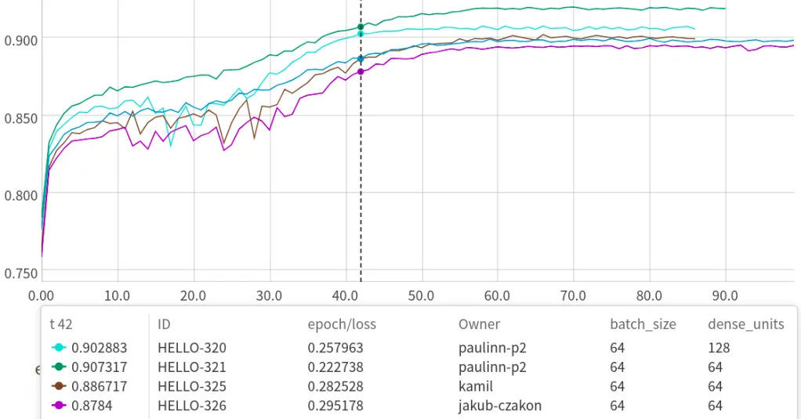

Documentation
=============

Neptune in 3 minutes
--------------------

|Neptune tour|

Try Neptune on Colab with zero setup and see results in the UI
--------------------------------------------------------------

Get a quick feel of how monitoring and keeping track of experiments can look like.

|Run on Colab|

What does Neptune do?
---------------------

Neptune is a lightweight experiment management tool that helps you keep track of your machine learning experiments.

Most common Neptune use cases:

- |Monitor ML runs live|
- |Organize ML experimentation|
- |Compare and debug ML experiments and models|
- |Share results of experiments with your team|

While Neptune is essentially a platform for tracking experiments, it provides Jupyter and JupyterLab extensions that also let you track Jupyter Notebooks.

- |Clean up your Jupyter workflow without git|

|Sign up|

How does Neptune work (in 3 steps)?
-----------------------------------

.. note::

    Following snippets are just to give you the idea.

    If you want to copy paste and run things quickly then go to |Quick starts|.

1. Connect it to your script

.. code:: python

    neptune.init('happy_tom/great-project')

2. Start an experiment

.. code:: python

    neptune.create_experiment('my-amazing-idea')

3. Log things that you care about

.. code:: python

    neptune.log_metric('test_auc', 0.92) # metrics, losses
    neptune.log_image('charts', roc_curve_fig) # images, charts
    neptune.log_artifact('model.h5') # model binaries, predictions, files

4. Run your script normally

.. code:: bash

    python train.py

5. See everything in Neptune UI

Check it for yourself:

- See our |Quick starts|

|Run on Colab|

Discover Neptune
----------------

- |Example Project|: See how example project looks in Neptune
- |YouTube channel|: Provides hands-on videos that showcase key Neptune features.
- |Neptune blog|: Provides in-depth articles about best practices in machine learning experimentation (among other things)
- |Neptune community|: Meet other Neptune users and developers and start a discussion.
- |neptune-client|: Neptune client is an open source Python library that lets you integrate your Python scripts with Neptune.
- |neptune-contrib|: Built on top of neptune-client, this is an open-source collection of advanced utilities that make work with Neptune easier.
- Questions? Send an email to contact@neptune.ai by email or click the chat icon in the bottom right corner.

.. ----------------------
.. Documentation contents

.. toctree::
   :hidden:
   :maxdepth: 2

   Home <self>

.. toctree::
   :hidden:
   :maxdepth: 2
   :caption: Getting started

   Installation <getting-started/installation/index.rst>
   Quick starts <getting-started/quick-starts/index.rst>
   Integrating Neptune into your codebase <getting-started/integrate-neptune-into-your-codebase/index.rst>
   Getting help <getting-started/getting-help.rst>

.. toctree::
   :hidden:
   :maxdepth: 2
   :caption: Guides

   Logging and managing experiment results <logging-and-managing-experiment-results/index.rst>
   Keeping track of Jupyter notebooks <keep-track-of-jupyter-notebooks/index.rst>
   Organizing and exploring results in the UI <organizing-and-exploring-results-in-the-ui/index.rst>
   Sharing results and models with the team <sharing-results-and-models-with-the-team/index.rst>
   Workspace, project, and user management <workspace-project-and-user-management/index.rst>
   Security and privacy <security-and-privacy/index.rst>

.. toctree::
   :hidden:
   :maxdepth: 2
   :caption: Essentials

   Integrations <integrations/index.rst>
   API reference <api-reference/index.rst>
   Use cases <use-cases/index.rst>
   FAQ <faq/index.rst>

.. toctree::
   :hidden:
   :maxdepth: 1
   :caption: Links

   Neptune website <https://neptune.ai/>
   Neptune app <https://ui.neptune.ai/>

.. External links

.. |Neptune tour| raw:: html

    <iframe width="720" height="420" src="https://www.youtube.com/embed/9iX6DxcijO8" frameborder="0" allow="accelerometer; autoplay; encrypted-media; gyroscope; picture-in-picture" allowfullscreen></iframe>

.. |Sign up| raw:: html

    

    <a href="https://neptune.ai/register" target="_blank">
        </img>
    </a>
    

.. |Run on Colab| raw:: html

    

.. |Neptune| raw:: html

    <a href="https://neptune.ai/" target="_blank">Neptune</a>

.. |Quick starts| raw:: html

    <a href="/getting-started/quick-starts/index.html">Quick Starts</a>

.. |Example Project| raw:: html

    <a href="https://ui.neptune.ai/o/neptune-ai/org/credit-default-prediction/experiments?viewId=a261e2d2-a558-468e-bf16-9fc9d0394abc" target="_blank">Example project</a>

.. |YouTube channel|  raw:: html

    <a href="https://www.youtube.com/channel/UCvOJU-ubyUqxGSDRN7xK4Ng" target="_blank">YouTube channel</a>

.. |Neptune Blog|  raw:: html

    <a href="https://neptune.ai/blog/category/machine-learning-model-management" target="_blank">Neptune blog</a>

.. |Neptune community|  raw:: html

    <a href="https://community.neptune.ai/" target="_blank">Neptune community forum</a>

.. |neptune-client| raw:: html

    <a href="https://github.com/neptune-ai/neptune-client" target="_blank">neptune-client</a>

.. |neptune-contrib|  raw:: html

    <a href="https://github.com/neptune-ai/neptune-contrib" target="_blank">neptune-contrib</a>

.. |Monitor ML runs live| raw:: html

    <a href="/use-cases/monitor-live/index.html">Monitor ML runs live</a>

.. |Organize ML experimentation| raw:: html

    <a href="/use-cases/organize-experiments/index.html">Organize ML experimentation</a>

.. |Share results of experiments with your team| raw:: html

    <a href="/use-cases/share-results/index.html">Share results of experiments with your team</a>

.. |Compare and Debug ML experiments and models| raw:: html

    <a href="/use-cases/compare-experiments/index.html">Compare and debug ML experiments and models</a>

.. |Clean up your Jupyter workflow without git| raw:: html

    <a href="/use-cases/clean-up-jupyter/index.html">Clean up your Jupyter workflow without git</a>
