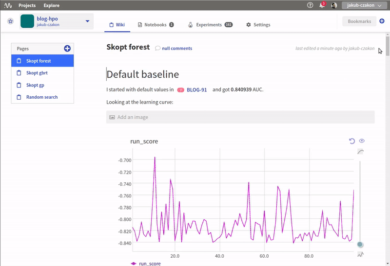

What is Neptune?
================
`Neptune <https://neptune.ml/>`_ is a data science collaboration hub. With Neptune, teams can work together efficiently and keep all aspects of their workflow in a single place. Whether it is source code, jupyter notebooks, model training curves or meeting notes, Neptune got you covered.

.. image:: ./_static/images/overview/quick_overview.gif
   :target: ./_static/images/overview/quick_overview.gif
   :alt: image

Neptune is lightweight
----------------------
Neptune is built with the single design principle in mind: *lightweightness*. What does it mean in practice?

* easy user onboarding: if you know how to use print() you will learn how to use it in no time.
* 20-minute deployment: use SaaS, deploy on any cloud or on your hardware.
* Neptune fits in any workflow, ranging from data exploration & analysis, decision science to machine learning and deep learning.
* Neptune works with common technologies in data science domain: Python 2 and 3, Jupyter Notebooks, `R <https://www.r-project.org/>`_.
* Neptune integrates with other tools like `MLflow <https://mlflow.org/>`_ and `TensorBoard <https://www.tensorflow.org/guide/summaries_and_tensorboard>`_.

Neptune's focus: track, organize and collaborate
------------------------------------------------
We put focus on three aspects of the team work on data science projects: :ref:`track <track>`, :ref:`organize <organize>` and :ref:`collaborate <collaborate>`.

.. _track:

Track
^^^^^
Track all objects in the data science or machine learning project. It can be model training curves, visualizations, input data, calculated features and so on. 
Snippet below, presents example integration with Python code.

.. code-block::

   import neptune

   neptune.init('shared/onboarding')
   with neptune.create_experiment():
       neptune.append_tag('minimal-example')
       n = 117
       for i in range(1, n):
           neptune.send_metric('iteration', i)
           neptune.send_metric('loss', 1/i**0.5)
       neptune.set_property('n_iterations', n)

.. _organize:

Organize
^^^^^^^^
Organize structure of your project: 

* code
* notebooks
* experiment results
* model weights
* meeting notes, 
* reports

Everything is in one place, accessible from the app or programatically!

.. _collaborate:

Collaborate
^^^^^^^^^^^
Collaborate in the team:

* share your experiments
* compare results
* comment and communicate your work.
* interactive widgets focused on data science

Speak Your language in our data-science focused interactive wiki!

Documentation contents
----------------------

.. toctree::
   :maxdepth: 1
   :caption: How-to?

   how-to/track.rst
   how-to/organize.rst

.. toctree::
   :maxdepth: 1
   :caption: Supported languages

   Python API <python-api.rst>
   R support <r-support.rst>

.. toctree::
   :maxdepth: 1
   :caption: Notebooks in Neptune

   Introduction <notebooks/introduction.rst>
   Installation and configuration <notebooks/install-configure.rst>
   Troubleshoot <notebooks/troubleshoot.rst>

.. toctree::
   :maxdepth: 1
   :caption: Integrations

   Integrations <integrations.rst>
