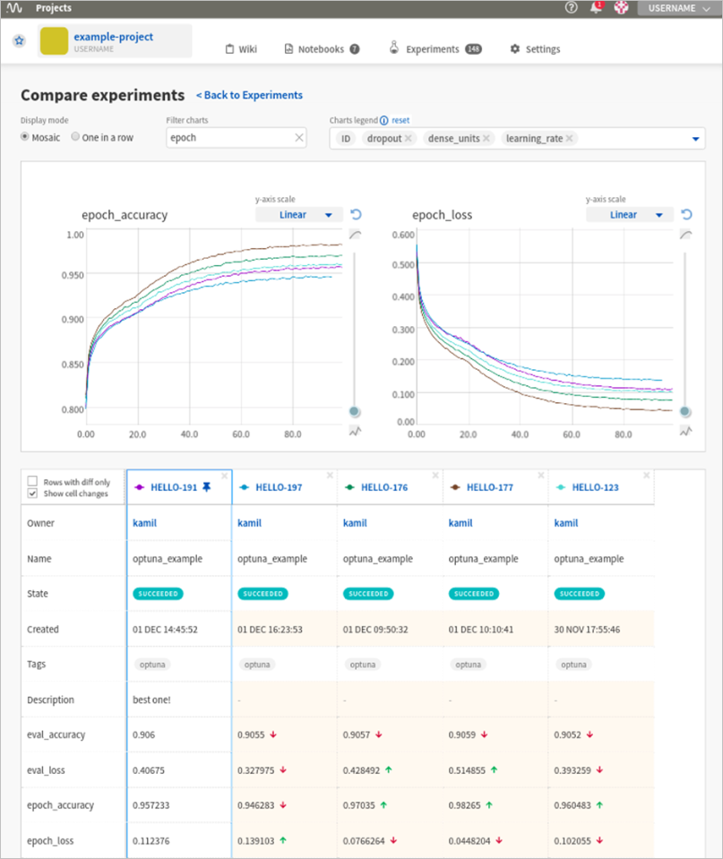

Documentation
=============

Neptune in 60 seconds
---------------------

|Neptune tour|

Play with Neptune on Colab
--------------------------

Get a quick feel of how monitoring and keeping track of experiments can look like.

|Run on Colab|

What is Neptune?
----------------

Neptune is a light-weight experiment management tool that helps you keep track of your machine learning experiments.

With Neptune you can:

- Monitor your ML experiment runs live
- Organize and version the ML experimentation process
- Compare experiments
- Share results with your team
- Version, organize, and share Jupyter Notebooks and checkpoints

|Sign up|

How does Neptune work?
----------------------

You embed Neptune in your scripts.

1. Connect it to your script

.. code:: python

    import neptune

    neptune.init('happy_tom/great-project')

2. Start an experiment

.. code:: python

    neptune.create_experiment('my-amazing-idea')

3. Log things that you care about

.. code:: python

    neptune.log_metric('test_auc', 0.92)
    neptune.log_image('charts', roc_curve_fig)
    neptune.log_artifact('model.h5')

4. Run your script normally

.. code:: bash

    python train.py

5. See everything in Neptune UI

Check it our for yourself:

- See our |Quick starts|
- |Run on Colab|

Discover Neptune
----------------

- |Example Project|: See how example project looks in Neptune
- |YouTube channel|: Provides hands-on videos that showcase key Neptune features.
- |Neptune blog|: Provides in-depth articles about best practices in machine learning experimentation (among other things)
- |Neptune user community|: Meet other Neptune users and developers and start a discussion.
- |neptune-client|: Neptune client is an open source Python library that lets you integrate your Python scripts with Neptune.
- |neptune-contrib|: Built on top of neptune-client, this is an open-source collection of advanced utilities that make work with Neptune easier.
- Questions? Send an email to contact@neptune.ai by email or click the chat icon in the bottom right corner.

.. ----------------------
.. Documentation contents

.. toctree::
   :hidden:

   Home <self>

.. toctree::
   :hidden:
   :maxdepth: 2

   Getting Started <getting-started/index.rst>

.. toctree::
   :hidden:
   :maxdepth: 2

   Use Cases <use-cases/index.rst>

.. toctree::
   :hidden:
   :maxdepth: 2

   Logging data to Neptune <logging-data-to-neptune/index.rst>

.. toctree::
   :hidden:
   :maxdepth: 2

   Working with Neptune UI <working-with-neptune-ui/index.rst>

.. toctree::
   :hidden:
   :maxdepth: 2

   Getting data from Neptune <getting-data-from-neptune/index.rst>

.. toctree::
   :hidden:
   :maxdepth: 2

   Teamwork and User Management <teamwork-and-user-management/index.rst>

.. toctree::
   :hidden:
   :maxdepth: 3

   Security <security/index.rst>

.. toctree::
   :hidden:
   :maxdepth: 2

   Integrations <integrations/index.rst>

.. toctree::
   :hidden:
   :maxdepth: 2

   API Reference <api-reference/index.rst>

.. toctree::
   :hidden:
   :maxdepth: 2

   FAQ <faq.rst>

.. External links

.. |Neptune tour| raw:: html

    

    <iframe width="100%" height="350" src="https://www.youtube.com/watch?v=9iX6DxcijO8&list=PLKePQLVx9tOeRjHIj4_L8KhNG9vWalX1A" frameborder="0" allow="autoplay; encrypted-media" allowfullscreen></iframe>
    

.. |Sign up| raw:: html

    

    <a href="https://neptune.ai/register" target="_blank">
        </img>
    </a>
    

.. |Run on Colab| raw:: html

    

.. |Neptune| raw:: html

    <a href="https://neptune.ai/" target="_blank">Neptune</a>

.. |Quick starts| raw:: html

    <a href="/getting-started/quick-starts.html">Quick Starts</a>

.. |Example Project| raw:: html

    <a href="https://ui.neptune.ai/o/neptune-ai/org/credit-default-prediction/experiments?viewId=a261e2d2-a558-468e-bf16-9fc9d0394abc" target="_blank">Example project</a>

.. |YouTube channel|  raw:: html

    <a href="https://www.youtube.com/channel/UCvOJU-ubyUqxGSDRN7xK4Ng" target="_blank">YouTube channel</a>

.. |Neptune Blog|  raw:: html

    <a href="https://neptune.ai/blog/category/machine-learning-model-management" target="_blank">Neptune blog</a>

.. |Neptune user community|  raw:: html

    <a href="https://community.neptune.ai/" target="_blank">Neptune user community</a>

.. |neptune-client| raw:: html

    <a href="https://github.com/neptune-ai/neptune-client" target="_blank">neptune-client</a>

.. |neptune-contrib|  raw:: html

    <a href="https://neptune-contrib.readthedocs.io/index.html" target="_blank">neptune-contrib</a>
