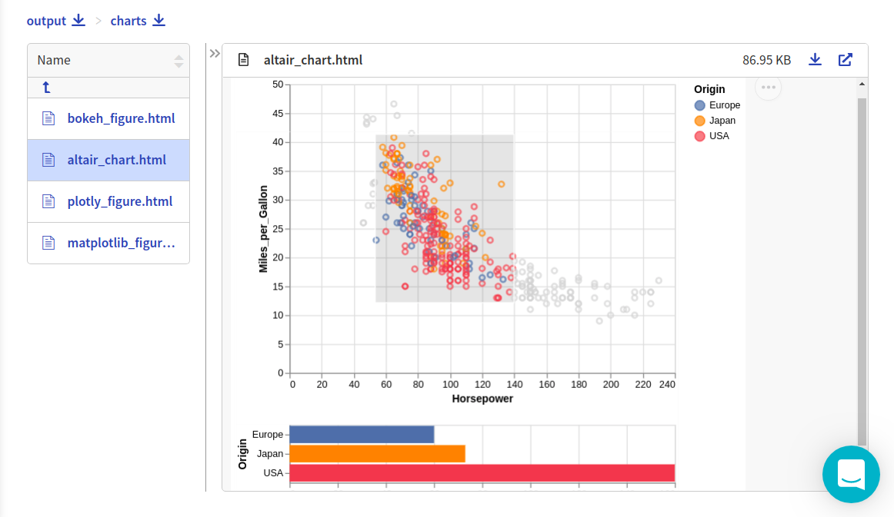
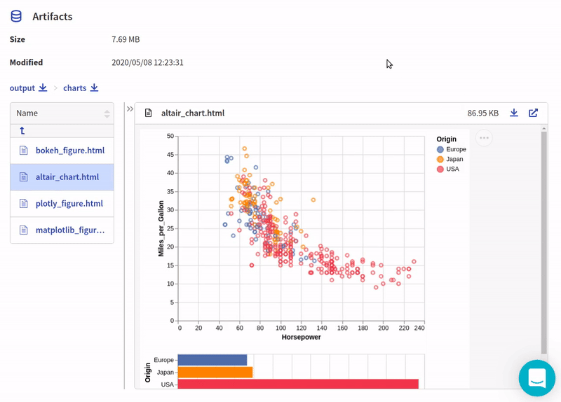

Neptune-Altair Integration
==========================

This integration lets you log interactive charts generated in |altair|, like confusion matrix or distribution, in Neptune.

Follow these steps:

0. Create an experiment:

   .. code-block::

        import neptune

        neptune.init(api_token='ANONYMOUS',project_qualified_name='shared/showroom')
        neptune.create_experiment()

1. Create and log altair charts into Neptune:

   .. code-block::

        import altair as alt
        from vega_datasets import data

        source = data.cars()

        brush = alt.selection(type='interval')

        points = alt.Chart(source).mark_point().encode(
            x='Horsepower:Q',
            y='Miles_per_Gallon:Q',
            color=alt.condition(brush, 'Origin:N', alt.value('lightgray'))
        ).add_selection(
            brush
        )

        bars = alt.Chart(source).mark_bar().encode(
            y='Origin:N',
            color='Origin:N',
            x='count(Origin):Q'
        ).transform_filter(
            brush
        )

        chart = points & bars

   .. code-block::

        from neptunecontrib.api import log_chart

        log_chart(name='altair_chart', chart=chart)

2. Explore the results in the Neptune dashboard:

Check out |this experiment| in the app.

.. External Links

.. |altair| raw:: html

    <a href="https://altair-viz.github.io/" target="_blank">altair</a>

.. |this experiment| raw:: html

    <a href="https://ui.neptune.ai/o/shared/org/showroom/e/SHOW-978/artifacts?path=charts%2F&file=altair_chart.html" target="_blank">this experiment</a>
