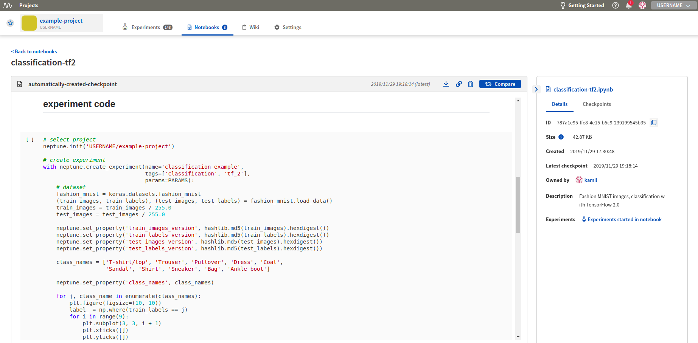

.. _integration-amazon-sagemaker:

Neptune-Amazon SageMaker Integration
====================================

You can use Neptune to track experiments that you run on Amazon SageMaker.

To set this up, perform the following steps:

1. Register to AWS.

    Follow the |instructions| to create your AWS account.

2. Create Lifecycle configuration.

    a. Go to SageMaker **Lifecycle configurations** and click **Create configuration**.

    .. image:: ../_static/images/integrations/ht-sagemaker-create_configuration.png
       :target: ../_static/images/integrations/ht-sagemaker-create_configuration.png
       :alt: image

    |

         You can choose whatever name you want -- just make sure to remember it.

    b. Modify the **Create Notebook** script to run it only once at the creation of your SageMaker Notebook instance.

    .. image:: ../_static/images/integrations/ht-sagemaker-config_specs.png
       :target: ../_static/images/integrations/ht-sagemaker-config_specs.png
       :alt: image

    |

    c. Copy and paste the script below to your **Create Notebook** tab.

        In the **PARAMETERS** section, choose in which environments you want to install neptune-client.

    .. code-block:: Bash

        #!/bin/bash

        set -e

        sudo -u ec2-user -i <<'EOF'

        # PARAMETERS
        ENVS=(
        python3
        pytorch_p36
        )

        # Install Neptune client library
        for env in $ENVS; do
            source /home/ec2-user/anaconda3/bin/activate $env
            pip install neptune-client
            source /home/ec2-user/anaconda3/bin/deactivate
        done

        # Install jupyter extension
        source /home/ec2-user/anaconda3/bin/activate JupyterSystemEnv
        pip install neptune-notebooks
        jupyter nbextension enable --py neptune-notebooks --sys-prefix
        jupyter labextension install neptune-notebooks
        source /home/ec2-user/anaconda3/bin/deactivate
        EOF

3. Create a Notebook instance.

    a. Go to SageMaker **Notebook instances** and click **Create notebook instance**.

    .. image:: ../_static/images/integrations/ht-sagemaker-create_instance.png
         :target: ../_static/images/integrations/ht-sagemaker-create_instance.png
         :alt: image

    |

    b. Type in an instance name and click **Additional configuration** to add the Lifecycle configuration you have just created.

    .. image:: ../_static/images/integrations/ht-sagemaker-create_instance_specs.png
         :target: ../_static/images/integrations/ht-sagemaker-create_instance_specs.png
         :alt: image

    |

    c. Click **Create notebook instance** at the bottom to start your instance.

    .. image:: ../_static/images/integrations/ht-sagemaker-create_notebook_run.png
         :target: ../_static/images/integrations/ht-sagemaker-create_notebook_run.png
         :alt: image

4. Start Notebook.

    If everything went well, your Amazon SageMaker instance should have *InService* status and you can open a Jupyter Notebook or JupyterLab
    with Neptune Notebook versioning enabled.

    .. image:: ../_static/images/integrations/ht-sagemaker-notebook_run.png
          :target: ../_static/images/integrations/ht-sagemaker-notebook_run.png
          :alt: image

**You can now version your Notebooks and track experiments in Amazon SageMaker with Neptune!**

    .. image:: ../_static/images/integrations/ht-sagemaker-notebook_runs_01.png
          :target: ../_static/images/integrations/ht-sagemaker-notebook_runs_01.png
          :alt: image

.. External links

.. |instructions| raw:: html

   <a href="https://aws.amazon.com/premiumsupport/knowledge-center/create-and-activate-aws-account/" target="_blank">instructions</a>