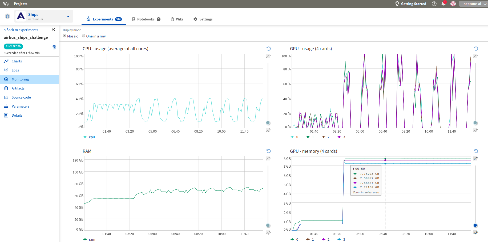

.. _integrations-aws-ec2:

Neptune-AWS EC2 Integration
===========================

You can run Neptune and track experiments that you run on AWS cloud.

To set this up, perform the following steps:

1. Register to AWS.

    Follow the |instructions| to create your AWS account.

2. Start an EC2 instance.

    Select ``ubuntu`` as your instance type and choose the worker type you need.
    You can use ``t2.micro`` just to test it out.

3. SSH to your instance.

    From the terminal, run:

    .. code-block:: Bash

        ssh -i /path_to_key/my_key.pem ubuntu@public_dns_name

    Make sure that you specify the correct key and public_dns_name.

4. Install Docker.

    a. Create a new file ``install_docker.sh``:

    .. code-block:: Bash

        nano install_docker.sh

    b. Copy the following commands to it:

    .. code-block:: Bash

        sudo apt-get update
        sudo apt-get install \
            apt-transport-https \
            ca-certificates \
            curl \
            gnupg-agent \
            software-properties-common
        curl -fsSL https://download.docker.com/linux/ubuntu/gpg | sudo apt-key add -
        sudo apt-key fingerprint 0EBFCD88
        sudo add-apt-repository \
        "deb [arch=amd64] https://download.docker.com/linux/ubuntu \
        $(lsb_release -cs) \
        stable"
        sudo apt-get update
        sudo apt-get install docker-ce docker-ce-cli containerd.io

    c. Run the installation script:

    .. code-block:: Bash

        source install_docker.sh

5. Define your secrets.

    a. Go to Neptune, `get your NEPTUNE_API_TOKEN <../python-api/how-to/organize.html#find-my-neptune-api-token>`_ and copy it to the clipboard.
    b. Create a password for your JupyterLab server.
    c. Set the following two secrets to your environment variables, ``NEPTUNE_API_TOKEN`` and ``JUPYTERLAB_PASSWORD``:

        .. code-block:: Bash

            export NEPTUNE_API_TOKEN='your_api_token=='
            export JUPYTERLAB_PASSWORD='difficult_password'

6. Build the Docker image.

    a. Create a new file ``Dockerfile``:

    .. code-block:: Bash

        nano Dockerfile

    b. Copy insights of the following Dockerfile to your newly created file. (If you want to run on a GPU, make sure to change your Dockerfile to start from Nvidia Docker images.)

    .. code-block:: Docker

        # Use a miniconda3 as base image
        FROM continuumio/miniconda3

        # Installation of jupyterlab and extensions
        RUN pip install jupyterlab==1.2.6  && \
            pip install jupyterlab-server==1.0.6  && \
            conda install -c conda-forge nodejs

        # Installation of Neptune and enabling neptune extension
        RUN pip install neptune-client  && \
            pip install neptune-notebooks  && \
            jupyter labextension install neptune-notebooks

        # Setting up Neptune API token as env variable
        ARG NEPTUNE_API_TOKEN
        ENV NEPTUNE_API_TOKEN=$NEPTUNE_API_TOKEN

        # Adding current directory to container
        ADD . /mnt/workdir
        WORKDIR /mnt/workdir

    c. Run the following command to build your Docker image:

    .. code-block:: Bash

        sudo docker build -t jupyterlab --build-arg NEPTUNE_API_TOKEN=$NEPTUNE_API_TOKEN .

7. Spin up a JupyterLab server with Docker:

    .. code-block:: Bash

        sudo docker run --rm -v `pwd`:/work/output -p 8888:8888 jupyterlab:latest \
        /opt/conda/bin/jupyter lab --allow-root --ip=0.0.0.0 --port=8888 --NotebookApp.token=$JUPYTERLAB_PASSWORD

8. Forward ports via SSH tunnel. Open a new terminal on your local machine and run:

    .. code-block:: Bash

        ssh -L 8888:localhost:8888 ubuntu@public_dns_name &

    Make sure that you specify the correct public_dns_name.

9. Open the JupyterLab server in your browser.

    Go to `localhost:8888`.

**Enjoy your JupyterLab server with Neptune!**

Neptune extensions are enabled and ``NEPTUNE_API_TOKEN`` is already in the environment variable so you can work with
Notebooks and run experiments with no problem.

.. External Links

.. |neptune-contrib| raw:: html

    <a href="/api-reference/neptunecontrib/index.html" target="_blank">neptune-contrib</a>

.. |instructions|  raw:: html

    <a href="https://aws.amazon.com/premiumsupport/knowledge-center/create-and-activate-aws-account" target="_blank">instructions</a>