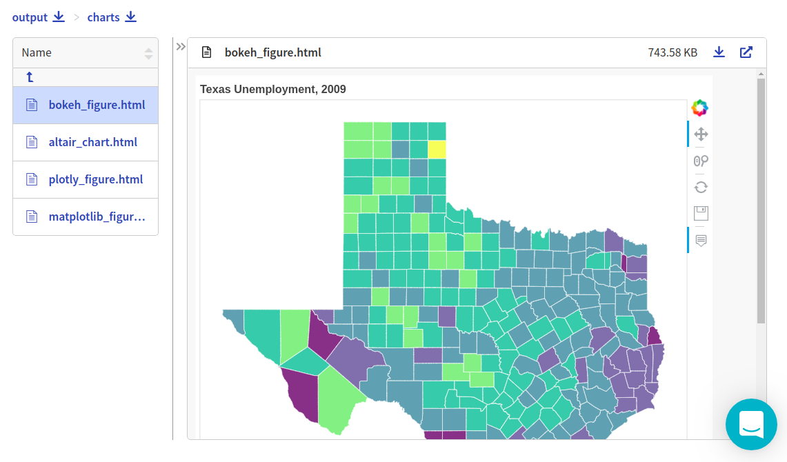
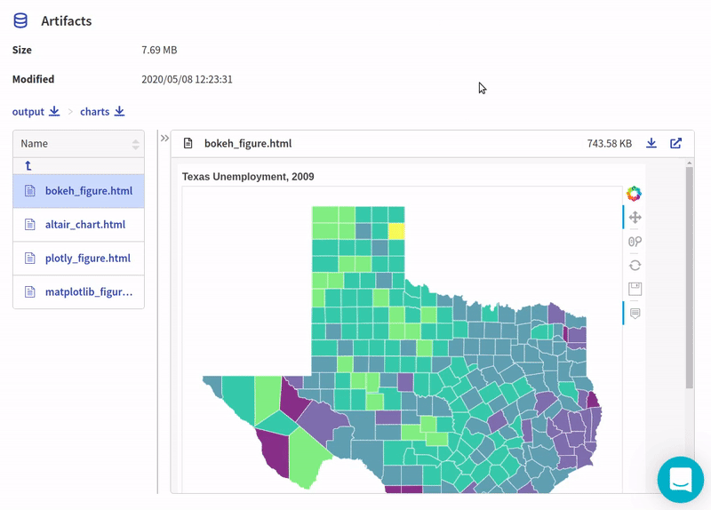

.. _integrations-bokeh:

Neptune-bokeh Integration
==============================

This integration lets you log interactive charts generated in |bokeh|, like confusion matrix or distribution, in Neptune.

Follow these steps:

0. Create an experiment:

   .. code-block::

        import neptune

        neptune.init(api_token='ANONYMOUS',project_qualified_name='shared/showroom')
        neptune.create_experiment()

1. Create and log bokeh charts into Neptune:

   .. code-block::

        from bokeh.models import LogColorMapper
        from bokeh.palettes import Viridis6 as palette
        from bokeh.plotting import figure
        from bokeh.sampledata.unemployment import data as unemployment
        from bokeh.sampledata.us_counties import data as counties

        palette = tuple(reversed(palette))

        counties = {
            code: county for code, county in counties.items() if county["state"] == "tx"
        }

        county_xs = [county["lons"] for county in counties.values()]
        county_ys = [county["lats"] for county in counties.values()]

        county_names = [county['name'] for county in counties.values()]
        county_rates = [unemployment[county_id] for county_id in counties]
        color_mapper = LogColorMapper(palette=palette)

        data=dict(
            x=county_xs,
            y=county_ys,
            name=county_names,
            rate=county_rates,
        )

        TOOLS = "pan,wheel_zoom,reset,hover,save"

        p = figure(
            title="Texas Unemployment, 2009", tools=TOOLS,
            x_axis_location=None, y_axis_location=None,
            tooltips=[
                ("Name", "@name"), ("Unemployment rate", "@rate%"), ("(Long, Lat)", "($x, $y)")
            ])
        p.grid.grid_line_color = None
        p.hover.point_policy = "follow_mouse"

        p.patches('x', 'y', source=data,
                  fill_color={'field': 'rate', 'transform': color_mapper},
                  fill_alpha=0.7, line_color="white", line_width=0.5)

   .. code-block::

        from neptunecontrib.api import log_chart

        log_chart(name='bokeh_figure', chart=p)

2. Explore the results in the Neptune dashboard:

Check out |this experiment| in the app.

.. External Links

.. |bokeh| raw:: html

    <a href="https://bokeh.org/" target="_blank">bokeh</a>

.. |this experiment| raw:: html

    <a href="https://ui.neptune.ai/o/shared/org/showroom/e/SHOW-978/artifacts?path=charts%2F&file=bokeh_figure.html" target="_blank">this experiment</a>
