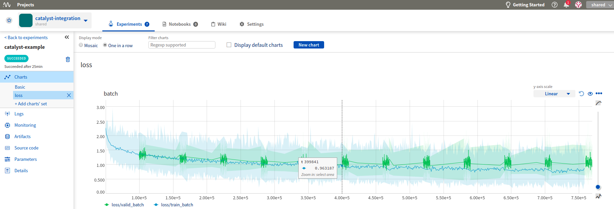

Log Catalyst metrics to neptune
=======================================

Prerequisites
-------------
Integration with |Catalyst| framework is introduced as a part of logging module so just need to have |neptune-client| installed.

.. code-block:: bash

    pip install neptune-client

Create the **SupervisedNeptuneRunner** and run .train
-----------------------------------------------------
.. code-block:: python3

    from catalyst.contrib.dl.runner.neptune import SupervisedNeptuneRunner
    runner = SupervisedNeptuneRunner()

    runner.train(
        model=model,
        criterion=criterion,
        optimizer=optimizer,
        logdir="./logs/neptune_example-1",
        loaders=loaders,
        num_epochs=10,
        verbose=True,
        monitoring_params={
            "init": {"project_qualified_name": "neptune-ai/catalyst-integration",
                     "api_token": None, # api key, keep in NEPTUNE_API_TOKEN
                    },
            "create_experiment": {"name": "catalyst-example", # experiment name
                                  "params": {"epoch_nr":10}, # immutable
                                  "properties": {"data_source": "cifar10"} , # mutable
                                  "tags": ["resnet", "no-augmentations"],
                                  "upload_source_files": ["**/*.py"] # grep-like
                                  }
                           })

Monitor your Catalyst training in Neptune
-----------------------------------------
Now you can watch your Catalyst model training in neptune!

.. image:: ../_static/images/catalyst/catalyst_monitoring.gif
   :target: ../_static/images/catalyst/catalyst_monitoring.gif
   :alt: Catalyst monitoring in neptune

Full Catalyst monitor script
----------------------------
Simply copy and paste it to ``catalyst_example.py`` and run.
Remember to change your credentials in the **runner.train()**:

.. code-block:: python3

    runner.train(
        ...
        monitoring_params={
            "init": {"project_qualified_name": "neptune-ai/catalyst-integration",
                     "api_token": None, # api key, keep in NEPTUNE_API_TOKEN
                     },
        ...
        )

.. code-block:: python3

    import collections
    import torch
    import torchvision
    import torchvision.transforms as transforms

    batch_size = 32
    num_workers = 4

    data_transform = transforms.Compose([
        transforms.ToTensor(),
        transforms.Normalize((0.5, 0.5, 0.5), (0.5, 0.5, 0.5))])

    loaders = collections.OrderedDict()

    trainset = torchvision.datasets.CIFAR10(
        root='./data', train=True,
        download=True, transform=data_transform)
    trainloader = torch.utils.data.DataLoader(
        trainset, batch_size=batch_size,
        shuffle=True, num_workers=num_workers)

    testset = torchvision.datasets.CIFAR10(
        root='./data', train=False,
        download=True, transform=data_transform)
    testloader = torch.utils.data.DataLoader(
        testset, batch_size=batch_size,
        shuffle=False, num_workers=num_workers)

    loaders["train"] = trainloader
    loaders["valid"] = testloader

    import torch
    import torch.nn as nn
    import torch.nn.functional as F

    class Net(nn.Module):
        def __init__(self):
            super().__init__()
            self.conv1 = nn.Conv2d(3, 6, 5)
            self.pool = nn.MaxPool2d(2, 2)
            self.conv2 = nn.Conv2d(6, 16, 5)
            self.fc1 = nn.Linear(16 * 5 * 5, 120)
            self.fc2 = nn.Linear(120, 84)
            self.fc3 = nn.Linear(84, 10)

        def forward(self, x):
            x = self.pool(F.relu(self.conv1(x)))
            x = self.pool(F.relu(self.conv2(x)))
            x = x.view(-1, 16 * 5 * 5)
            x = F.relu(self.fc1(x))
            x = F.relu(self.fc2(x))
            x = self.fc3(x)
            return x

    model = Net()
    criterion = nn.CrossEntropyLoss()
    optimizer = torch.optim.Adam(model.parameters())

    from catalyst.contrib.dl.runner.neptune import SupervisedNeptuneRunner
    runner = SupervisedNeptuneRunner()

    runner.train(
        model=model,
        criterion=criterion,
        optimizer=optimizer,
        loaders=loaders,
        logdir="./logs/neptune_example-1",
        num_epochs=10,
        verbose=True,
        monitoring_params={
            "init": {"project_qualified_name": "neptune-ai/catalyst-integration",
                     "api_token": None, # api key, keep in NEPTUNE_API_TOKEN
                    },
            "create_experiment": {"name": "catalyst-example", # experiment name
                                  "params": {"epoch_nr":10,
                                             "batch_size":32,
                                             "num_workers":4}, # immutable
                                  "properties": {"data_source": "cifar10"} , # mutable
                                  "tags": ["resnet", "no-augmentations"],
                                  "upload_source_files": ["catalyst_example.py"] # grep-like
                                   }
        })

.. External links

.. |Catalyst| raw:: html

    <a href="https://github.com/catalyst-team/catalyst" target="_blank">Catalyst</a>

.. |neptune-client| raw:: html

    <a href="https://github.com/neptune-ai/neptune-client" target="_blank">neptune-client</a>