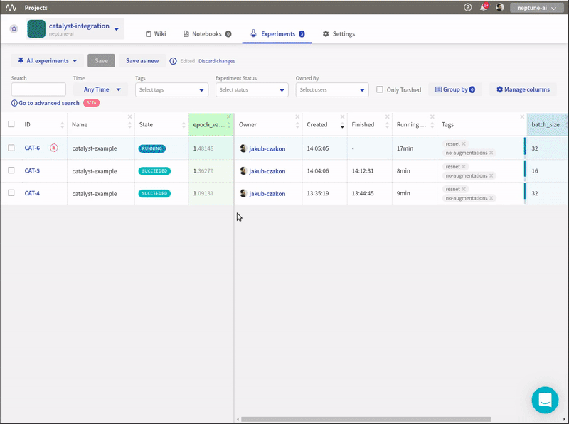

.. _integrations-catalyst:

Neptune-Catalyst Integration
============================

The integration enables you to log |Catalyst| metrics to Neptune.

.. image:: ../_static/images/integrations/catalyst_neptuneai.png
   :target: ../_static/images/integrations/catalyst_neptuneai.png
   :alt: Catalyst neptune.ai integration

Requirements
------------
Integration with the Catalyst framework is enabled as part of the Neptune logging module, so all you need is to have |neptune-client| installed.

.. code-block:: bash

    pip install neptune-client

Create the **NeptuneLogger**
----------------------------
.. code-block:: python3

    from catalyst.contrib.dl.callbacks.neptune import NeptuneLogger

    neptune_logger = NeptuneLogger(
                        api_token='ANONYMOUS',  # your Neptune token
                        project_name='shared/catalyst-integration',
                        offline_mode=False,  # turn off neptune for debug
                        name='catalyst-example',
                        params={'epoch_nr': 10},  # your hyperparameters, immutable
                        properties={'data_source': 'cifar10'},  # mutable
                        tags=['resnet', 'no-augmentations'],  # tags
                        upload_source_files=['*.py'],  # files to save, grep-like
                        )

Pass the **neptune_logger** to the **runner.train** callbacks argument
----------------------------------------------------------------------
.. code-block:: python3

    from catalyst.dl import SupervisedRunner

    runner = SupervisedRunner()
    runner.train(
        model=model,
        criterion=criterion,
        optimizer=optimizer,
        loaders=loaders,
        logdir=logdir,
        num_epochs=num_epochs,
        verbose=True,
        callbacks=[neptune_logger]
         )

Monitor your Catalyst training in Neptune
-----------------------------------------
Now you can watch your Catalyst model training in Neptune!

Check out this |example experiment|.

Full Catalyst monitor script
----------------------------
Simply copy and paste it to ``catalyst_example.py`` and run.
Remember to change your credentials in the ``NeptuneLogger``:

.. code-block:: python3

    neptune_logger = NeptuneLogger(
                        'api_token': 'ANONYMOUS', # your Neptune token
                        'project_name': 'shared/catalyst-integration',
                        ...
                         )

.. code-block:: python3

    import collections
    import torch
    import torchvision
    import torchvision.transforms as transforms

    batch_size = 16
    num_workers = 4
    num_epochs =12
    logdir = 'exps'

    data_transform = transforms.Compose([
        transforms.ToTensor(),
        transforms.Normalize((0.5, 0.5, 0.5), (0.5, 0.5, 0.5))])

    loaders = collections.OrderedDict()

    trainset = torchvision.datasets.CIFAR10(
        root='./data', train=True,
        download=True, transform=data_transform)
    trainloader = torch.utils.data.DataLoader(
        trainset, batch_size=batch_size,
        shuffle=True, num_workers=num_workers)

    testset = torchvision.datasets.CIFAR10(
        root='./data', train=False,
        download=True, transform=data_transform)
    testloader = torch.utils.data.DataLoader(
        testset, batch_size=batch_size,
        shuffle=False, num_workers=num_workers)

    loaders['train'] = trainloader
    loaders['valid'] = testloader

    import torch
    import torch.nn as nn
    import torch.nn.functional as F

    class Net(nn.Module):
        def __init__(self):
            super().__init__()
            self.conv1 = nn.Conv2d(3, 6, 5)
            self.pool = nn.MaxPool2d(2, 2)
            self.conv2 = nn.Conv2d(6, 16, 5)
            self.fc1 = nn.Linear(16 * 5 * 5, 120)
            self.fc2 = nn.Linear(120, 84)
            self.fc3 = nn.Linear(84, 10)

        def forward(self, x):
            x = self.pool(F.relu(self.conv1(x)))
            x = self.pool(F.relu(self.conv2(x)))
            x = x.view(-1, 16 * 5 * 5)
            x = F.relu(self.fc1(x))
            x = F.relu(self.fc2(x))
            x = self.fc3(x)
            return x

    model = Net()
    criterion = nn.CrossEntropyLoss()
    optimizer = torch.optim.Adam(model.parameters())

    from catalyst.contrib.dl.callbacks.neptune import NeptuneLogger

    neptune_logger = NeptuneLogger(
        api_token='ANONYMOUS',  # your Neptune token
        project_name='shared/catalyst-integration',
        offline_mode=False,  # turn off neptune for debug
        name='catalyst-example',
        params={'batch_size': batch_size,
                'epoch_nr': num_epochs,
                'num_workers': num_workers},  # your hyperparameters, immutable
        properties={'data_source': 'cifar10'},  # mutable
        tags=['resnet', 'no-augmentations'],  # tags
        upload_source_files=['catalyst_example.py'],  # files to save, grep-like
    )

    from catalyst.dl import SupervisedRunner

    runner = SupervisedRunner()
    runner.train(
        model=model,
        criterion=criterion,
        optimizer=optimizer,
        loaders=loaders,
        logdir=logdir,
        num_epochs=num_epochs,
        verbose=True,
        callbacks=[neptune_logger]
    )

.. External links

.. |Catalyst| raw:: html

    <a href="https://github.com/catalyst-team/catalyst" target="_blank">Catalyst</a>

.. |example experiment| raw:: html

    <a href="https://ui.neptune.ai/o/shared/org/catalyst-integration/e/CAT-13/charts" target="_blank">example experiment</a>

.. |neptune-client| raw:: html

    <a href="https://github.com/neptune-ai/neptune-client" target="_blank">neptune-client</a>
