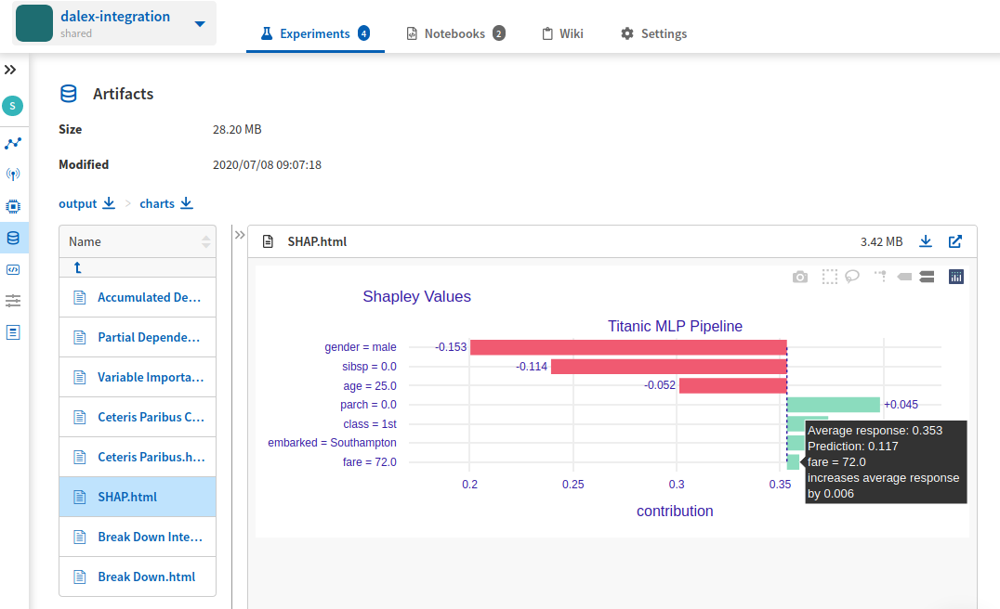
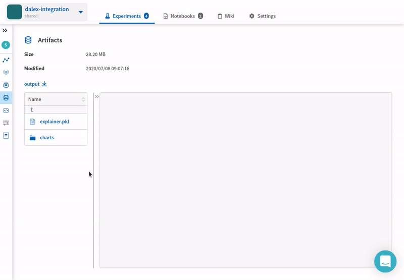

Dalex Integration
=================

This integration enables you to log |DALEX| global and local explanations as well as the ``dalex.expainer`` object to Neptune.

Requirements
------------
To use Neptune + DALEX integration you need to have |neptune-client| and |neptune-contrib| installed.

.. code-block:: bash

    pip install neptune-client neptune-contrib

You also need to have |DALEX| python client installed.

.. code-block:: bash

    pip install dalex

.. note:: dalex client is available for python versions 3.6 and later.

Initialize Neptune and create an experiment
-------------------------------------------

.. code-block:: python3

    import neptune

    neptune.init(api_token='ANONYMOUS',
                 project_qualified_name='shared/dalex-integration')

    neptune.create_experiment(name='logging explanations')

Train model and create explainer
--------------------------------

.. code-block:: python3

    ...
    clf.fit(X, y)
    expl = dx.Explainer(clf, X, y, label="Titanic MLP Pipeline")

Log global explanations
------------------------
Explainer object contains all the information to create global explanation plots so you can simply log that to Neptune
and charts will be created automatically.

If you are dealing with categorical variables you need to pass the column names explicitly.

The following charts can be logged to Neptune:

* variable importance
* partial dependence if `numerical_features` are specified
* accumulated dependence if `categorical_features` are specified

.. code-block:: python3

    import neptunecontrib.api import log_global_explanations

    log_global_explanations(expl, categorical_features=["gender", "class"], numerical_features=["age", "fare"])

Log local explanations
----------------------

To log local explanations you need to pass the observation and the explainer object.

The following charts can be logged to Neptune:

* break down
* break down with interactions
* shap
* ceteris paribus
* ceteris paribus for categorical variables

.. code-block:: python3

    import neptunecontrib.api import log_local_explanations

    new_observation = pd.DataFrame({'gender': ['male'],
                                    'age': [25],
                                    'class': ['1st'],
                                    'embarked': ['Southampton'],
                                    'fare': [72],
                                    'sibsp': [0],
                                    'parch': 0},
                                    index=['John'])

    log_local_explanations(expl, new_observation)

Log explainer object
--------------------
You can also log the explainer object in case you may need it later.

.. code-block:: python3

    import neptunecontrib.api import log_explainer

    log_explainer('explainer.pkl', expl)

See explanations in Neptune
---------------------------
Now you can go to the experiment ``Artifacts`` section and see your interactive DALEX explanations.

Check out this |example experiment|.

Full script
-----------

.. code-block:: python3

    import dalex as dx
    import neptune
    import pandas as pd
    from sklearn.compose import ColumnTransformer
    from sklearn.impute import SimpleImputer
    from sklearn.neural_network import MLPClassifier
    from sklearn.pipeline import Pipeline
    from sklearn.preprocessing import StandardScaler, OneHotEncoder

    from neptunecontrib.api import log_explainer, log_local_explanations, log_global_explanations

    project = neptune.init(project_qualified_name='shared/dalex-integration',
                           api_token='ANONYMOUS')

    data = dx.datasets.load_titanic()

    X = data.drop(columns='survived')
    y = data.survived

    numerical_transformer = Pipeline(
        steps=[
            ('imputer', SimpleImputer(strategy='median')),
            ('scaler', StandardScaler())
        ]
    )

    categorical_transformer = Pipeline(
        steps=[
            ('imputer', SimpleImputer(strategy='constant', fill_value='missing')),
            ('onehot', OneHotEncoder(handle_unknown='ignore'))
        ]
    )

    preprocessor = ColumnTransformer(
        transformers=[
            ('num', numerical_transformer, ['age', 'fare', 'sibsp', 'parch']),
            ('cat', categorical_transformer, ['gender', 'class', 'embarked'])
        ]
    )

    classifier = MLPClassifier(hidden_layer_sizes=(100, 200, 20), max_iter=400, random_state=0)

    clf = Pipeline(steps=[('preprocessor', preprocessor),
                          ('classifier', classifier)])

    neptune.create_experiment('explanations')

    clf.fit(X, y)

    new_observation = pd.DataFrame({'gender': ['male'],
                                    'age': [25],
                                    'class': ['1st'],
                                    'embarked': ['Southampton'],
                                    'fare': [72],
                                    'sibsp': [0],
                                    'parch': 0},
                                   index=['John'])

    expl = dx.Explainer(clf, X, y, label="Titanic MLP Pipeline")

    log_local_explanations(expl, new_observation)
    log_global_explanations(expl, categorical_features=["gender", "class"], numerical_features=["age", "fare"])
    log_explainer('explainer.pkl', expl)

.. External links

.. |DALEX| raw:: html

    <a href="https://github.com/ModelOriented/DALEX" target="_blank">DALEX</a>

.. |example experiment| raw:: html

    <a href="https://ui.neptune.ai/shared/dalex-integration/e/DAL-83/artifacts?path=charts%2F&file=SHAP.html" target="_blank">example experiment</a>

.. |neptune-client| raw:: html

    <a href="https://github.com/neptune-ai/neptune-client" target="_blank">neptune-client</a>

.. |neptune-contrib| raw:: html

    <a href="https://github.com/neptune-ai/neptune-contrib" target="_blank">neptune-contrib</a>
