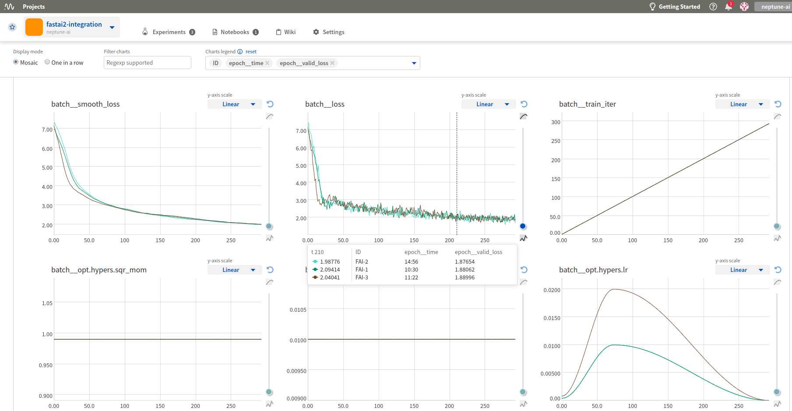
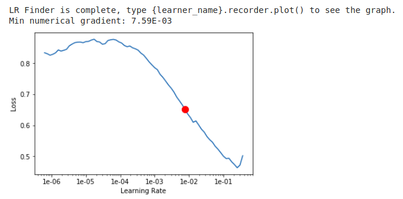
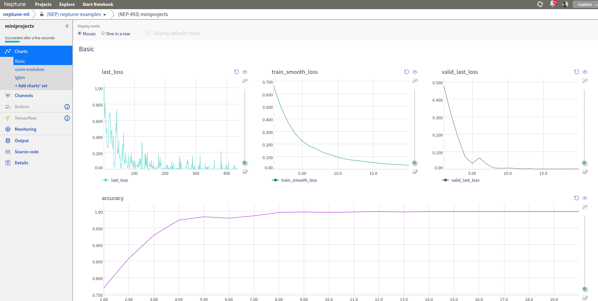

Log fast.ai metrics to neptune
==============================

Prerequisites
-------------
Integration with |fast-ai| framework is introduced as a part of |neptune-contrib| - open source project curated by Neptune team.

Please install it before you continue. Check the `docs <neptune-contrib.html>`_ if you need more info.

.. code-block:: bash

    pip install neptune-contrib
    pip install neptune-contrib[monitoring]

Create your databunch
---------------------
.. code-block:: python3

    from fastai.vision import *
    path = untar_data(URLs.MNIST_TINY)

    data = ImageDataBunch.from_folder(path, ds_tfms=(rand_pad(2, 28), []), bs=64)
    data.normalize(imagenet_stats)

Create the **learner** find your optimal learning rate and plot it
------------------------------------------------------------------
.. code-block:: python3

    learn = cnn_learner(data, models.resnet18, metrics=accuracy)
    learn.lr_find()
    learn.recorder.plot()

Create an experiment and add **neptune_monitor** callback
---------------------------------------------------------
.. code-block:: python3

    import neptune
    from neptunecontrib.monitoring.fastai import NeptuneMonitor

    neptune.init(project_qualified_name='USER_NAME/PROJECT_NAME')

    with neptune.create_experiment(params={'lr': 1e-2}):
        learn = cnn_learner(data, models.resnet18, metrics=accuracy,
                            callback_fns=[NeptuneMonitor])
        learn.fit_one_cycle(20, 1e-2)

Monitor your fast.ai training in Neptune
----------------------------------------
Now you can watch your fast.ai model training in neptune!

Full fast.ai monitor script
---------------------------
Simply copy and paste it to ``fastai_example.py`` and run.

.. code-block:: python3

    from fastai.vision import *
    import neptune
    from neptunecontrib.monitoring.fastai import NeptuneMonitor

    neptune.init(project_qualified_name='USER_NAME/PROJECT_NAME')

    path = untar_data(URLs.MNIST_TINY)

    data = ImageDataBunch.from_folder(path, ds_tfms=(rand_pad(2, 28), []), bs=64)
    data.normalize(imagenet_stats)

    learn = cnn_learner(data, models.resnet18, metrics=accuracy)
    learn.lr_find()
    learn.recorder.plot()

    with neptune.create_experiment(params={'lr': 1e-2}):
        learn = cnn_learner(data, models.resnet18, metrics=accuracy,
                            callback_fns=[NeptuneMonitor])
        learn.fit_one_cycle(20, 1e-2)

.. External links

.. |fast-ai| raw:: html

    <a href="https://github.com/fastai/fastai" target="_blank">fast.ai</a>

.. |neptune-contrib| raw:: html

    <a href="https://github.com/neptune-ai/neptune-contrib" target="_blank">neptune-contrib</a>
