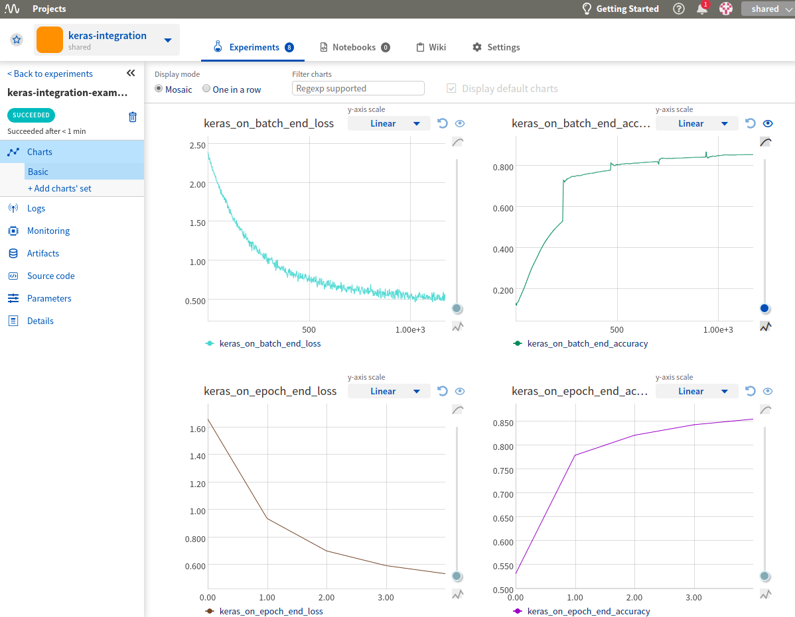
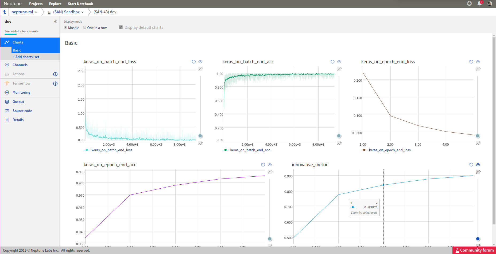
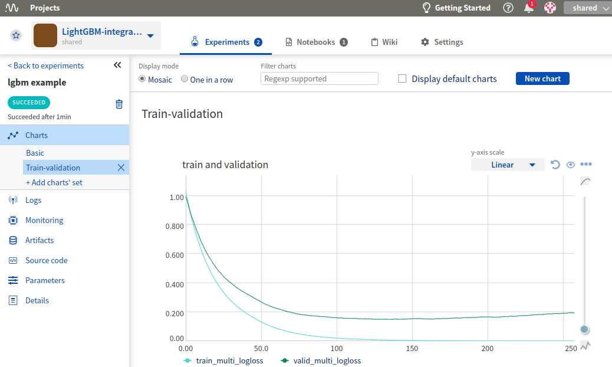
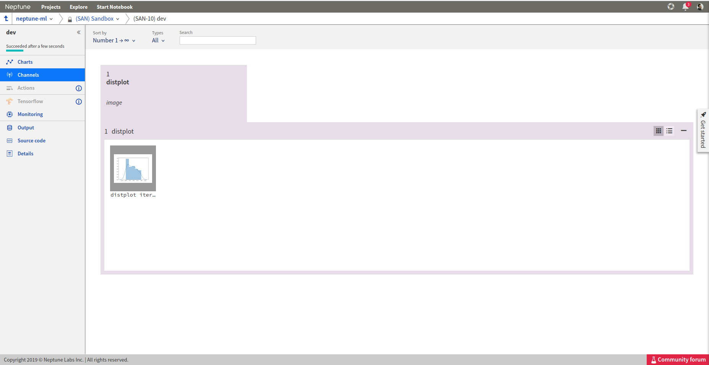
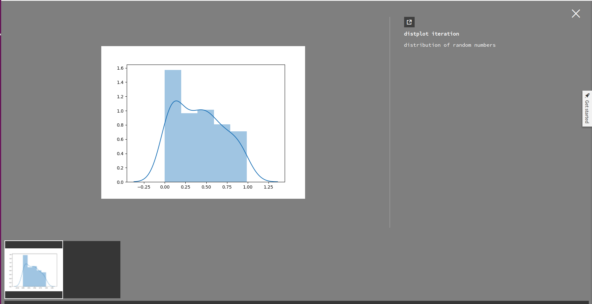

Keras
=====

Log keras metrics
-----------------
I have a training script written in `keras <https://keras.io>`_. How do I adjust it to log metrics to Neptune?

Solution
^^^^^^^^
**Step 1**

Say your training script looks like this:

.. code-block::

   import keras
   from keras import backend as K

   mnist = keras.datasets.mnist
   (x_train, y_train),(x_test, y_test) = mnist.load_data()
   x_train, x_test = x_train / 255.0, x_test / 255.0

   model = keras.models.Sequential([
     keras.layers.Flatten(),
     keras.layers.Dense(512, activation=K.relu),
     keras.layers.Dropout(0.2),
     keras.layers.Dense(10, activation=K.softmax)
   ])
   model.compile(optimizer='adam',
                 loss='sparse_categorical_crossentropy',
                 metrics=['accuracy'])

   model.fit(x_train, y_train, epochs=5)

**Step 2**

Now let's use Keras Callback

.. code-block::

   from keras.callbacks import Callback

   class NeptuneMonitor(Callback):
       def on_epoch_end(self, epoch, logs={}):
           innovative_metric = logs['acc'] - 2 * logs['loss']
           neptune.send_metric('innovative_metric', epoch, innovative_metric)

**Step 3**

Instantiate it and add it to your callbacks list:

.. code-block::

   with neptune.create_experiment():
       neptune_monitor = NeptuneMonitor()
       model.fit(x_train, y_train, epochs=5, callbacks=[neptune_monitor])

All your metrics are now logged to Neptune:

PyTorch
=======

Log PyTorch metrics
-------------------
I have a training script written in `PyTorch <https://pytorch.org>`_. How do I adjust it to log metrics to Neptune?

.. image:: ../_static/images/others/pytorch_neptuneml.png
   :target: ../_static/images/others/pytorch_neptuneml.png
   :alt: Pytorch neptune.ml integration

Solution
^^^^^^^^
Say your training script looks like this:

.. code-block::

   import torch
   import torch.nn as nn
   import torch.nn.functional as F
   import torch.optim as optim
   from torchvision import datasets, transforms

   DEVICE = torch.device("cuda" if torch.cuda.is_available() else "cpu")
   ITERATIONS = 10000

   class Net(nn.Module):
       def __init__(self):
           super(Net, self).__init__()
           self.conv1 = nn.Conv2d(1, 20, 5, 1)
           self.conv2 = nn.Conv2d(20, 50, 5, 1)
           self.fc1 = nn.Linear(4*4*50, 500)
           self.fc2 = nn.Linear(500, 10)

       def forward(self, x):
           x = F.relu(self.conv1(x))
           x = F.max_pool2d(x, 2, 2)
           x = F.relu(self.conv2(x))
           x = F.max_pool2d(x, 2, 2)
           x = x.view(-1, 4*4*50)
           x = F.relu(self.fc1(x))
           x = self.fc2(x)
           return F.log_softmax(x, dim=1)

   train_loader = torch.utils.data.DataLoader(
       datasets.MNIST('../data',
                      train=True,
                      download=True,
                      transform=transforms.Compose([
                          transforms.ToTensor(),
                          transforms.Normalize((0.1307,), (0.3081,))])
                      ),
       batch_size=64,
       shuffle=True)

   model = Net().to(DEVICE)

   optimizer = optim.SGD(model.parameters(), lr=0.01, momentum=0.9)

   for batch_idx, (data, target) in enumerate(train_loader):
       data, target = data.to(DEVICE), target.to(DEVICE)
       optimizer.zero_grad()
       output = model(data)
       loss = F.nll_loss(output, target)
       loss.backward()
       optimizer.step()

       if batch_idx == ITERATIONS:
           break

Add a snippet to the training loop, that sends your loss or metric to Neptune:

.. code-block::

   import neptune

   neptune.init('shared/onboarding')
   neptune.create_experiment()
   ...
   for batch_idx, (data, target) in enumerate(train_loader):
       ...
       neptune.send_metric('batch_loss', batch_idx, loss.data.cpu().numpy())

Your loss is now logged to Neptune:

.. image:: ../_static/images/how-to/ht-log-pytorch-1.png
   :target: ../_static/images/how-to/ht-log-pytorch-1.png
   :alt: image

LightGBM
========

Log LightGBM metrics
--------------------
I have a training script written in `LightGBM <https://lightgbm.readthedocs.io>`_. How do I adjust it to log metrics to Neptune?

Solution
^^^^^^^^
Say your training script looks like this:

.. code-block::

   import lightgbm as lgb
   from sklearn.model_selection import train_test_split
   from sklearn.datasets import load_wine

   data = load_wine()

   X_train, X_test, y_train, y_test = train_test_split(data.data, data.target, test_size=0.1)
   lgb_train = lgb.Dataset(X_train, y_train)
   lgb_eval = lgb.Dataset(X_test, y_test, reference=lgb_train)

   params = {
       'boosting_type': 'gbdt',
       'objective': 'multiclass',
       'num_class': 3,
       'num_leaves': 31,
       'learning_rate': 0.05,
       'feature_fraction': 0.9,
   }

   gbm = lgb.train(params,
                   lgb_train,
                   num_boost_round=500,
                   valid_sets=[lgb_train, lgb_eval],
                   valid_names=['train','valid'],
                   )

Now, you need to use lightGBM callbacks to pass log metrics to Neptune:

**Step 1**

Take this callback:

.. code-block::

   import neptune

   neptune.init('shared/onboarding')
   neptune.create_experiment()

   def neptune_monitor():
       def callback(env):
           for name, loss_name, loss_value, _ in env.evaluation_result_list:
               neptune.send_metric('{}_{}'.format(name, loss_name), x=env.iteration, y=loss_value)
       return callback

**Step 2**

Pass it to ``lgb.train`` object via ``callbacks`` parameter:

.. code-block::

   gbm = lgb.train(params,
                   lgb_train,
                   num_boost_round=500,
                   valid_sets=[lgb_train, lgb_eval],
                   valid_names=['train','valid'],
                   callbacks=[neptune_monitor()],
                   )

All your metrics are now logged to Neptune

.. image:: ../_static/images/how-to/ht-log-lightgbm-1.png
   :target: ../_static/images/how-to/ht-log-lightgbm-1.png
   :alt: image

Matplotlib
==========

Log matplotlib figure to Neptune
--------------------------------
How to log charts generated in `matplotlib <https://matplotlib.org/>`_, like confusion matrix or distribution in Neptune?

.. image:: ../_static/images/others/matplotlib_neptuneml.png
   :target: ../_static/images/others/matplotlib_neptuneml.png
   :alt: matplotlib neptune.ml integration

Solution
^^^^^^^^
**Step 1**

Neptune-client supports logging matplotlib figures. Examples:

.. code-block::

    # matplotlib figure example 1
    from matplotlib import pyplot
    pyplot.plot([1, 2, 3, 4])
    pyplot.ylabel('some numbers')
    experiment.log_image('plots', plt.gcf())

.. code-block::

    # matplotlib figure example 2
    from matplotlib import pyplot
    import numpy

    numpy.random.seed(19680801)
    data = numpy.random.randn(2, 100)

    figure, axs = pyplot.subplots(2, 2, figsize=(5, 5))
    axs[0, 0].hist(data[0])
    axs[1, 0].scatter(data[0], data[1])
    axs[0, 1].plot(data[0], data[1])
    axs[1, 1].hist2d(data[0], data[1])

    experiment.log_image('diagrams', figure)

**Step 2**

Explore it in the browser:

