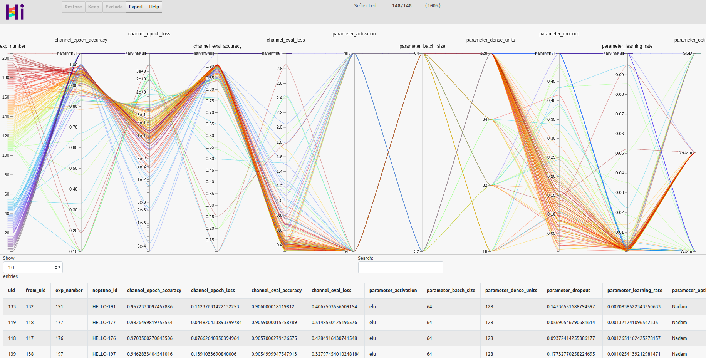

Use parallel coordinates plot to analyse multiple experiments
=============================================================

.. image:: ../_static/images/hiplot/example_hiplot_0.png
   :target: ../_static/images/hiplot/example_hiplot_0.png
   :alt: parallel plot header

Parallel coordinates plot is a powerful tool that allows AI researchers analyse correlations
and patterns between experiments' metrics, parameters and properties.

Parallel plots are especially useful when inspecting hyper-parameter optimization jobs
that usually consists of hundreds of experiments. |Neptune| allows you to very easily generate such plot in a Notebook
or Python script.

Visualization is build with |HiPlot|, lightweight interactive visualization tool published by
the Facebook AI group.

Prerequisites
-------------
This feature makes use of the HiPlot library and is implemented as a part of the |neptune-contrib|.
Make sure that you have all dependencies installed:

* neptune-client
* neptune-contrib[viz]
* hiplot

Use this command to install all dependencies:

.. code-block:: bash

    pip install neptune-client neptune-contrib[viz] hiplot

Generate parallel coordinates plot
----------------------------------

.. note::
    Make sure you have your project set: ``neptune.init('USERNAME/example-project')``

.. code-block:: python3

    import neptune

    from neptunecontrib.viz.parallel_coordinates_plot import make_parallel_coordinates_plot

    neptune.init('USERNAME/example-project')

    make_parallel_coordinates_plot(html_file_path='my_visual.html',
                                   metrics= ['epoch_accuracy', 'epoch_loss', 'eval_accuracy', 'eval_loss'],
                                   params = ['activation', 'batch_size', 'dense_units', 'dropout', 'learning_rate', 'optimizer'],
                                   tag='optuna')

Customize visualization to your need
------------------------------------

#. Set axes order,
#. Drop unused axes,
#. Apply coloring to axis,
#. Sort by clicking on axis,
#. Select range in axis & slide.

.. image:: ../_static/images/hiplot/example_hiplot_1.gif
   :target: ../_static/images/hiplot/example_hiplot_1.gif
   :alt: parallel plot customization options

Inspect experiments lineage
---------------------------

#. Right-click on the axis name,
#. Use options 'Set as X axis' and 'Set as Y axis' (in the menu XY group at the bottom),
#. When both are selected, you will see lineage plot below parallel coordinates plot.

.. image:: ../_static/images/hiplot/example_hiplot_2.gif
   :target: ../_static/images/hiplot/example_hiplot_2.gif
   :alt: experiments lineage

Learn more
----------

#. Learn more about the |parallel-plot|,
#. Check this |notebook-example| for ready to use example.

.. External links

.. |Neptune| raw:: html

    <a href="https://neptune.ai/" target="_blank">Neptune</a>

.. |HiPlot| raw:: html

    <a href="https://facebookresearch.github.io/hiplot/index.html" target="_blank">HiPlot</a>

.. |neptune-contrib| raw:: html

    <a href="https://docs.neptune.ai/integrations/neptune-contrib.html" target="_blank">neptune-contrib</a>

.. |parallel-plot| raw:: html

    <a href="https://neptune-contrib.readthedocs.io/user_guide/viz/parallel_coordinates_plot.html" target="_blank">parallel coordinates plot</a>

.. |notebook-example| raw:: html

    <a href="https://ui.neptune.ai/o/USERNAME/org/example-project/n/HPO-analysis-with-HiPlot-82bf08ed-c442-4d62-8f41-bc39fcc6c272/d1d4ad24-25f5-4286-974c-c0b08450d5e1" target="_blank">Example notebook</a>
