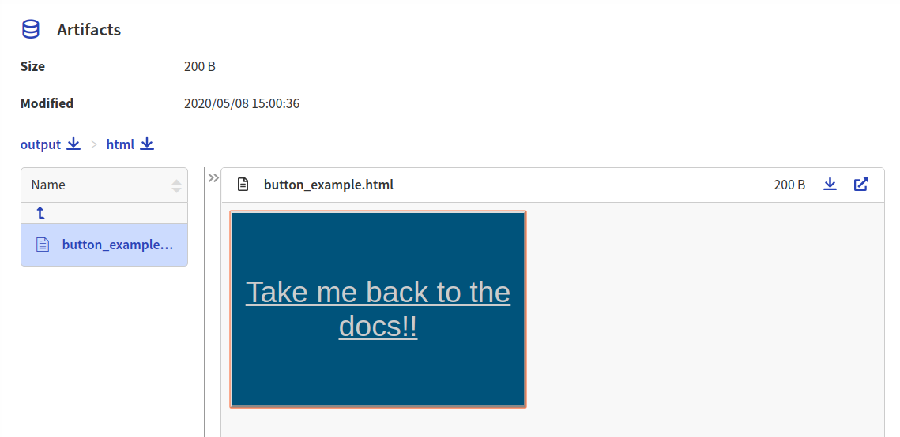
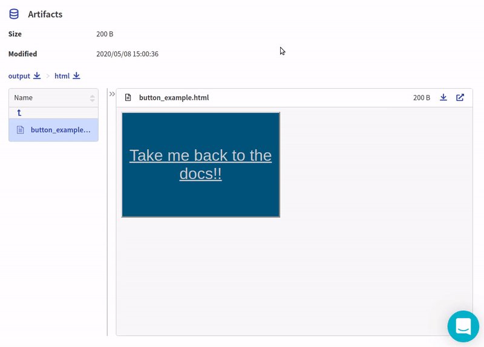

.. _integration-html:

Neptune-HTML Integration
==============================

This integration lets you log any standalone HTML objects to Neptune.

Follow these steps:

0. Create an experiment:

   .. code-block::

        import neptune

        neptune.init(api_token='ANONYMOUS',project_qualified_name='shared/showroom')
        neptune.create_experiment()

1. Create and log html object into Neptune:

   .. code-block::

        html = "<button type='button', style='background-color:#005879; width:300px; height:200px; font-size:30px'> \
            <a style='color: #ccc', href='https://docs.neptune.ai'> Take me back to the docs!!<a> </button>"

   .. code-block::

        from neptunecontrib.api import log_html

        log_html('button_example', html)

2. Explore the results in the Neptune dashboard:

Check out |this experiment| in the app.

.. External Links

.. |this experiment| raw:: html

    <a href="https://ui.neptune.ai/o/shared/org/showroom/e/SHOW-988/artifacts?path=html%2F&file=button_example.html" target="_blank">this experiment</a>
