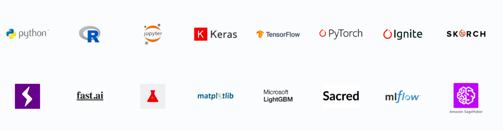

.. _integrations-index:

Integrations
============

Neptune comes with 25+ integrations with Python libraries popular in machine learning, deep learning and reinforcement learning.

How integrations work?
----------------------
Integrations are written using |neptune-client| and provide a convenient way to jump-start working with Neptune and a library that you are using. There is no need to integrate your code manually using neptune-client (it's easy though).

Each integration, that is installation, scope and usage example are explained in detail in the documentation (see: :ref:`PyTorch Lightning <integrations-pytorch-lightning>` for example).

.. note::

    You can always :ref:`use neptune-client to log data to experiments <guides-logging-and-managing-experiment-results>` .
    If you need more control or explicit logging, you can always use it (all integrations use it anyway).

.. _list-of-all-integrations:

List of all integrations
^^^^^^^^^^^^^^^^^^^^^^^^
* :ref:`Altair <integrations-altair>`
* :ref:`Bokeh <integrations-bokeh>`
* :ref:`Catalyst <integrations-catalyst>`
* :ref:`Dalex <integrations-dalex>`
* :ref:`Fastai <integrations-fastai>`
* :ref:`HiPlot <integrations-hiplot>`
* :ref:`HTML <integrations-html>`
* :ref:`TensorFlow / Keras <integrations-tensorflow-keras>`
* :ref:`Lightgbm <integrations-lightgbm>`
* :ref:`Matplotlib <integrations-matplotlib>`
* :ref:`MLflow <integrations-mlflow>`
* :ref:`Optuna <integrations-optuna>`
* :ref:`Pandas <integrations-pandas>`
* :ref:`Plotly <integrations-plotly>`
* :ref:`Pytorch <integrations-pytorch>`
* :ref:`Pytorch Ignite <integrations-pytorch-ignite>`
* :ref:`Pytorch Lightning <integrations-pytorch-lightning>`
* :ref:`Sacred <integrations-sacred>`
* :ref:`Scikit-learn <integrations-sklearn>`
* :ref:`Scikit Optimize <integrations-scikit-optimize>`
* :ref:`Skorch <integrations-skorch>`
* :ref:`Telegram <integrations-telegram>`
* :ref:`Tensorboard <integrations-tensorboard>`
* :ref:`XGBoost <integrations-xgboost>`
* :ref:`Ray/Tune <list-of-all-integrations>` *coming soon...*
* :ref:`Hydra <list-of-all-integrations>` *coming soon...*
* :ref:`ACME <list-of-all-integrations>` *coming soon...*
* :ref:`Spinning up <list-of-all-integrations>` *coming soon...*
* :ref:`Stable baselines <list-of-all-integrations>` *coming soon...*

My library is not here. What now?
---------------------------------
There are two common paths:

#. You can always use  |neptune-client| , our open source Python library for logging all kinds of data and metadata to experiments.
#. Contact us directly via mail (contact@neptune.ai) or chat (that little thing in the lower right corner) to discuss what you need and how we can deliver it.

.. toctree::
   :hidden:
   :maxdepth: 2

   Deep learning frameworks <deep_learning_frameworks.rst>
   Machine learning frameworks <machine_learning_frameworks.rst>
   Hyperparmeter optimization frameworks <hyperparams_opt_frameworks.rst>
   Visualization libraries <visualization_tools.rst>
   Experiment tracking frameworks <experiment_tracking_frmwks.rst>
   Other integrations <other-integrations.rst>

.. External links

.. |neptune-client| raw:: html

    <a href="/api-reference/neptune/index.html" target="_blank">neptune-client</a>
