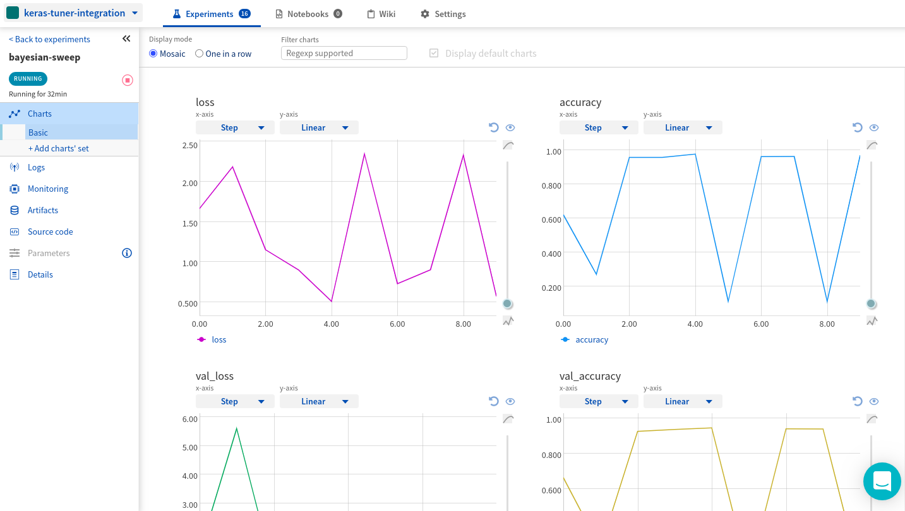
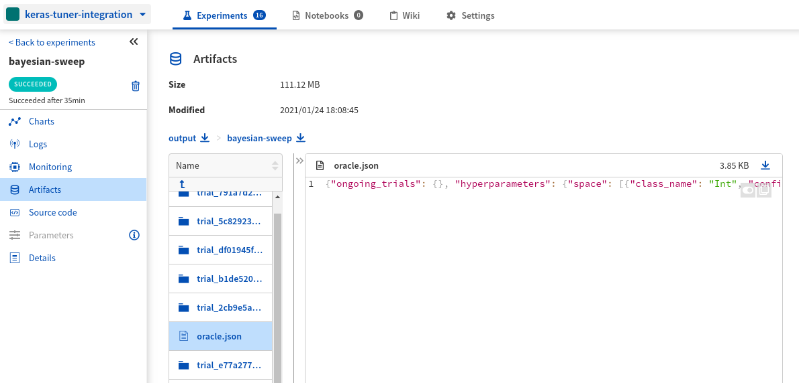

.. _integrations-keras-tuner:

Neptune-Keras Tuner Integration
===============================

.. warning::
    This is the documentation of the legacy client which is under the maintenance support only.
    No new updates will be made to this documentation and legacy client.

    It is **highly recommended** to go the to `new documentation <https://docs.neptune.ai/>`_ for the latest documentation and full support of the new, improved Neptune.

    `Read new documentation <https://docs.neptune.ai/>`_

|Run on Colab|

What will you get with this integration?
----------------------------------------

|Keras Tuner-tour|

|Keras Tuner| is an open source hyperparameter optimization framework enables hyperparameter search on Keras Models.

With Neptune integration, you can:

* see charts of logged metrics for every trial
* see the parameters tried at every trial,
* see hardware consumption during search,
* log the best parameters after training,
* log hyperparameter search space
* log Keras Tuner project directory with information for all the trials
   
.. note::

    This integration is tested with ``keras-tuner==1.0.2``, ``neptune-client==0.4.133``, and ``neptune-contrib==0.26.0``.

.. _keras-tuner-quickstart:

Quickstart
----------
This quickstart will show you how to:

* Install the necessary neptune packages
* Connect Neptune to your Keras Tuner hyperparameter search code and create the first experiment
* Log metrics, parameters, and artifacts from your Keras Tuner sweep to Neptune
* Monitor hardware consumption and search performance during a sweep
* Explore them in the Neptune UI.

|Run on Colab|

.. _kerastuner-before-you-start:

Before you start
^^^^^^^^^^^^^^^^
You have ``Python 3.x`` and following libraries installed:

* ``neptune-client``, and ``neptune-contrib``. See :ref:`neptune-client installation guide <installation-neptune-client>`.
* ``keras-tuner``. See how to |install Keras Tuner|.

You also need minimal familiarity with Keras Tuner. Have a look at the |Keras Tuner guide| to get started.

.. code-block:: bash
	
   pip install --quiet keras-tuner neptune-client neptune-contrib['monitoring']

Step 1: Initialize Neptune
^^^^^^^^^^^^^^^^^^^^^^^^^^
Run the code below:

.. code-block:: python3

    import neptune

    neptune.init(api_token='ANONYMOUS', project_qualified_name='shared/keras-tuner-integration')

.. tip::

    You can also use your personal API token. Read more about how to :ref:`securely set the Neptune API token <how-to-setup-api-token>`.

Step 2: Create an Experiment
^^^^^^^^^^^^^^^^^^^^^^^^^^^^
Run the code below to create a Neptune experiment:

.. code-block:: python3

    neptune.create_experiment('bayesian-sweep')

This also creates a link to the experiment. Open the link in a new tab. 
The charts will currently be empty, but keep the window open. You will be able to see live metrics once logging starts.

Step 3: Pass Neptune Logger to Keras Tuner
^^^^^^^^^^^^^^^^^^^^^^^^^^^^^^^^^^^^^^^^^^
Import :meth:`~neptunecontrib.monitoring.kerastuner.NeptuneLogger` from ``neptunecontrib`` and pass it to the Tuner.

.. code-block:: python3

    import neptunecontrib.monitoring.kerastuner as npt_utils

    tuner =  BayesianOptimization(
        build_model,
        objective='val_accuracy',
        max_trials=10,
        num_initial_points=3,
        executions_per_trial=3,
        project_name='bayesian-sweep',
        logger=npt_utils.NeptuneLogger())

This will log the following after every trial:

- run parameters under 'hyperparameters/values' text log
- loss and all the metrics defined when compiling Keras model
- hardware consumption with CPU, GPU and Memory during search

.. note::

    You can use :meth:`~neptunecontrib.monitoring.kerastuner.NeptuneLogger` with all Keras Tuners: ``BayesianOptimization``, ``Hyperband``, ``RandomSearch``, and ``Sklearn``.

Step 4: Run the search and monitor it in Neptune
^^^^^^^^^^^^^^^^^^^^^^^^^^^^^^^^^^^^^^^^^^^^^^^^
Now you can switch to the Neptune tab which you had opened previously to watch the optimization live!

.. code-block:: python3

    tuner.search(x=x, y=y,
                 epochs=5,
                 validation_data=(val_x, val_y))

Check out this |example experiment|.

Step 5: Log additional sweep information after the sweep
^^^^^^^^^^^^^^^^^^^^^^^^^^^^^^^^^^^^^^^^^^^^^^^^^^^^^^^^
Log more information from Keras Tuner object to Neptune with :meth:`~neptunecontrib.monitoring.kerastuner.log_tuner_info`

.. code-block:: python3

    npt_utils.log_tuner_info(tuner)

This will log:

- best score ('best_score' metric),
- best parameters ('best_parameters' property),
- score for every run ('run_score', metric),
- tuner project directory ('TUNER_PROJECT_NAME' artifact),
- parameter space ('hyperparameters/space' text log),
- name of the metric/loss used as objective ('objective/name' property),
- direction of the metric/loss used as objective ('objective/direction' property),
- tuner id ('tuner_id' property),
- best trial id ('best_trial_id' property).

Check out this |example experiment|.

Remember that you can try it out with zero setup:

|Run on Colab|

How to ask for help?
--------------------
Please visit the :ref:`Getting help <getting-help>` page. Everything regarding support is there.

Other pages you may like
------------------------

You may also find the following pages useful:

- :ref:`Tensorflow / Keras integration <integrations-tensorflow-keras>`
- :ref:`TensorBoard integration <integrations-tensorboard>`
- :ref:`Full list of objects you can log and display in Neptune <what-you-can-log>`
- :ref:`Optuna integration <integrations-optuna>`

.. External links

.. |Run on Colab| raw:: html

    

        

        <a target="_blank" href="https://github.com/neptune-ai/neptune-examples/blob/master/integrations/kerastuner/docs/Neptune-Keras-Tuner.py">
            
            View source on GitHub
        </a>
        <a target="_blank" href="https://ui.neptune.ai/o/shared/org/keras-tuner-integration/e/KER-19/charts">
            
            See example in Neptune
        </a>
    

.. |install Keras Tuner| raw:: html

    <a href="https://keras-team.github.io/keras-tuner/#installation" target="_blank">install Keras Tuner</a>

.. |Keras Tuner| raw:: html

    <a href="https://keras-team.github.io/keras-tuner/" target="_blank">Keras Tuner</a>

.. |Keras Tuner guide| raw:: html

    <a href="https://keras-team.github.io/keras-tuner/#usage-the-basics" target="_blank">Keras Tuner guide</a>
   	
.. |neptune-client| raw:: html

    <a href="https://github.com/neptune-ai/neptune-client" target="_blank">neptune-client</a>

.. |neptune-contrib| raw:: html

    <a href="https://github.com/neptune-ai/neptune-contrib" target="_blank">neptune-contrib</a>

.. |Neptune| raw:: html

    <a href="https://neptune.ai/register" target="_blank">Neptune</a>
	
.. |example experiment| raw:: html

    <a href="https://ui.neptune.ai/o/shared/org/keras-tuner-integration/e/KER-19" target="_blank">example experiment</a>

.. |Keras Tuner-tour| raw:: html

    
<iframe src="https://www.loom.com/embed/089eac8375054169a4b46548c7a6ea1a" frameborder="0" webkitallowfullscreen mozallowfullscreen allowfullscreen style="position: absolute; top: 0; left: 0; width: 100%; height: 100%;"></iframe>

