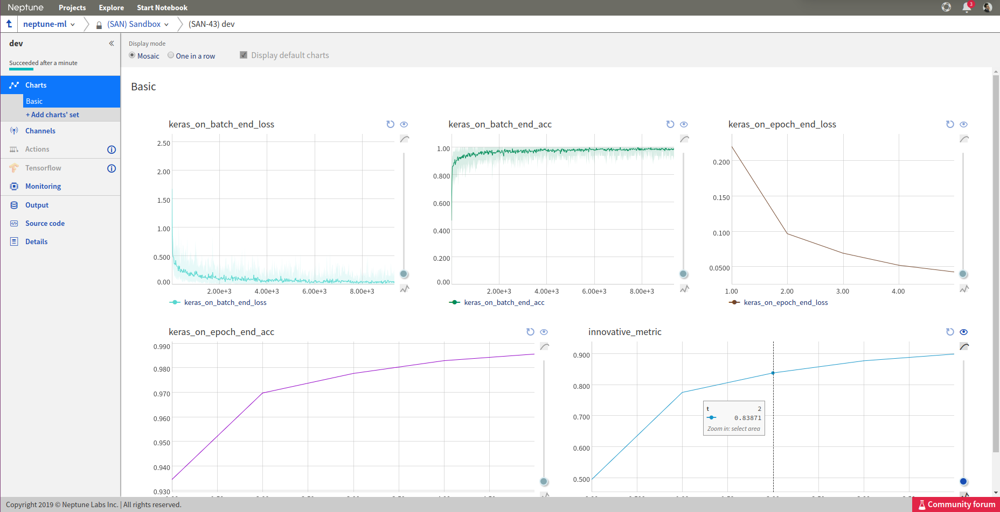

Neptune-Keras Integration
=========================

Neptune has implemented an integration with the Keras neural network library.

Integration with Keras is enabled through the |neptune-contrib| package. 
It lets you automatically track metrics and losses (on *batch end* and *epoch end*).

Installation
^^^^^^^^^^^^
.. code-block:: bash

    pip install neptune-contrib

Usage
^^^^^

To log your experiments to Neptune, use the 
:class:`~neptunecontrib.monitoring.keras.NeptuneMonitor` callback as an argument
to the :meth:`keras.models.Model.fit` method and other Keras methods supporting
training callbacks. An integration snippet is presented below.

.. code-block:: python3

    from neptunecontrib.monitoring.keras import NeptuneMonitor

    model = ...

    model.fit(x_train,
              y_train,
              epochs=42,
              callbacks=[NeptuneMonitor()])

When using the Neptune callback, all metrics and losses are automatically 
tracked in Neptune.

.. note::

    Check for more examples in the |keras-integration| Neptune project.

Full script
^^^^^^^^^^^
.. code-block:: python3

    import neptune
    import keras
    from neptunecontrib.monitoring.keras import NeptuneMonitor

    # set project
    neptune.init(api_token='ANONYMOUS',
                project_qualified_name='shared/keras-integration')

    # parameters
    PARAMS = {'epoch_nr': 5,
            'batch_size': 256,
            'lr': 0.005,
            'momentum': 0.4,
            'use_nesterov': True,
            'unit_nr': 256,
            'dropout': 0.05}

    # start experiment
    neptune.create_experiment(name='keras-integration-example', params=PARAMS)

    mnist = keras.datasets.mnist
    (x_train, y_train),(x_test, y_test) = mnist.load_data()
    x_train, x_test = x_train / 255.0, x_test / 255.0

    model = keras.models.Sequential([
    keras.layers.Flatten(),
    keras.layers.Dense(PARAMS['unit_nr'], activation=keras.activations.relu),
    keras.layers.Dropout(PARAMS['dropout']),
    keras.layers.Dense(10, activation=keras.activations.softmax)
    ])

    optimizer = keras.optimizers.SGD(lr=PARAMS['lr'],
                                    momentum=PARAMS['momentum'],
                                    nesterov=PARAMS['use_nesterov'],)

    model.compile(optimizer=optimizer,
                loss='sparse_categorical_crossentropy',
                metrics=['accuracy'])

    model.fit(x_train, y_train,
            epochs=PARAMS['epoch_nr'],
            batch_size=PARAMS['batch_size'],
            callbacks=[NeptuneMonitor()])

.. External links

.. |neptune-contrib| raw:: html

    <a href="https://pypi.org/project/neptune-contrib/" target="_blank">neptune-contrib</a>

.. |keras-integration| raw:: html

    <a href="https://ui.neptune.ai/shared/keras-integration/experiments" target="_blank">keras-integration</a>
