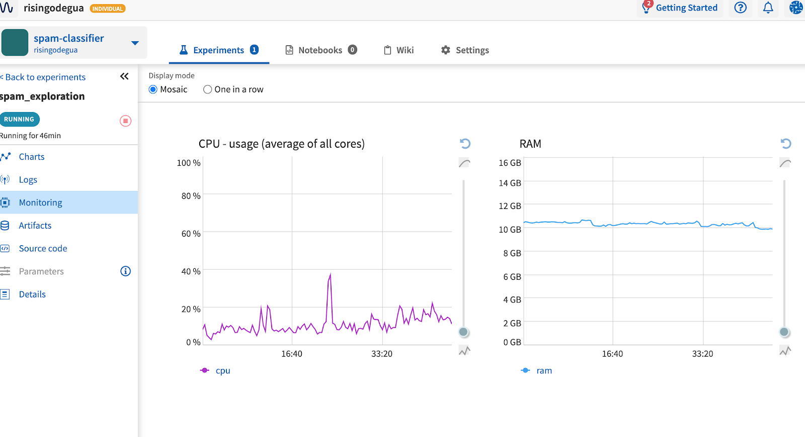
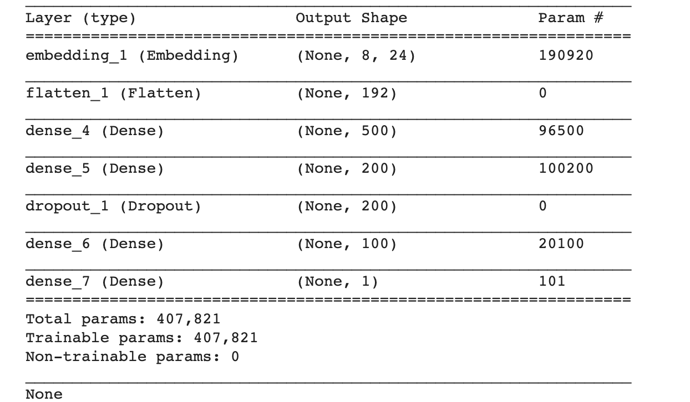
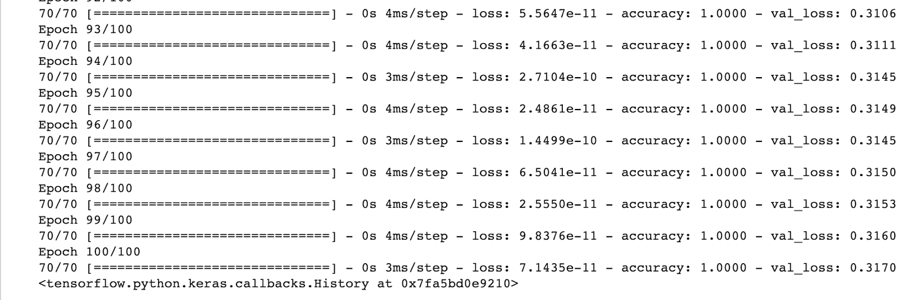
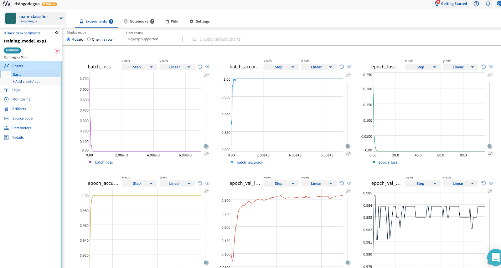
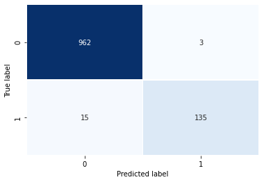

Neptune-Keras Integration
*************************

What will you get with this integration
=======================================

In this integration, you'll learn how to efficiently track and monitor model training, log and hardware metrics, images, artifacts and even datasets in any Keras script.

.. TODO: ADD VIDEO

Video [1min screencast] 

Introduction
------------

|Keras| is a high level interactive API that can be used to prototype, build and train neural networks. \
Keras acts as an interface for the TensorFlow library, and in the latest version of Tensorflow, Keras was officially integrated under the name |tf.keras|.

By the end of this example you will be able to: \

* How to integrate Neptune with Keras to effectively track metrics and model training. 
* How to easily reproduce experiments and aid collaboration in your project. 

.. Note::

   This integration works with library==tf.keras v0.24.1 and neptune-contrib v0.24.1 

Links:
|source code| |open in colab|

.. |Keras| raw:: html

    <a href="https://keras.io" target="_blank">Keras</a> 

.. |tf.keras| raw:: html

    <a href="https://www.tensorflow.org/api_docs/python/tf/keras" target="_blank">tf.keras</a>

.. |link| raw:: html

    <a href="https://www.pyimagesearch.com/2019/10/21/keras-vs-tf-keras-whats-the-difference-in-tensorflow-2-0" target="_blank">link</a>

.. |open in colab| raw:: html

    

.. |steps here| raw:: html

    <a href="https://docs.neptune.ai/workspace-project-and-user-management/projects/create-project.html" target="_blank">open in colab</a>

.. |signup| raw:: html

    <a href="https://neptune.ai/register" target="_blank">open in colab</a>

Quickstart
==========

**Step 1**

Get a neptune account and your API token. You can |signup| here.

**Step 2**

Create a new project called spam-classifier. You can follow the |steps here| to create a new project. 

**Step 3**

In your environment (colab/jupyter/python script) and install neptune client library.

.. code-block:: bash

   pip install neptune-contrib

**STEP 4**

Import neptune, and add your initialization code:

.. code-block:: python3 

   import neptune
   neptune.init(api_token='ADD-API-TOKEN-HERE',project_qualified_name='risingodegua/spam-classifier')

The code above will initialize your project, and connect your local neptune client to your online account. So that any logs made locally can be synced online.

.. Note::
   Your API token is a secret, and should be hidden from outsiders. In production environments, it is advisable to add the token to your environment variable. Neptune will automatically pick up the variable from the environment as long as it is called NEPTUNE_API_TOKEN, so you can easily initialize Neptune by running:

.. code-block:: python3

   neptune.init(project_qualified_name='risingodegua/spam-classifier')

**STEP 5**

Create your first experiment under your project

.. code-block:: bash

   neptune.create_experiment(name='spam_exploration')

.. image:: ../_static/images/integrations/keras-integration/out1.png

Experiments are important for tracking and experimenting on different ideas, and aids reproduction. It is important to always create a new experiment for any new idea you want to try out.
The |experiment link| provided will open the experiment dashboard where you can see details about your experiments in real time. This link can be shared with collaborators and even the general public if the project has been made public.
Note: Neptune also tracks hardware metrics to tell you how your machine operates during experimentation. If you're running this experiment locally, you may have to install psutil library first.

.. |experiment link| raw:: html

    <a href="https://ui.neptune.ai/risingodegua/spam-classifier/e/SPAM-2" target="_blank">experiment link</a>

.. code-block:: bash

   pip install psutil

To see your hardware metrics, you can click on the project |link| generated by Neptune above, and then select logs. You should be presented with a realtime dashboard as shown below:

**Step 6**
In a new cell of your notebook, import all the necessary packages needed for this project.

.. code-block:: python3

   ...
   ...
   from neptunecontrib.monitoring.keras import NeptuneMonitor

Notice that we're importing the NeptuneMonitor from the neptunecontrib package? This is because we are going to be integrating neptune with keras. Neptune can also be integrated with other libraries easily. You can find some useful link on how to achieve this below.

.. **TODO: SOME SEO LINKS HERE**

Now since this is a text classification dataset, there are numerous preprocessing steps you will follow in order to get your data into numeric form which you can pass to your model. We assume you have performed these steps and have the saved some important parameters like vocabulary size, input size and so on. 
In code block below, we create a dictionary to hold these parameters, as it will be used to initialize a new neptune training experiment.

.. code-block:: python3

   # parameters
   PARAMS = {'vocab_size':vocab_size,
            'max_length': max_length,
            'epochs': 100,
            'batch_size': 64,
            'input_size': 24,
            'metric': 'accuracy',
            'loss': 'binary_crossentropy',
            'optimizer': 'rmsprop',
            'dropout': 0.5}

   #create first model experiment
   neptune.create_experiment(name='training_model_exp1', params=PARAMS)
   
.. image:: ../_static/images/integrations/keras-integration/out2.png

Notice that the **PARAMS** dictionary contains mostly model parameters like input size, epochs, metrics and so on. After parameter initialization, you'll create your keras model.

.. code-block:: python3

   # define the model
   model = Sequential()
   model.add(Embedding(vocab_size, PARAMS['input_size'], input_length=max_length))
   model.add(Flatten())
   model.add(Dense(500, activation='relu'))
   model.add(Dense(200, activation='relu'))
   model.add(Dropout(PARAMS['dropout']))
   model.add(Dense(100, activation='relu'))
   model.add(Dense(1, activation='sigmoid'))

   # compile the model
   model.compile(optimizer=PARAMS['optimizer'], loss=PARAMS['loss'], metrics=[PARAMS['metric']])

   # summarize the model
   print(model.summary())

The model is pretty basic, and uses an |embedding| layer as the input because you're working with text inputs of large dimensions. The output layer is a sigmoid node, because this is a binary classification problem (Spam or Not-Spam).
In the next section, you'll start model training as you normally would when training a keras model, with just one exception in the callbacks section.

.. |embedding| raw:: html

    <a href="https://machinelearningmastery.com/use-word-embedding-layers-deep-learning-keras/#:~:text=2.-,Keras%20Embedding%20Layer,API%20also%20provided%20with%20Keras." target="_blank">embedding</a>

.. code-block:: python3

   # fit the model
   model.fit(x=padded_train,
            y=y_train,
            epochs=PARAMS['epochs'],
            batch_size=PARAMS['batch_size'],
            validation_data=(padded_test, y_test), verbose=1,
            callbacks=[NeptuneMonitor()]
            )

Notice that we pass the NeptuneMonitor() to the callbacks parameter of the model.fit method? 
This is the one line integration of Neptune client with keras. 
This integration code will send all training metrics and logs like epoch loss, epoch accuracy, batch loss and batch accuracy and so on, in real time, and this can be monitored in the dashboard of your |experiment|

Click on |charts| to see live training logs

Click on |logs| to download training logs

Isn't it amazing how with just a single line of code you and your team can get to log and monitor metrics in real time? It sure is! Now you can start long running model training and have a Neptune effectively monitor and log all metrics for you, and with just the dashboard link, you can check your experiments on the go.

.. |charts| raw:: html

    <a href="https://ui.neptune.ai/risingodegua/spam-classifier/e/SPAM-4/charts" target="_blank">charts</a>

.. |logs| raw:: html

    <a href="https://ui.neptune.ai/risingodegua/spam-classifier/e/SPAM-4/logs" target="_blank">logs</a>

EXTRA SECTION
=============
In this extra section, You'll:

* Test your model
* Plot and save a confusion matrix for your model
* Make and save the prediction with your model as CSV
* Save your model as an artifact

First, let’s evaluate  your model:

.. code-block:: python3

   loss, accuracy = model.evaluate(padded_test, y_test, verbose=0)
   print('Accuracy: %f' % (accuracy*100))

//output
Accuracy: 98.385650

Log the evaluation metrics:

.. code-block:: python3

   neptune.log_metric('Test Accuracy', accuracy)
   neptune.log_metric('Test Loss', loss)

Next, you’ll make and log predictions on the test set:

.. code-block:: python3

   preds = (model.predict(padded_test) > 0.5).astype("int32")
   pd.Series(preds.flatten()).to_csv("test_predictions.csv", index=False)
   neptune.log_artifact("test_predictions.csv"

Next, you’ll plot and save the confusion matrix of the model:

.. code-block:: python3

   from sklearn.metrics import confusion_matrix

   def plot_confusion_matrix(y_true, y_pred):
      mtx = confusion_matrix(y_true, y_pred)
      sns.heatmap(mtx, annot=True, fmt='d', linewidths=.5, 
                  cmap="Blues", cbar=False)
      plt.ylabel('True label')
      plt.xlabel('Predicted label')
      plt.savefig("cf.png")
      neptune.log_image("confusion_matrix", "cf.png")
   plot_confusion_matrix(y_test, preds)

And finally, you can save the model:

.. code-block:: python3

   model.save("spam_model_exp1")
   #save model as an artifact in Neptune
   neptune.log_artifact("spam_model_exp1")

You can view the saved model in the |artifacts| page.
|source code| |open in colab|

.. |source code| raw:: html

    <a href="https://github.com/risenW/neptune-keras-int" target="_blank">source code</a>

.. |artifacts| raw:: html

    <a href="https://ui.neptune.ai/risingodegua/spam-classifier/e/SPAM-4/artifacts" target="_blank">artifacts</a>

Other integrations you may like
===============================
List of similar integrations
