Neptune-Keras Integration
*************************

What will you get with this integration
=======================================

In this tutorial, you'll learn how to integrate Neptune into your Keras application, and at the end you'll be able to efficiently track and monitor model training, metrics, images and even datasets.

Video [1min screencast]

|Keras| is a high level interactive API that can be used to prototype, build and train neural networks. \
Keras acts as an interface for the TensorFlow library, and in the latest version of Tensorflow,\
Keras was officially integrated under the name |tf.keras|. The original Keras is still available,\
but in this tutorial, you'll be using the Tensorflow version \
of Keras (TF Keras). Don't worry, the API is totally the same. For more explanation \
on TF Keras, check out this |link|. At the end of this tutorial you will learn: \

* How to integrate Neptune with Keras to effectively track metrics and model training. 
* How to easily reproduce experiments and aid collaboration in your project. 

**Note:** This integration works with library==tf.keras v0.24.1 and neptune-contrib v0.24.1 

Links:
|source code| |open in colab|

.. |Keras| raw:: html

    <a href="https://keras.io" target="_blank">Keras</a> 

.. |tf.keras| raw:: html

    <a href="https://www.tensorflow.org/api_docs/python/tf/keras" target="_blank">tf.keras</a>

.. |link| raw:: html

    <a href="https://www.pyimagesearch.com/2019/10/21/keras-vs-tf-keras-whats-the-difference-in-tensorflow-2-0" target="_blank">link</a>

.. |open in colab| raw:: html

    

Quickstart
==========

Introduction
------------
Neptune is a lightweight experiment management tool that helps you keep track of your machine learning experiments. With Neptune, you can: 

* `Monitor ML runs live <https://docs.neptune.ai/getting-started/quick-starts/how-to-monitor-live.html#use-cases-monitor-runs-live>`_

* `Organize ML experimentation <https://docs.neptune.ai/getting-started/quick-starts/how-to-organize-experiments.html#use-cases-organize-ml-experiments>`_

* `Compare and debug ML experiments and models <https://docs.neptune.ai/getting-started/quick-starts/how-to-compare-experiments.html#use-cases-compare-and-debug-experiments>`_

* `Share results of experiments with your team <https://docs.neptune.ai/getting-started/quick-starts/how-to-share-results.html#use-cases-share-results-with-team>`_

* `Clean up your Jupyter workflow without git <https://docs.neptune.ai/getting-started/quick-starts/how-to-clean-up-jupyter.html#use-cases-clean-jupyter-workflow>`_

In this tutorial, you'll build a simple spam classifier using Keras. The task is a binary classification problem,\
as such you'll create a neural network that takes spam messages as input, and then return a prediction of 1 (spam) or 0 (not-spam). \
The |SPAM| dataset contains 5572 SMS messages and a label. Using this dataset, you are going to create a machine learning model that learns to detect "spam" or not "spam".

.. |SPAM| raw:: html

    <a href="https://www.kaggle.com/uciml/sms-spam-collection-dataset" target="_blank">SPAM</a>

What will you get after
-----------------------
At the end of this tutorial, you'll have a created an accurate model that can effectively predict if an SMS to you is Spam or not, and you'll have effectively tracked and saved all experimentation details including metrics, artifacts like the trained model, plots/charts showing visualization, training and testing datasets, as well as your experimentation notebooks.
Links:
|source code| |open in colab|

Prerequisites:
--------------
* Have working knowledge of Python
* Have basic understanding of machine and deep learning
* Have basic understanding of Keras framework
* Have used or created a neural network before
* Have a neptune account and API token. You can just |signup| here to get one

If you tick all the prerequisites listed above, then you're ready to move on to the next part of this tutorial.

Setting up your environment
---------------------------
Head over to |colab| and create a new notebook in order to get started. Note that this tutorial can be run locally with minimal changes, you just have to install each package you'll be using in your local environment. If you have installed a distribution like Anaconda, then you have almost all the packages you need except tensorflow keras and neptune. 

I'll walk you through installation and setting up of neptune. In order to install Tensorflow Keras, you can visit this link.

Neptune does not come preinstalled on colab, and also needs to be initialized with an API token before you can log metrics. In the steps below, you're going to create a new Neptune project, install a Neptune client on colab via pip, and also initialize the project with your API token. Follow the steps below to achieve this:

Step 1: If you have signed-up, login into your account and create a new project. In the new project settings, add a project name (spam-classifier), copy the initialization code, you can set your project to either public or private, and also add a description. Finally click apply to save the new project.

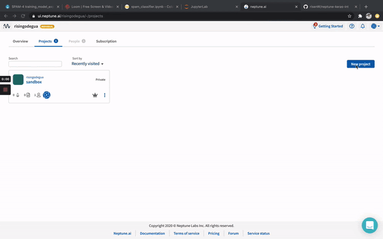

.. |signup| raw:: html

    <a href="https://neptune.ai/login" target="_blank">signup</a>

.. |colab| raw:: html

    

.. |Anaconda| raw:: html

    <a href="https://www.anaconda.com" target="_blank">Anaconda</a>

Step 2: In your notebook (colab/local) and install neptune client library.

.. code-block:: bash

   pip install neptune-contrib

STEP 3: Import neptune, and add your initialization code:

.. code-block:: python3 

   import neptune
   neptune.init(api_token='ADD-API-TOKEN-HERE',project_qualified_name='risingodegua/spam-classifier')

The code above will initialize your project, and connect your local neptune client to your online account. So that any logs made locally can be synced online.

**Note:** Your API token is a secret, and should be hidden from outsiders. In production environments, it is advisable to add the token to your environment variable. 
Neptune will automatically pick up the variable from the environment as long as it is called NEPTUNE_API_TOKEN, so you can easily initialize Neptune by running:

.. code-block:: python3

   neptune.init(project_qualified_name='risingodegua/spam-classifier')

STEP 4: Create your first experiment under your project

.. code-block:: bash

   neptune.create_experiment(name='spam_exploration')

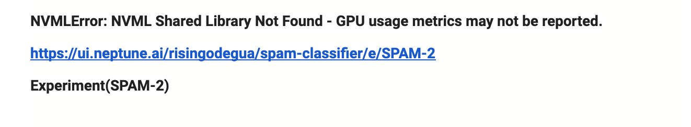

Experiments are important for tracking and experimenting on different ideas, and aids reproduction. It is important to always create a new experiment for any new idea you want to try out.
The |experiment link| provided will open the experiment dashboard where you can see details about your experiments in real time. This link can be shared with collaborators and even the general public if the project has been made public.
Note: Neptune also tracks hardware metrics to tell you how your machine operates during experimentation. If you're running this experiment locally, you may have to install psutil library first.

.. |experiment link| raw:: html

    <a href="https://ui.neptune.ai/risingodegua/spam-classifier/e/SPAM-2" target="_blank">experiment link</a>

.. code-block:: bash

   pip install psutil

To see your hardware metrics, you can click on the project |link| generated by Neptune above, and then select logs. You should be presented with a realtime dashboard as shown below:

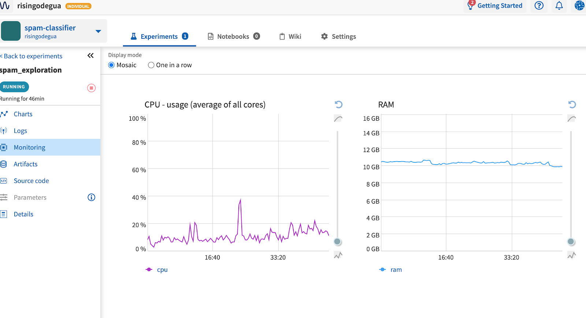

Step 5: In a new cell of your notebook, import all the necessary packages needed for this project.

.. code-block:: python3

   import numpy as np
   import pandas as pd
   import matplotlib.pyplot as plt
   import seaborn as sns
   import wordcloud
   import warnings
   warnings.filterwarnings("ignore")

   from neptunecontrib.monitoring.keras import NeptuneMonitor

Notice that we're importing the NeptuneMonitor from the neptunecontrib package? This is because we are going to be integrating neptune with keras. Neptune can also be integrated with other libraries easily. You can find some useful link on how to achieve this below.

**TODO: SOME SEO LINKS HERE**

IMPORT DATA AND PERFORM SOME SIMPLE EDA
=======================================

In a typical machine learning project, you'll perform some exploratory data analysis (EDA) on the dataset before modeling. 
Neptune can be used in this phase as well to help you log important outputs and information like charts, transformed data, properties, and any text that you feel is important.
Although the main goal of this tutorial is to show you how to integrate Neptune with Keras, you will get to use Neptune as we perform some basic data pre-processing and exploration, so you will continually log and save different outputs.

To see the list of things you can log or save with Neptune, visit |this link|.
Before you proceed, you'll read in the spam dataset. You can download it |from here|.

.. code-block:: python3

   df = pd.read_csv("spam.csv",encoding='latin-1')
   df.head()

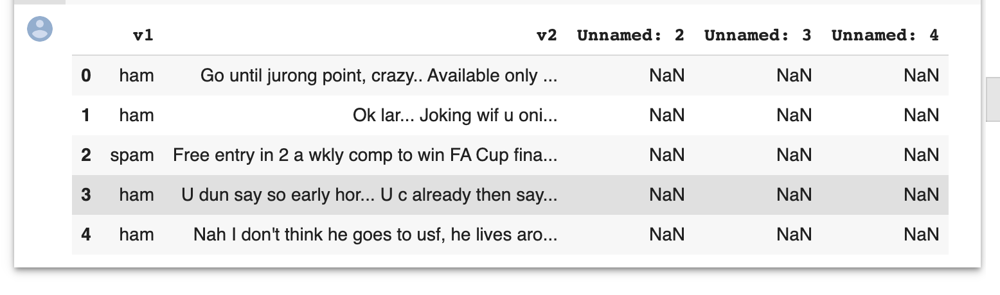

.. |this link| raw:: html

    <a href="https://docs.neptune.ai/logging-and-managing-experiment-results/logging-experiment-data/what-can-you-log-to-experiments.html" target="_blank">this link</a>

.. |from here| raw:: html

    <a href="https://www.kaggle.com/uciml/sms-spam-collection-dataset" target="_blank">from here</a>

The Columns 2,3,4 will be dropped as they contain no relevant information.

.. code-block:: python3

   data = df.copy()
   data.drop(columns=["Unnamed: 2", "Unnamed: 3", "Unnamed: 4"], inplace=True)
   data = data.rename(columns={"v1":"label", "v2":"text"})
   data.label.value_counts()

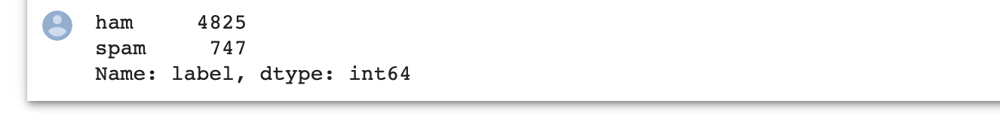

The number of unique values in each class is something I would like to log in my experiment. 
You can easily do it with Neptune's |log_text| as shown below:

.. |log_text| raw:: html

    <a href="https://docs.neptune.ai/api-reference/neptune/experiments/index.html#neptune.experiments.Experiment.log_text" target="_blank">log_text</a>

.. code-block:: python3

   neptune.log_text('target_distribution', 'Spam {}, Ham {}'.format(747, 4825))

The logged text will automatically be displayed in the experiment |dashboard|.
Next, let's make and add the target distribution chart:

.. |dashboard| raw:: html

    <a href="https://ui.neptune.ai/risingodegua/spam-classifier/e/SPAM-2/logs" target="_blank">dashboard</a>

.. code-block:: python3

   sns.countplot(data['label'])
   plt.savefig("dist")
   plt.show()

Charts like this can be logged as well using the log_image function as shown below:

.. code-block:: python3

   neptune.log_image('target_dist', 'dist.png') # log the image

The chart is also saved in the logs ||dashboard|

Let's do a little data processing. You'll convert the target/labels to numerical form.

.. code-block:: python3

   data['label'] = data['label'].map( {'spam': 1, 'ham': 0} )
   data.head()

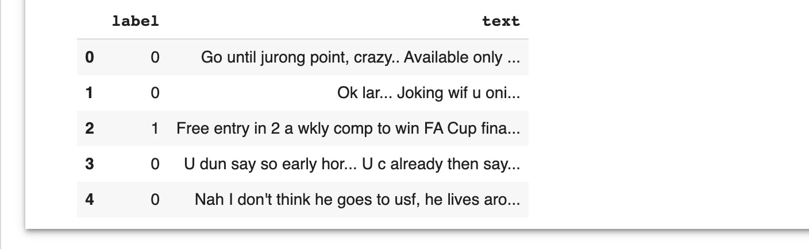

Next, seperate the spam and not-spam (ham) data so you can visualize them in word clouds:

.. code-block:: python3

   data_ham  = data[data['label'] == 0].copy()
   data_spam = data[data['label'] == 1].copy()

.. code-block:: python3

   data_ham.to_csv("data_ham.csv")
   data_spam.to_csv("data_spam.csv")

   #Log the generated artifact in Neptune:
   neptune.log_artifact("data_ham.csv")
   neptune.log_artifact("data_spam.csv")

You can find the dataset in the artifact |page| on Neptune.
Next, let's make some word clouds to better understand the dataset. Note that you can also log these charts on Neptune as well.

.. |page| raw:: html

    <a href="https://ui.neptune.ai/risingodegua/spam-classifier/e/SPAM-2/artifacts" target="_blank">page</a>

.. code-block:: python3

   def show_wordcloud(df, title):
      text = ' '.join(df['text'].astype(str).tolist())
      stopwords = set(wordcloud.STOPWORDS)
      fig_wordcloud = wordcloud.WordCloud(stopwords=stopwords,background_color='lightgrey',
                     colormap='viridis', width=800, height=600).generate(text)
   
      plt.figure(figsize=(10,7), frameon=True)
      plt.imshow(fig_wordcloud) 
      plt.axis('off')
      plt.title(title, fontsize=20 )
      plt.savefig(f"{title}.png")
      plt.show()
      neptune.log_image(title, f'{title}.png') # log the image

The function above will use the wordcloud package to generate wordclouds of the different common words found in each category. 
First, let’s make a wordcloud for Non-Spam (Ham) messages:

.. code-block:: python3

   show_wordcloud(data_ham, "Ham messages")

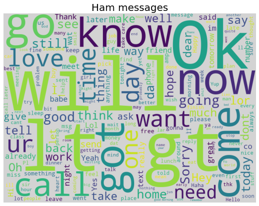

Next, let’s plot one for Spam messages:

.. code-block:: python3

   show_wordcloud(data_spam, "Spam messages")

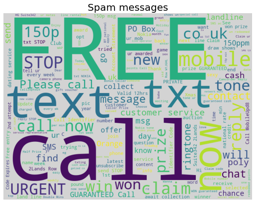

|Neptune link| to view the saved images.
Next, you'll split the dataset into train and test set:

.. |Neptune link| raw:: html

    <a href="https://ui.neptune.ai/risingodegua/spam-classifier/e/SPAM-2/logs" target="_blank">Neptune link</a>

.. code-block:: python3

   from sklearn.model_selection import train_test_split

.. code-block:: python3

   X = data['text'].values
   y = data['label'].values
   X_train, X_test, y_train, y_test = train_test_split(X, y, test_size=0.20, random_state=42)

   ##Save in properties
   neptune.set_property('test_split_percent', 0.20)
   neptune.set_property('data_split_random_state', 42)

Next, you’ll import keras from tensorflow and also some pre-processing functions:

.. code-block:: python3

   from tensorflow.keras.preprocessing.sequence import pad_sequences
   from tensorflow.keras.preprocessing.text import Tokenizer
   from tensorflow.keras.models import Sequential
   from tensorflow.keras.layers import Dense
   from tensorflow.keras.layers import Dropout
   from tensorflow.keras.layers import Flatten
   from tensorflow.keras.layers import Embedding
   from tensorflow.keras.callbacks import EarlyStopping

Next, let’s do some basic text pre-processing since the dataset is made up of SMS. 
These preprocessing steps will help  turn text into integers using the |Tokenizer| and |pad_sequence| helper functions in Keras.

.. |Tokenizer| raw:: html

    <a href="https://www.tensorflow.org/api_docs/python/tf/keras/preprocessing/text/Tokenizer " target="_blank">Tokenizer</a>

.. |pad_sequence| raw:: html

    <a href="https://www.tensorflow.org/api_docs/python/tf/keras/preprocessing/sequence/pad_sequences" target="_blank">pad_sequence</a>

.. code-block:: python3

   # prepare tokenizer
   t = Tokenizer()
   t.fit_on_texts(X_train)

   # integer encode the documents
   encoded_train = t.texts_to_sequences(X_train)
   encoded_test = t.texts_to_sequences(X_test)

   vocab_size = len(t.word_index) + 1

   # pad documents to a max length of 4 words
   max_length = 8
   padded_train = pad_sequences(encoded_train, maxlen=max_length, padding='post')
   padded_test = pad_sequences(encoded_test, maxlen=max_length, padding='post')

Now that the data has been processed and converted to integers. You are ready to start model training. Before you proceed, you'll create a new experiment for tracking model training. This experiment will be initialized with some training parameters, and will aid efficient model/experiment comparison in your future training.

.. code-block:: python3

   # parameters
   PARAMS = {'vocab_size':vocab_size,
            'max_length': max_length,
            'epochs': 100,
            'batch_size': 64,
            'input_size': 24,
            'metric': 'accuracy',
            'loss': 'binary_crossentropy',
            'optimizer': 'rmsprop',
            'dropout': 0.5}

   #create first model experiment
   neptune.create_experiment(name='training_model_exp1', params=PARAMS)
   
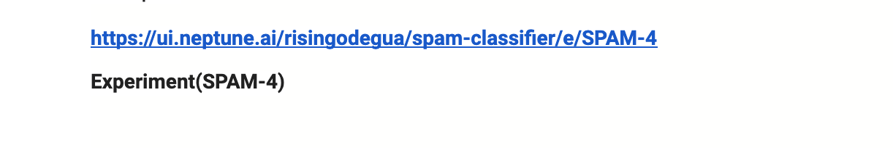

Notice that the **PARAMS** dictionary contains mostly model parameters like input size, epochs, metrics and so on. Now that you have initialized the parameters, in the next section, you'll create your model.

.. code-block:: python3

   # define the model
   model = Sequential()
   model.add(Embedding(vocab_size, PARAMS['input_size'], input_length=max_length))
   model.add(Flatten())
   model.add(Dense(500, activation='relu'))
   model.add(Dense(200, activation='relu'))
   model.add(Dropout(PARAMS['dropout']))
   model.add(Dense(100, activation='relu'))
   model.add(Dense(1, activation='sigmoid'))

   # compile the model
   model.compile(optimizer=PARAMS['optimizer'], loss=PARAMS['loss'], metrics=[PARAMS['metric']])

   # summarize the model
   print(model.summary())

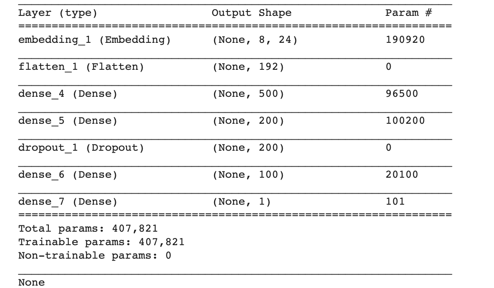

The model is pretty simple, and uses an |embedding| layer as the input because you're working with text inputs of large dimensions. The output layer is a sigmoid node, because this is a binary classification problem (Spam or Not-Spam).
In the next section, you'll start model training as you normally would when training a keras model, with just one exception in the callbacks section.

.. |embedding| raw:: html

    <a href="https://machinelearningmastery.com/use-word-embedding-layers-deep-learning-keras/#:~:text=2.-,Keras%20Embedding%20Layer,API%20also%20provided%20with%20Keras." target="_blank">embedding</a>

.. code-block:: python3

   # fit the model
   model.fit(x=padded_train,
            y=y_train,
            epochs=PARAMS['epochs'],
            batch_size=PARAMS['batch_size'],
            validation_data=(padded_test, y_test), verbose=1,
            callbacks=[NeptuneMonitor()]
            )

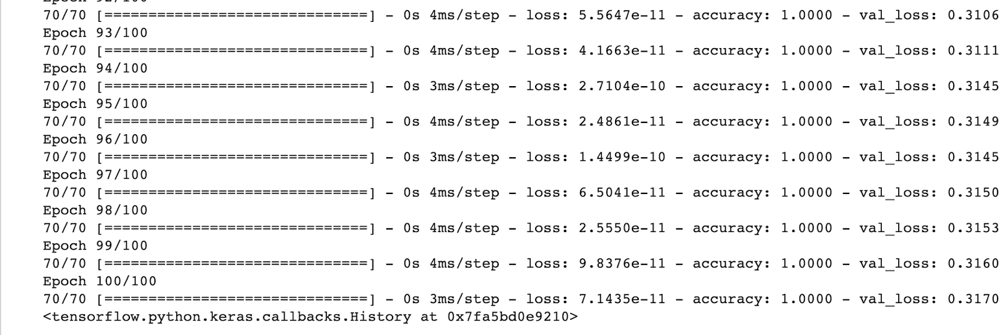

Notice that we pass the NeptuneMonitor() to the callbacks parameter of the model.fit method? 
This is the one line integration of Neptune client with keras. 
This integration code will send all training metrics and logs like epoch loss, epoch accuracy, batch loss and batch accuracy and so on, in real time, and this can be monitored in the dashboard of your |experiment|

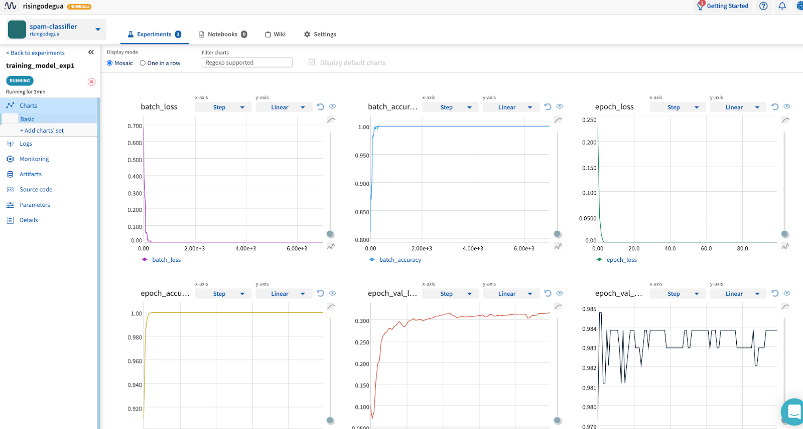

Click on |charts| to see live training logs

Click on |logs| to download training logs

Isn't it amazing how with just a single line of code you and your team can get to log and monitor metrics in real time? It sure is! Now you can start long running model training and have a Neptune effectively monitor and log all metrics for you, and with just the dashboard link, you can check your experiments on the go.

.. |charts| raw:: html

    <a href="https://ui.neptune.ai/risingodegua/spam-classifier/e/SPAM-4/charts" target="_blank">charts</a>

.. |logs| raw:: html

    <a href="https://ui.neptune.ai/risingodegua/spam-classifier/e/SPAM-4/logs" target="_blank">logs</a>

EXTRA SECTION
=============
In this extra section, You'll:

* Test your model
* Plot and save a confusion matrix for your model
* Make and save the prediction with your model as CSV
* Save your model as an artifact

First, let’s evaluate  your model:

.. code-block:: python3

   loss, accuracy = model.evaluate(padded_test, y_test, verbose=0)
   print('Accuracy: %f' % (accuracy*100))

//output
Accuracy: 98.385650

Log the evaluation metrics:

.. code-block:: python3

   neptune.log_metric('Test Accuracy', accuracy)
   neptune.log_metric('Test Loss', loss)

Next, you’ll make and log predictions on the test set:

.. code-block:: python3

   preds = (model.predict(padded_test) > 0.5).astype("int32")
   pd.Series(preds.flatten()).to_csv("test_predictions.csv", index=False)
   neptune.log_artifact("test_predictions.csv"

Next, you’ll plot and save the confusion matrix of the model:

.. code-block:: python3

   from sklearn.metrics import confusion_matrix

   def plot_confusion_matrix(y_true, y_pred):
      mtx = confusion_matrix(y_true, y_pred)
      sns.heatmap(mtx, annot=True, fmt='d', linewidths=.5, 
                  cmap="Blues", cbar=False)
      plt.ylabel('True label')
      plt.xlabel('Predicted label')
      plt.savefig("cf.png")
      neptune.log_image("confusion_matrix", "cf.png")
   plot_confusion_matrix(y_test, preds)

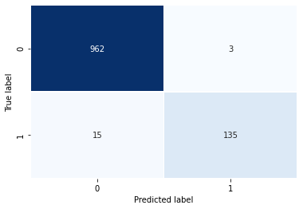

And finally, you can save the model:

.. code-block:: python3

   model.save("spam_model_exp1")
   #save model as an artifact in Neptune
   neptune.log_artifact("spam_model_exp1")

You can view the saved model in the |artifacts| page.
|source code| |open in colab|

.. |source code| raw:: html

    <a href="https://github.com/risenW/neptune-keras-int" target="_blank">source code</a>

.. |artifacts| raw:: html

    <a href="https://ui.neptune.ai/risingodegua/spam-classifier/e/SPAM-4/artifacts" target="_blank">artifacts</a>

Other integrations you may like
===============================
List of similar integrations

