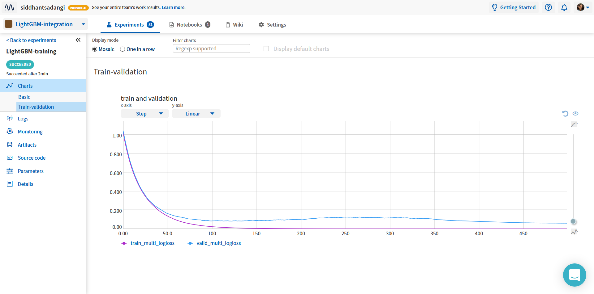
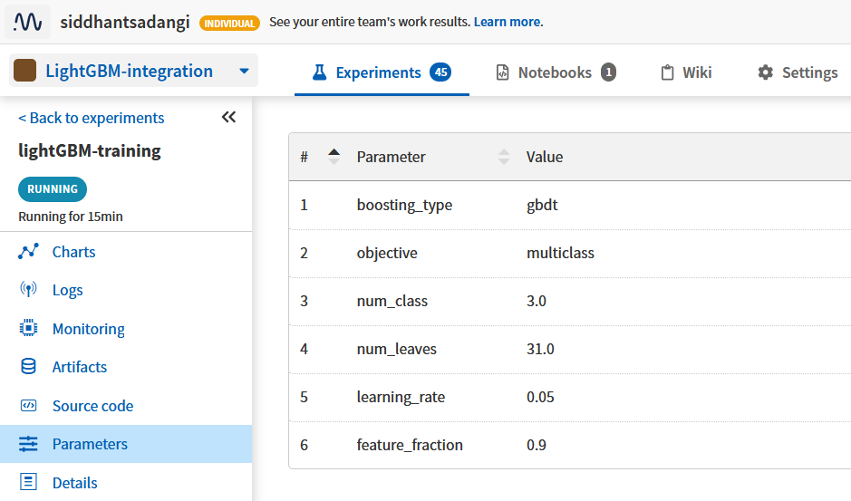
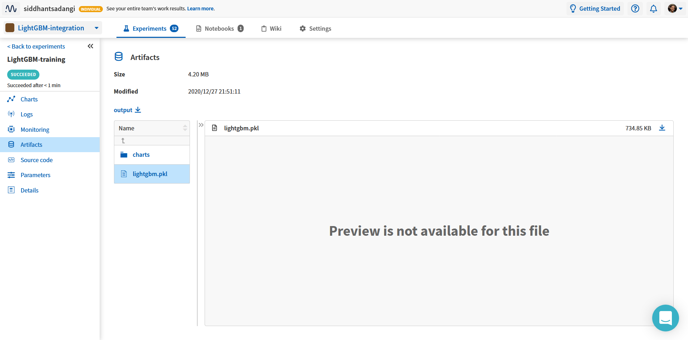
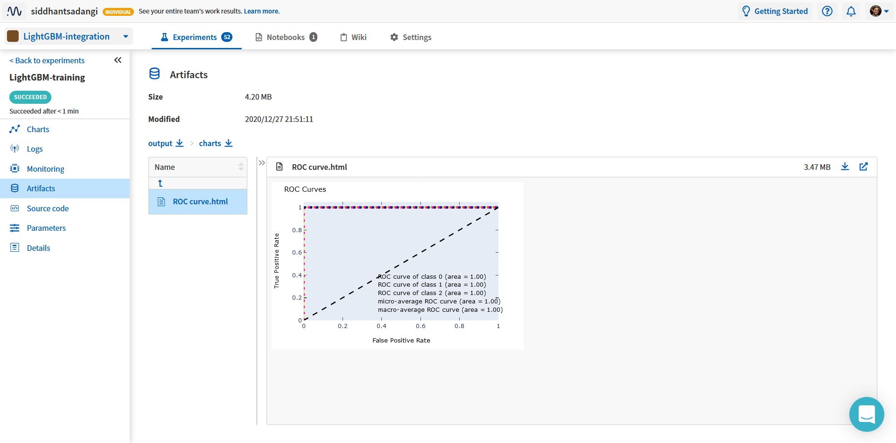

.. _integrations-lightgbm:

Neptune-LightGBM Integration
============================

|Run on Colab|

What will you get with this integration?
----------------------------------------

|lightgbm-tour|

|lightGBM| is a popular gradient boosting library.

With the Neptune + LightGBM integration, you can:

- log training and evaluation metrics
- vizualize learning curves for losses and metrics during training
- see hardware consumption during training
- save model artifacts

.. tip::
    You can log many other experiment metadata like interactive charts, video, audio, and more.
    See the :ref:`full list <what-you-can-log>`.
   
.. note::

    This integration is tested with ``neptune-client==0.4.131``, ``neptune-contrib==0.25.0``, and ``lightgbm==2.2.3``

.. _lightgbm-quickstart:

Quickstart
----------

This quickstart will show you how to:

* Install the necessary Neptune packages
* Log lightGBM metrics to and visualize them with Neptune

|Run on Colab|

.. _lightgbm-before-you-start-basic:

Before you start
^^^^^^^^^^^^^^^^

#. Ensure that you have ``Python 3.x`` and following libraries installed:

   * ``neptune-client>=0.4.129``. See |neptune-client|
   * ``neptune-contrib>=0.25.0``. See |neptune-contrib|
   * ``lightgbm==2.2.3``. See the |lightgbm-install|
   
   .. code-block:: bash
   	
      pip install --quiet lightgbm==2.2.3 neptune-client neptune-contrib[monitoring]

#. You also need minimal familiarity with LightGBM. Have a look at the |lightgbm-guide| guide to get started.

Step 1: Initialize Neptune
^^^^^^^^^^^^^^^^^^^^^^^^^^

.. code-block:: python3

    import neptune

    neptune.init(api_token='ANONYMOUS', project_qualified_name='shared/LightGBM-integration')

.. tip::

    You can also use your personal API token. Read more about how to :ref:`securely set the Neptune API token <how-to-setup-api-token>`.

Step 2: Create an Experiment
^^^^^^^^^^^^^^^^^^^^^^^^^^^^

.. code-block:: python3

	neptune.create_experiment(name='LightGBM-training')

This also creates a link to the experiment. Open the link in a new tab. 
The charts will currently be empty, but keep the window open. You will be able to see live metrics once logging starts.

Step 3: Pass ``neptune_monitor`` to ``lgb.train``
^^^^^^^^^^^^^^^^^^^^^^^^^^^^^^^^^^^^^^^^^^^^^^^^^

Simply pass ``neptune_monitor`` to the callbacks argument of ``lgb.train``

.. code-block:: python3

    from neptunecontrib.monitoring.lightgbm import neptune_monitor

    gbm = lgb.train(params,
            lgb_train,
            num_boost_round = 500,
            valid_sets = [lgb_train, lgb_eval],
            valid_names = ['train','valid'],
            callbacks = [neptune_monitor()], # Just add this callback
           )

Step 4: Monitor your LightGBM training in Neptune
^^^^^^^^^^^^^^^^^^^^^^^^^^^^^^^^^^^^^^^^^^^^^^^^^
Now you can switch to the Neptune tab which you had opened previously to watch the training live!

	   
|Run on Colab|

.. _lightgbm-advanced-options:

More Options
------------

Log hyperparameters
^^^^^^^^^^^^^^^^^^^
You can log training and model hyperparameters.
To do that just pass the parameter dictionary to :meth:`~neptune.projects.Project.create_experiment` method:

.. code-block:: python3

	params = {'boosting_type': 'gbdt',
              'objective': 'multiclass',
              'num_class': 3,
              'num_leaves': 31,
              'learning_rate': 0.05,
              'feature_fraction': 0.9
              }

	neptune.create_experiment(name='LightGBM-training', params=params)

|example-hyperparameters|

Save Model artifacts
^^^^^^^^^^^^^^^^^^^^
You can save model artifacts to Neptune both during and after training.

To do that just use a :meth:`~neptune.experiments.Experiment.log_artifact` method on the saved model file.

.. code-block:: python3

	gbm.save_model('lightgbm.pkl')

	# Log model
	neptune.log_artifact('lightgbm.pkl')

|example-weights|

Log interactive charts
^^^^^^^^^^^^^^^^^^^^^^
You can log interactive charts to Neptune.

For example, let's log an interactive ROC AUC curve.

1. Install dependencies

.. code-block:: bash

    pip install neptune-contrib scikit-plot matplotlib==3.2.0 plotly==4.12.0

.. warning::

    Automatic conversion between matplotlib figures and plotly charts works only with ``matplotlib==3.2.0`` and ``plotly==4.12.0``.

2. Create an ROC AUC curve

.. code-block:: python3

    import matplotlib.pyplot as plt
    from scikitplot.metrics import plot_roc

    y_test_pred = model.predict(x_test)

    fig, ax = plt.subplots()
    plot_roc(y_test, y_test_pred, ax=ax)

3. Log it to Neptune via :meth:`~neptunecontrib.api.log_chart` function.

.. code-block:: python3

    from neptunecontrib.api import log_chart

    log_chart(name='ROC curve', chart=fig)

|example-interactive-charts|

How to ask for help?
--------------------
Please visit the :ref:`Getting help <getting-help>` page. Everything regarding support is there.

Other pages you may like
------------------------

You may also find the following pages useful:

- :ref:`Full list of objects you can log and display in Neptune <what-you-can-log>`
- :ref:`Optuna integration <integrations-optuna>`
- :ref:`Logging Plotly/Bokeh/Altair/Matplotlib charts to Neptune <integrations-visualization-tools>`

.. External Links

.. |Run on Colab| raw:: html

    

        

        <a target="_blank" href="https://github.com/neptune-ai/neptune-examples/blob/master/integrations/lightgbm/docs/Neptune_lightGBM.py">
            
            View source on GitHub
        </a>
        <a target="_blank" href="https://ui.neptune.ai/shared/LightGBM-integration/e/LGBM-71">
            
            See example in Neptune
        </a>
    

.. |lightgbm-tour| raw:: html

	

		<iframe src="https://www.loom.com/embed/54861bb7166e417289025afff49b86d7" frameborder="0" webkitallowfullscreen mozallowfullscreen allowfullscreen style="position: absolute; top: 0; left: 0; width: 100%; height: 100%;">
		</iframe>
	

	
.. |lightGBM| raw:: html

    <a href="https://lightgbm.readthedocs.io/en/latest/" target="_blank">LightGBM</a>

.. |neptune-client| raw:: html

    <a href="https://github.com/neptune-ai/neptune-client" target="_blank">neptune-client</a>

.. |neptune-contrib| raw:: html

    <a href="https://github.com/neptune-ai/neptune-contrib" target="_blank">neptune-contrib</a>
	
.. |lightgbm-install| raw:: html

	<a href="https://github.com/microsoft/LightGBM/tree/master/python-package" target="_blank">LightGBM Installation Guide</a>

.. |lightgbm-guide| raw:: html

	<a href="https://lightgbm.readthedocs.io/en/latest/Python-Intro.html" target="_blank">LightGBM Quickstart</a>

.. |psutil| raw:: html

    <a href="https://psutil.readthedocs.io/en/latest/" target="_blank">psutil</a>

.. |example-hyperparameters| raw:: html

    

        <a target="_blank"  href="https://ui.neptune.ai/shared/LightGBM-integration/e/LGBM-71/parameters">
            
            See example in Neptune
        </a>
    

.. |example-weights| raw:: html

    

        <a target="_blank"  href="https://ui.neptune.ai/shared/LightGBM-integration/e/LGBM-71/artifacts?path=.&file=lightgbm.pkl">
            
            See example in Neptune
        </a>
    

.. |example-interactive-charts| raw:: html

    

        <a target="_blank"  href="https://ui.neptune.ai/shared/LightGBM-integration/e/LGBM-71/artifacts?path=charts%2F&file=ROC%20curve.html">
            
            See example in Neptune
        </a>
    

