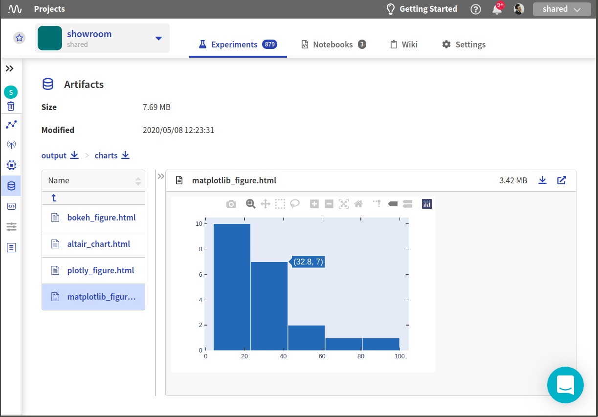
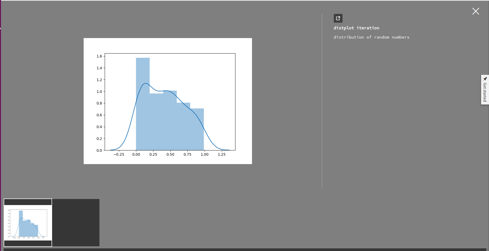
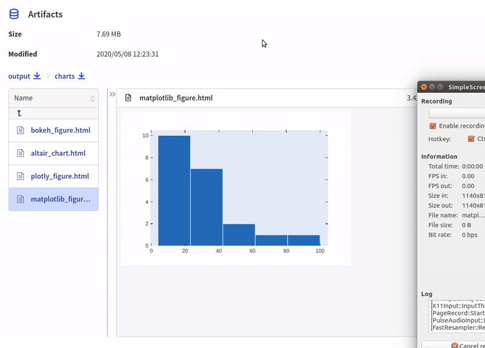

.. _integrations-matplotlib:

Neptune-Matplotlib Integration
==============================

This integration lets you log charts generated in |matplotlib|, like confusion matrix or distribution, in Neptune.

Follow these steps:

0. Create an experiment:

   .. code-block::

        import neptune

        neptune.init(api_token='ANONYMOUS',project_qualified_name='shared/showroom')
        neptune.create_experiment()

1. Create a matplotlib figure:

   For example:

   .. code-block::

      # matplotlib figure example 2
      from matplotlib import pyplot
      import numpy

      numpy.random.seed(19680801)
      data = numpy.random.randn(2, 100)

      figure, axs = pyplot.subplots(2, 2, figsize=(5, 5))
      axs[0, 0].hist(data[0])
      axs[1, 0].scatter(data[0], data[1])
      axs[0, 1].plot(data[0], data[1])
      axs[1, 1].hist2d(data[0], data[1])

2. Log figure into Neptune:

**Log as static image**

   .. code-block::

      experiment.log_image('diagrams', figure)

**Log as interactive plotly chart**

   .. code-block::

    from neptunecontrib.api import log_chart

    log_chart(name='matplotlib_figure', chart=figure)

3. Explore the results in the Neptune dashboard:

Static image is logged into the logs section:

Interactive figure is logged as artifact into the charts folder.
Check out |this experiment| in the app.

.. External Links

.. |matplotlib| raw:: html

    <a href="https://matplotlib.org/" target="_blank">matplotlib</a>

.. |this experiment| raw:: html

    <a href="https://ui.neptune.ai/o/shared/org/showroom/e/SHOW-978/artifacts?path=charts%2F&file=matplotlib_figure.html" target="_blank">this experiment</a>
