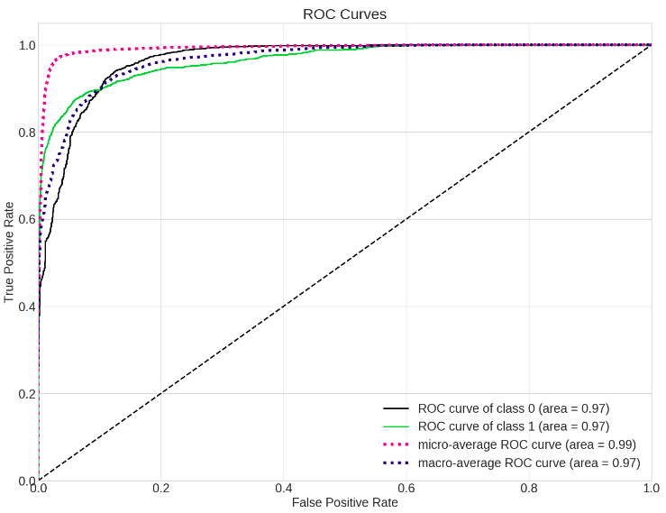

Neptune-Matplotlib Integration
==============================

This integration lets you log charts generated in |matplotlib|, like confusion matrix or distribution, in Neptune.

Follow these steps:

1. Import matplotlib figures into Neptune-client so that they are logged:

   Some examples:

   .. code-block::

      # matplotlib figure example 1
      from matplotlib import pyplot
      pyplot.plot([1, 2, 3, 4])
      pyplot.ylabel('some numbers')
      experiment.log_image('plots', plt.gcf())

   .. code-block::

      # matplotlib figure example 2
      from matplotlib import pyplot
      import numpy

      numpy.random.seed(19680801)
      data = numpy.random.randn(2, 100)

      figure, axs = pyplot.subplots(2, 2, figsize=(5, 5))
      axs[0, 0].hist(data[0])
      axs[1, 0].scatter(data[0], data[1])
      axs[0, 1].plot(data[0], data[1])
      axs[1, 1].hist2d(data[0], data[1])

      experiment.log_image('diagrams', figure)

2. Explore the results in the Neptune dashboard:

.. image:: ../_static/images/how-to/ht-matplotlib-1.png
   :target: ../_static/images/how-to/ht-matplotlib-1.png
   :alt: image

.. image:: ../_static/images/how-to/ht-matplotlib-2.png
   :target: ../_static/images/how-to/ht-matplotlib-2.png
   :alt: image

.. External Links

.. |matplotlib| raw:: html

    <a href="https://matplotlib.org/" target="_blank">matplotlib</a>