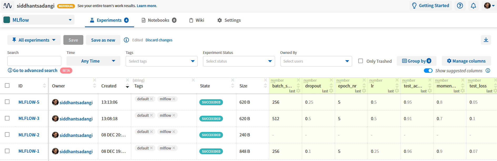
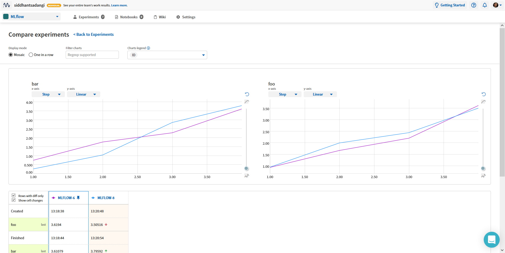

.. _integrations-mlflow:

Neptune-MLflow Integration
==========================

|Run on Colab|

What will you get with this integration?
----------------------------------------

|mlflow-tour|

|neptune-mlflow| is an open source project curated by Neptune team that enables |mlflow| experiment runs to be hosted on Neptune.

The integration lets you enjoy the best of both worlds: the tracking and reproducibility of MLflow with the organization and collaboration of Neptune.
With Neptune, you can push the following MLrun objects to a Neptune experiment:

* experiment id
* experiment name
* run id
* run name
* metrics
* parameters
* artifacts
* tags

.. note::

    This integration is tested with ``neptune-client==0.4.129``, ``neptune-mlflow==0.2.5`` and ``mlflow==1.12.1``
	
.. _mlflow-quickstart:

Quickstart
----------

This quickstart will show you how to:

* Install the necessary Neptune packages
* Convert MLruns directory of experiment runs into Neptune experiments.

|Run on Colab|

.. _mlflow-before-you-start-basic:

Before you start
^^^^^^^^^^^^^^^^
#. This integration requires you to have your Personal API token. You need a Neptune account to have this. Create one for free |neptune-register| if you haven't already

#. Ensure that you have ``Python 3.x`` and following libraries installed:

   * ``neptune-mlflow``
   * ``mlflow==1.12.1``. See the |mlflow-install|.
   
   .. code-block:: bash
   	
      pip install --quiet mlflow neptune-mlflow

#. You also need minimal familiarity with Mlflow. Have a look at the |mlflow-guide| guide to get started.

Step 1: Set your ``NEPTUNE_API_TOKEN``
^^^^^^^^^^^^^^^^^^^^^^^^^^^^^^^^^^^^^^

Linux/iOS:

.. code:: bash

    export NEPTUNE_API_TOKEN='YOUR_API_TOKEN'

Windows:

.. code-block:: bat

    set NEPTUNE_API_TOKEN="YOUR_API_TOKEN"

.. tip::

    Read more about how to :ref:`securely set the Neptune API token <how-to-setup-api-token>`.

Step 2: Sync your MLruns with Neptune
^^^^^^^^^^^^^^^^^^^^^^^^^^^^^^^^^^^^^
Navigate to the MLflow project in your directory and run:

.. code-block:: bash

    neptune mlflow --project USER_NAME/PROJECT_NAME

Alternatively, you can point to the MLflow project directory:

.. code-block:: bash

    neptune mlflow /PATH/TO/MLflow_PROJECT --project USER_NAME/PROJECT_NAME

.. tip::

    You can also set the project qualified name in the ``NEPTUNE_PROJECT`` environment variable and skip the ``--project`` argument
	
	Linux/macOS:

	.. code:: bash

		export NEPTUNE_PROJECT='USER_NAME/PROJECT_NAME'

	Windows:

	.. code-block:: bat

		set NEPTUNE_PROJECT="USER_NAME/PROJECT_NAME"

**That's it! You can now browse and collaborate on your MLflow runs in Neptune.**

   

Remember that you can try it out with zero setup:

|Run on Colab|

.. External links

.. |Run on Colab| raw:: html

    

        

        <a target="_blank" href="https://github.com/neptune-ai/neptune-examples/blob/master/integrations/mlflow/docs/Neptune-MLflow.py">
            
            View source on GitHub
        </a>
        <a target="_blank" href="https://ui.neptune.ai/o/shared/org/mlflow-integration/experiments?viewId=7608998d-4828-48c5-81cc-fb9ec625e206">
            
            See example in Neptune
        </a>
    

.. |mlflow-tour| raw:: html

	

		<iframe src="https://www.loom.com/embed/444799388f3e4ec695984841f36e8b9b" frameborder="0" webkitallowfullscreen mozallowfullscreen allowfullscreen style="position: absolute; top: 0; left: 0; width: 100%; height: 100%;">
		</iframe>
	

.. |neptune-mlflow| raw:: html

    <a href="https://github.com/neptune-ai/neptune-mlflow" target="_blank">Neptune-MLflow</a>

.. |mlflow| raw:: html

    <a href="https://mlflow.org" target="_blank">MLflow</a>
	
.. |neptune-register| raw:: html

    <a href="https://neptune.ai/register" target="_blank">here</a>

.. |mlflow-install| raw:: html

    <a href="https://mlflow.org/docs/latest/quickstart.html#installing-mlflow" target="_blank">MLflow Installation Guide</a>

.. |mlflow-guide| raw:: html

    <a href="https://mlflow.org/docs/latest/quickstart.html" target="_blank">MLflow Quickstart</a>
