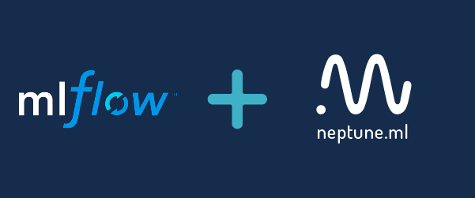
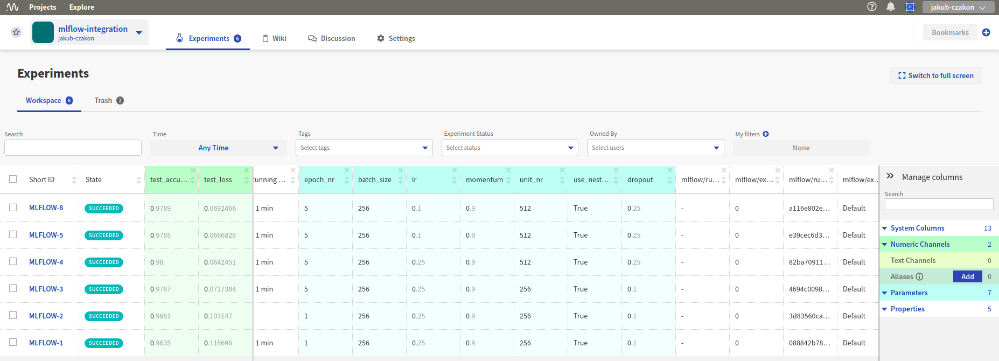

Neptune-MLflow Integration
==========================

|neptune-mlflow| is an open source project curated by Neptune team that enables |mlflow| experiment runs to be hosted in Neptune.

The integration lets you enjoy the best of both worlds: the tracking and reproducibility of MLflow with the organization and collaboration of Neptune.

Check the example project in Neptune: |mlflow-integration|.

Installation
------------

.. code-block:: bash

    pip install neptune-mlflow

Sync your MLruns with Neptune
-----------------------------

1. Set your ``NEPTUNE_API_TOKEN``:

.. code-block:: bash

    export NEPTUNE_API_TOKEN="YOUR_NEPTUNE_API_TOKEN"

2. Navigate to the MLflow project in your directory and run:

.. code-block:: bash

    neptune mlflow --project USER_NAME/PROJECT_NAME

Alternatively you can point to the MLflow project directory:

.. code-block:: bash

    neptune mlflow /PATH/TO/MLflow_PROJECT --project USER_NAME/PROJECT_NAME

**That's it! You can now browse and collaborate on your MLflow runs in Neptune.**

Organize and share your MLflow experiments
------------------------------------------

.. image:: ../_static/images/mlflow/mlflow_2.png
   :target: ../_static/images/mlflow/mlflow_2.png
   :alt: share artifacts logged during MLflow run

Examples
--------
.. toctree::
   :maxdepth: 1

   Sync and compare runs <mlflow/mlflow_compare_runs.rst>
   Sync runs and share model weights <mlflow/mlflow_sync_runs_and_share_model.rst>

Support
-------

If you need assistance, report an issue in Git, or talk to us directly in a |support-chat|.

.. External links

.. |neptune-mlflow| raw:: html

    <a href="https://github.com/neptune-ai/neptune-mlflow" target="_blank">Neptune-mlflow</a>

.. |mlflow| raw:: html

    <a href="https://mlflow.org" target="_blank">MLflow</a>

.. |mlflow-integration| raw:: html

    <a href="https://ui.neptune.ai/jakub-czakon/mlflow-integration/experiments" target="_blank">MLflow integration</a>

.. |support-chat| raw:: html

    <a href="https://spectrum.chat/neptune-community" target="_blank">support chat</a>
