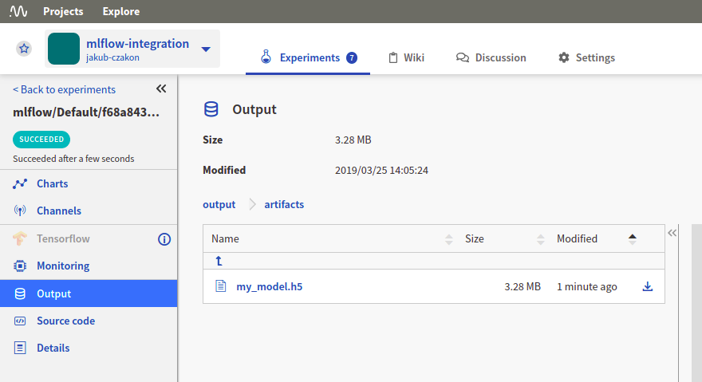

Sync Runs and Share Model Weights
=================================

Train your model and log artifact
---------------------------------
.. code-block:: python3

    import tensorflow as tf
    import mlflow

    PARAMS = {
        'epoch_nr': 5,
        'batch_size': 256,
        'lr': 0.1,
        'momentum': 0.9,
        'use_nesterov': True,
        'unit_nr': 512,
        'dropout': 0.25
    }

    with mlflow.start_run():
        mnist = tf.keras.datasets.mnist
        (x_train, y_train),(x_test, y_test) = mnist.load_data()
        x_train, x_test = x_train / 255.0, x_test / 255.0

        model = tf.keras.models.Sequential([
          tf.keras.layers.Flatten(),
          tf.keras.layers.Dense(PARAMS['unit_nr'], activation=tf.nn.relu),
          tf.keras.layers.Dropout(PARAMS['dropout']),
          tf.keras.layers.Dense(10, activation=tf.nn.softmax)
        ])

        optimizer = tf.keras.optimizers.SGD(lr=PARAMS['lr'],
                                            momentum=PARAMS['momentum'],
                                            nesterov=PARAMS['use_nesterov'],)

        model.compile(optimizer=optimizer,
                      loss='sparse_categorical_crossentropy',
                      metrics=['accuracy'])

        model.fit(x_train, y_train,
                  epochs=PARAMS['epoch_nr'],
                  batch_size=PARAMS['batch_size'])

        # log artifact
        model.save('my_model.h5')
        mlflow.log_artifact('my_model.h5')

Sync MLruns with Neptune
------------------------
You can now sync your MLruns directory with Neptune.

.. code-block:: python3

    neptune mlflow --project USER_NAME/PROJECT_NAME

**Now you can share your experiment artifacts!**

See |the example|.

.. External Links

.. |the example| raw:: html

    <a href="https://ui.neptune.ai/jakub-czakon/mlflow-integration/experiments?viewId=817b9095-103e-11ea-9a39-42010a840083" target="_blank">the example</a>
