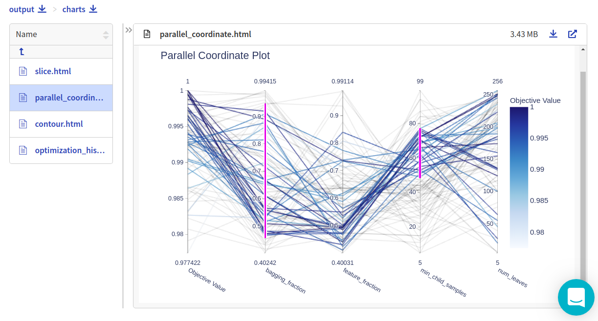
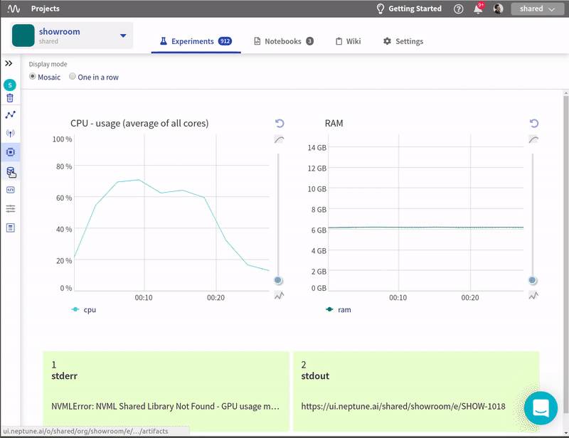

.. _integrations-optuna:

Neptune-Optuna Integration
==========================

This integration enables you to monitor |Optuna| hyperparameter optimization in Neptune.

Requirements
------------
To use Neptune + Optuna integration you need to have installed is |neptune-client| and |neptune-contrib|.

.. code-block:: bash

    pip install neptune-client neptune-contrib['monitoring']

Initialize Neptune and create an experiment
-------------------------------------------

.. code-block:: python3

    import neptune

    neptune.init(api_token='ANONYMOUS',
                 project_qualified_name='shared/showroom')

    neptune.create_experiment('optuna-sweep')

Create **NeptuneCallback**
--------------------------
.. note:: You can pass the experiment object as the first argument if you want to do it explicitly.

.. code-block:: python3

    import neptunecontrib.monitoring.optuna as opt_utils

    neptune_callback = opt_utils.NeptuneCallback()

Pass **neptune_monitor** to **study.optimize**
----------------------------------------------
Monitor the metrics and parameters checked at each run:

.. code-block:: python3

    study = optuna.create_study(direction='maximize')
    study.optimize(objective, n_trials=100, callbacks=[neptune_callback])

Log all results
---------------
You can log additional information from optuna study after the sweep has completed.
By running:

.. code-block:: python3

    opt_utils.log_study_info(study)

You log the following things to Neptune:

* Best score
* Best parameters
* Interactive plotly figures from optuna.visualization: plot_contour, plot_slice, plot_parallel_coordinate, optimization_history
* Pickled study object

Log study and charts after every iteration
------------------------------------------
You can log interactive charts from optuna.visualization and the study object after every iteration.
Simply specify what you want to log at `NeptuneCallback` creation.

.. code-block:: python3

    neptune_callback = opt_utils.NeptuneCallback(log_study=True, log_charts=True)

Monitor your Optuna training in Neptune
---------------------------------------
Now you can watch your Optuna hyperparameter optimization in Neptune!

Check out this |example experiment|.

.. image:: ../_static/images/integrations/optuna_monitoring.gif
   :target: ../_static/images/integrations/optuna_monitoring.gif
   :alt: Optuna monitoring in Neptune

Full script
-----------

.. code-block:: python3

    import lightgbm as lgb
    import optuna
    from sklearn.datasets import load_breast_cancer
    from sklearn.metrics import roc_auc_score
    from sklearn.model_selection import train_test_split

    import neptune
    import neptunecontrib.monitoring.optuna as optuna_utils

    neptune.init(api_token='ANONYMOUS',
                 project_qualified_name='shared/showroom')

    neptune.create_experiment('optuna-sweep')
    neptune_callback = optuna_utils.NeptuneCallback()

    def objective(trial):
        data, target = load_breast_cancer(return_X_y=True)
        train_x, test_x, train_y, test_y = train_test_split(data, target, test_size=0.25)
        dtrain = lgb.Dataset(train_x, label=train_y)

        param = {
            'objective': 'binary',
            'metric': 'binary_logloss',
            'num_leaves': trial.suggest_int('num_leaves', 2, 256),
            'feature_fraction': trial.suggest_uniform('feature_fraction', 0.4, 1.0),
            'bagging_fraction': trial.suggest_uniform('bagging_fraction', 0.4, 1.0),
            'min_child_samples': trial.suggest_int('min_child_samples', 5, 100),
        }

        gbm = lgb.train(param, dtrain)
        preds = gbm.predict(test_x)
        accuracy = roc_auc_score(test_y, preds)
        return accuracy

    study = optuna.create_study(direction='maximize')
    study.optimize(objective, n_trials=100, callbacks=[neptune_callback])
    optuna_utils.log_study(study)

.. External links

.. |Optuna| raw:: html

    <a href="https://optuna.org/" target="_blank">Optuna</a>

.. |example experiment| raw:: html

    <a href="https://ui.neptune.ai/o/shared/org/showroom/e/SHOW-1018/artifacts" target="_blank">example experiment</a>

.. |neptune-client| raw:: html

    <a href="https://github.com/neptune-ai/neptune-client" target="_blank">neptune-client</a>

.. |neptune-contrib| raw:: html

    <a href="https://github.com/neptune-ai/neptune-contrib" target="_blank">neptune-contrib</a>
