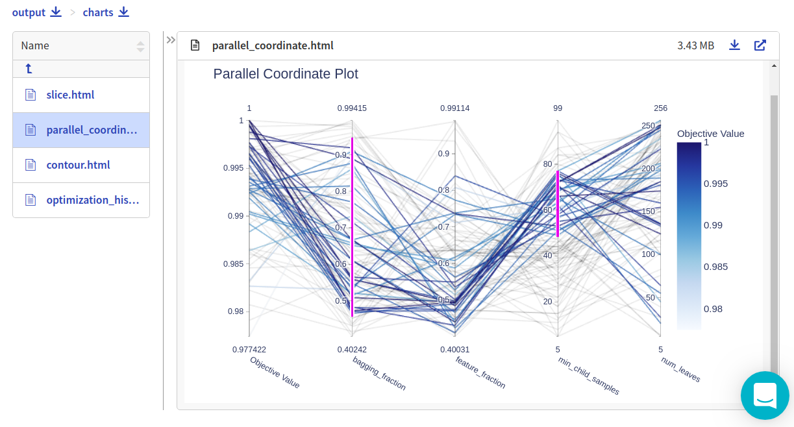
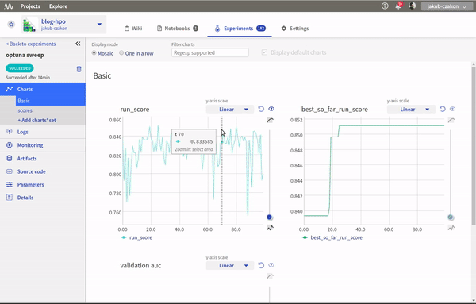

Neptune-Optuna Integration
==========================

This integration enables you to monitor |Optuna| hyperparameter optimization in Neptune.

Requirements
------------
Integration with the Optuna framework is enabled as a part of the logging module, so all you need to have installed is |neptune-client| and |neptune-contrib|.

.. code-block:: bash

    pip install neptune-client neptune-contrib['monitoring']

Initialize Neptune and create an experiment
-------------------------------------------

.. code-block:: python3

    import neptune
    neptune.init('jakub-czakon/blog-hpo')
    neptune.create_experiment(name='optuna sweep')

Create **NeptuneMonitor** callback
----------------------------------
Pass the experiment object as the first argument.

.. note:: To be able to log information after the ``.fit()`` method finishes, remember to pass ``close_after_train=False``.

.. code-block:: python3

    import neptunecontrib.monitoring.optuna as opt_utils
    neptune_monitor = opt_utils.NeptuneMonitor()

Pass **neptune_monitor** to **study.optimize**
----------------------------------------------
Monitor the metrics and parameters checked at each run:

.. code-block:: python3

    study = optuna.create_study(direction='maximize')
    study.optimize(objective, n_trials=100, callbacks=[monitor])

Log all results
---------------

The script logs the following to Neptune:

* Best score
* Best parameters
* plot_convergence figure
* plot_evaluations figure
* plot_objective figure

.. code-block:: python3

    opt_utils.log_study(study)

Monitor your Optuna training in Neptune
---------------------------------------
Now you can watch your Optuna hyperparameter optimization in Neptune!

Check out this |example experiment|.

.. External links

.. |Optuna| raw:: html

    <a href="https://optuna.org/" target="_blank">Optuna</a>

.. |example experiment| raw:: html

    <a href="https://ui.neptune.ai/jakub-czakon/blog-hpo/e/BLOG-270/logs" target="_blank">example experiment</a>

.. |neptune-client| raw:: html

    <a href="https://github.com/neptune-ai/neptune-client" target="_blank">neptune-client</a>

.. |neptune-contrib| raw:: html

    <a href="https://github.com/neptune-ai/neptune-contrib" target="_blank">neptune-contrib</a>
