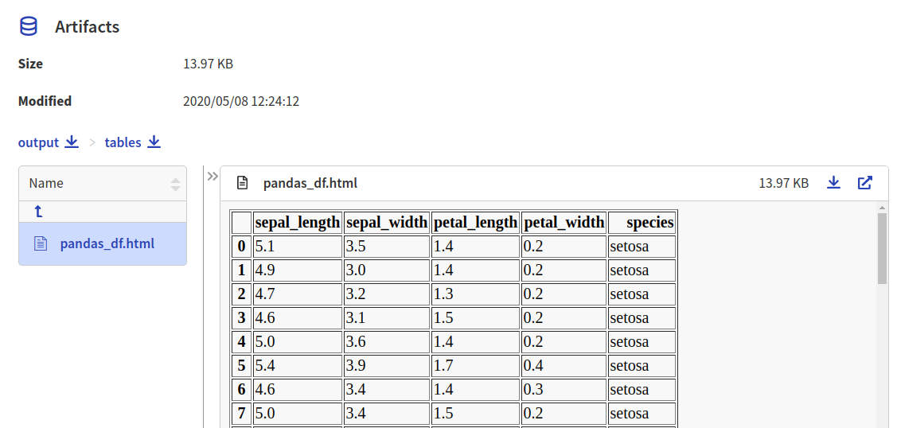
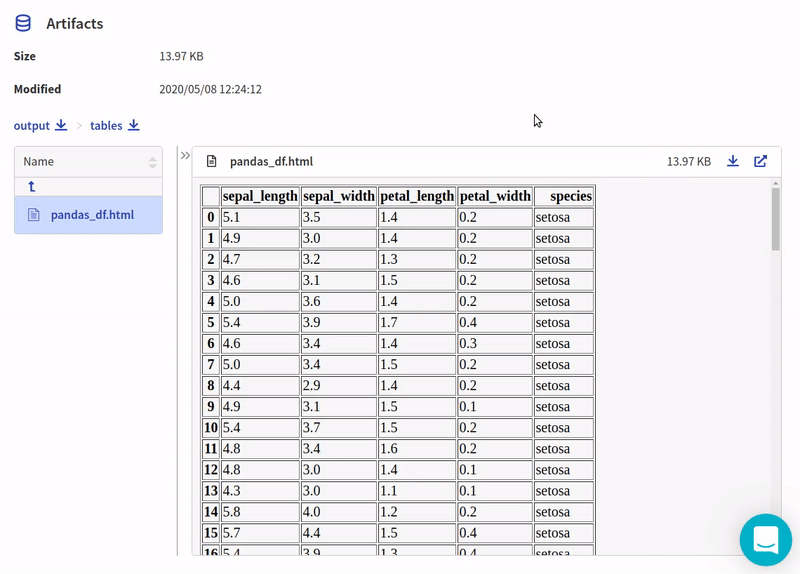

.. _integration-pandas:

Neptune-Pandas Integration
==============================

This integration lets you log |pandas| dataframes to Neptune.

Follow these steps:

0. Create an experiment:

   .. code-block::

        import neptune

        neptune.init(api_token='ANONYMOUS',project_qualified_name='shared/showroom')
        neptune.create_experiment()

1. Create and log pandas dataframes into Neptune:

   .. code-block::

    import pandas as pd

    iris_df = pd.read_csv('https://raw.githubusercontent.com/mwaskom/seaborn-data/master/iris.csv', nrows=100)

   .. code-block::

        from neptunecontrib.api import log_table

        log_table('pandas_df', iris_df)

2. Explore the results in the Neptune dashboard:

Check out |this experiment| in the app.

.. External Links

.. |pandas| raw:: html

    <a href="https://pandas.pydata.org/" target="_blank">pandas</a>

.. |this experiment| raw:: html

    <a href="https://ui.neptune.ai/o/shared/org/showroom/e/SHOW-980/artifacts?path=tables%2F&file=pandas_df.html" target="_blank">this experiment</a>
