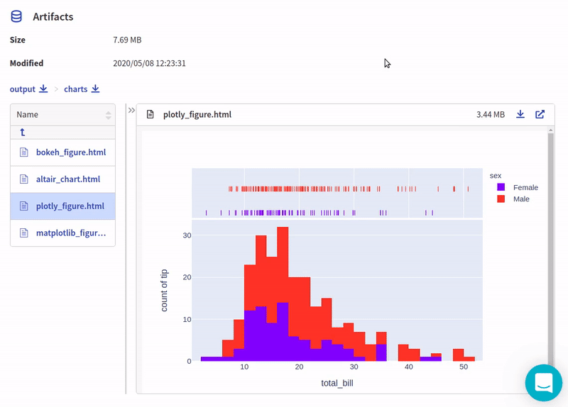

Neptune-plotly Integration
==============================

This integration lets you log interactive charts generated in |plotly|, like confusion matrix or distribution, in Neptune.

Follow these steps:

0. Create an experiment:

   .. code-block::

        import neptune

        neptune.init(api_token='ANONYMOUS',project_qualified_name='shared/showroom')
        neptune.create_experiment()

1. Create and log plotly figures into Neptune:

   .. code-block::

        import plotly.express as px

        df = px.data.tips()
        plotly_fig = px.histogram(df, x="total_bill", y="tip", color="sex", marginal="rug",
                           hover_data=df.columns)

   .. code-block::

        from neptunecontrib.api import log_chart

        log_chart(name='plotly_figure', chart=plotly_fig)

2. Explore the results in the Neptune dashboard:

Check out |this experiment| in the app.

.. External Links

.. |plotly| raw:: html

    <a href="https://plotly.com/" target="_blank">plotly</a>

.. |this experiment| raw:: html

    <a href="https://ui.neptune.ai/o/shared/org/showroom/e/SHOW-978/artifacts?path=charts%2F&file=plotly_figure.html" target="_blank">this experiment</a>
