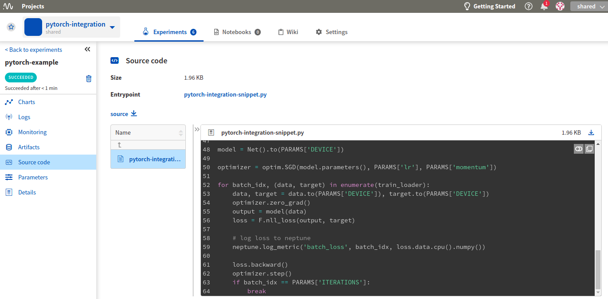

.. _integration-pytorch:

Neptune-PyTorch Integration
===========================

Neptune has implemented an integration with the PyTorch machine learning library.

Log PyTorch metrics
-------------------
It is very easy to track PyTorch metrics in Neptune. The following example presents a simple integration that lets you track loss:

.. code-block:: python3

    for batch_idx, (data, target) in enumerate(train_loader):
        data, target = data.to(PARAMS['DEVICE']), target.to(PARAMS['DEVICE'])
        optimizer.zero_grad()
        output = model(data)
        loss = F.nll_loss(output, target)

        # log loss to neptune
        neptune.log_metric('batch_loss', batch_idx, loss.data.cpu().numpy())

Your loss is now logged to Neptune:

.. image:: ../_static/images/integrations/ht-log-pytorch-1.png
   :target: ../_static/images/integrations/ht-log-pytorch-1.png
   :alt: image

.. note::

    Check for more example in the |pytorch-integration| Neptune project.

Full script
^^^^^^^^^^^
.. code-block:: python3

    # imports
    import neptune
    import torch
    import torch.nn as nn
    import torch.nn.functional as F
    import torch.optim as optim
    from torchvision import datasets, transforms

    # set project
    neptune.init(api_token='ANONYMOUS',
                 project_qualified_name='shared/pytorch-integration')

    PARAMS = {'DEVICE': torch.device("cuda" if torch.cuda.is_available() else "cpu"),
              'ITERATIONS': 1000,
              'batch_size': 64,
              'lr': 0.005,
              'momentum': 0.9}

    class Net(nn.Module):
        def __init__(self):
            super(Net, self).__init__()
            self.conv1 = nn.Conv2d(1, 20, 5, 1)
            self.conv2 = nn.Conv2d(20, 50, 5, 1)
            self.fc1 = nn.Linear(4*4*50, 500)
            self.fc2 = nn.Linear(500, 10)

        def forward(self, x):
            x = F.relu(self.conv1(x))
            x = F.max_pool2d(x, 2, 2)
            x = F.relu(self.conv2(x))
            x = F.max_pool2d(x, 2, 2)
            x = x.view(-1, 4*4*50)
            x = F.relu(self.fc1(x))
            x = self.fc2(x)
            return F.log_softmax(x, dim=1)

    # start experiment
    neptune.create_experiment(name='pytorch-example', params=PARAMS)

    train_loader = torch.utils.data.DataLoader(
        datasets.MNIST('../data',
                       train=True,
                       download=True,
                       transform=transforms.Compose([transforms.ToTensor(),
                                                     transforms.Normalize((0.1307,), (0.3081,))])),
       batch_size=PARAMS['batch_size'],
       shuffle=True)

    model = Net().to(PARAMS['DEVICE'])

    optimizer = optim.SGD(model.parameters(), PARAMS['lr'], PARAMS['momentum'])

    for batch_idx, (data, target) in enumerate(train_loader):
        data, target = data.to(PARAMS['DEVICE']), target.to(PARAMS['DEVICE'])
        optimizer.zero_grad()
        output = model(data)
        loss = F.nll_loss(output, target)

        # log loss to neptune
        neptune.log_metric('batch_loss', batch_idx, loss.data.cpu().numpy())

        loss.backward()
        optimizer.step()
        if batch_idx == PARAMS['ITERATIONS']:
            break

.. External links

.. |pytorch-integration| raw:: html

    <a href="https://ui.neptune.ai/shared/pytorch-integration/experiments" target="_blank">pytorch-integration</a>
