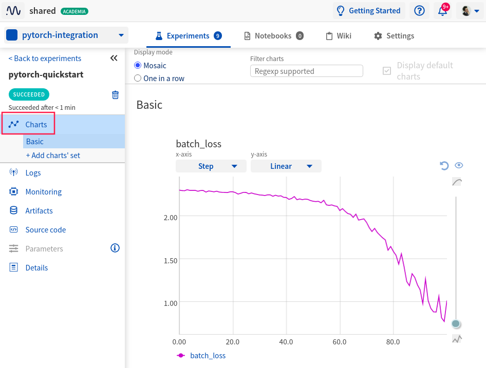

.. _integrations-pytorch:

Neptune-PyTorch Integration
===========================

.. note::

    Neptune integrates with both pure PyTorch and many libraries from the PyTorch Ecosystem.
    You may want to check out the following integrations:

    - :ref:`PyTorch Lightning <integrations-pytorch-lightning>`
    - :ref:`Fastai and Fastai2 <integrations-fastai>`
    - :ref:`PyTorch Ignite <integrations-pytorch-ignite>`
    - :ref:`Catalyst <integrations-catalyst>`
    - :ref:`Skorch <integrations-skorch>`

    For pure PyTorch integration, read on.

|colab-script-neptune|

What will you get with this integration?
----------------------------------------

|pytorch-tour-loom|

|Pytorch| is an open source machine learning framework commonly used for building deep neural network models.
Neptune helps with keeping track of model training metadata.

With Neptune + PyTorch integration you can:

- log hyperparameters
- see learning curves for losses and metrics during training
- see hardware consumption during training
- log stdout and stderr
- log training code and .git information
- log model weights
- log torch tensors as images

.. tip::
    You can log many other experiment metadata like interactive charts, video, audio and more.
    See a :ref:`full list <what-you-can-log>`.

.. note::

    This integration is tested with ``torch==1.7.0``, ``neptune-client==0.4.126``.

Where to start?
---------------
To get started with this integration, follow the :ref:`quickstart <pytorch-quickstart>` below.
You can also skip the basics and take a look at how to log model weights and prediction images in the :ref:`advanced options <pytorch-advanced-options>` section.

If you want to try things out and focus only on the code you can either:

|colab-script-neptune|

.. _pytorch-quickstart:

Quickstart
----------
This quickstart will show you how to:

* Install the necessary neptune packages
* Connect Neptune to your Optuna hyperparameter tuning code and create the first experiment
* Log metrics, figures, and artifacts from your first Optuna sweep to Neptune, and
* Explore them in the Neptune UI.

.. _pytorch-before-you-start-basic:

Before you start
^^^^^^^^^^^^^^^^
You have ``Python 3.x`` and following libraries installed:

* ``neptune-client``. See :ref:`neptune-client installation guide <installation-neptune-client>`.
* ``torch``. See |pytorch-install|.

You also need minimal familiarity with torch. Have a look at this |pytorch-guide| to get started.

.. code-block:: bash

   pip install --quiet torch neptune-client

Step 1: Initialize Neptune
^^^^^^^^^^^^^^^^^^^^^^^^^^
Run the code below:

.. code-block:: python3

    import neptune

    neptune.init(api_token='ANONYMOUS', project_qualified_name='shared/pytorch-integration')

.. tip::

    You can also use your personal API token. Read more about how to :ref:`securely set the Neptune API token <how-to-setup-api-token>`.

Step 2: Create an Experiment and log parameters
^^^^^^^^^^^^^^^^^^^^^^^^^^^^^^^^^^^^^^^^^^^^^^^
Run the code below to create a Neptune experiment:

.. code-block:: python3

    neptune.create_experiment('pytorch-quickstart')

This also creates a link to the experiment. Open the link in a new tab.
The charts will currently be empty, but keep the window open. You will be able to see live metrics once logging starts.

Step 3: Add logging into your training loop
^^^^^^^^^^^^^^^^^^^^^^^^^^^^^^^^^^^^^^^^^^^
Log your loss after every batch by adding ``neptune.log_metric`` inside of the loop.

.. code-block:: python3

    for batch_idx, (data, target) in enumerate(train_loader):
        optimizer.zero_grad()
        outputs = model(data)
        loss = F.nll_loss(outputs, target)

        # log loss
        neptune.log_metric('batch_loss', loss)

        loss.backward()
        optimizer.step()
        if batch_idx == 100:
            break

You can log epoch metric and losses by calling ``neptune.log_metric`` at the epoch level.

Step 4: Run your training script
^^^^^^^^^^^^^^^^^^^^^^^^^^^^^^^^
Run your script as you normally do:

.. code-block:: bash

    python train.py

Step 5: Monitor your PyTorch training in Neptune
^^^^^^^^^^^^^^^^^^^^^^^^^^^^^^^^^^^^^^^^^^^^^^^^
Now you can switch to the Neptune tab which you had opened previously to watch the training live!

|example-charts|

.. _pytorch-advanced-options:

Advanced Options
----------------

Log hardware consumption
^^^^^^^^^^^^^^^^^^^^^^^^
Neptune can automatically log your CPU and GPU consumption during training as well as stderr and stdout from your console.
To do that you just need to install psutil.

.. code-block:: bash

    pip install psutil

.. image:: ../_static/images/integrations/pytorch-hardware.png
   :target: ../_static/images/integrations/pytorch-hardware.png
   :alt: PyTorch hardware consumption charts

|example-hardware|

Log hyperparameters
^^^^^^^^^^^^^^^^^^^
You can log training and model hyperparameters.
To do that just pass the parameter dictionary to ``neptune.create_experiment`` method:

.. code-block:: python3

    PARAMS = {'lr':0.005,
               'momentum':0.9,
               'iterations':100}

    optimizer = optim.SGD(model.parameters(), PARAMS['lr'], PARAMS['momentum'])

    # log params
    neptune.create_experiment('pytorch-advanced', params=PARAMS)

.. image:: ../_static/images/integrations/pytorch-parameters.png
   :target: ../_static/images/integrations/pytorch-parameters.png
   :alt: PyTorch hyperparameter logging

|example-hyperparameters|

Log model weights
^^^^^^^^^^^^^^^^^
You can log model weights to Neptune both during and after training.

To do that just use a ``neptune.log_artifact`` method on the saved model file.

.. code-block:: python3

    torch.save(model.state_dict(), 'model_dict.ckpt')

    # log model
    neptune.log_artifact('model_dict.ckpt')

.. image:: ../_static/images/integrations/pytorch-artifacts.png
   :target: ../_static/images/integrations/pytorch-artifacts.png
   :alt: PyTorch checkpoints logging

|example-weights|

Log image predictions
^^^^^^^^^^^^^^^^^^^^^
You can log tensors as images to Neptune with some additional descriptions.

.. code-block:: python3

    for batch_idx, (data, target) in enumerate(train_loader):

        optimizer.zero_grad()
        outputs = model(data)
        loss = F.nll_loss(outputs, target)

        loss.backward()
        optimizer.step()

        # log loss
        neptune.log_metric('batch_loss', loss)

        # log predicted images
        if batch_idx % 50 == 1:
            for image, prediction in zip(data, outputs):
                description = '\n'.join(['class {}: {}'.format(i, pred)
                                         for i, pred in enumerate(F.softmax(prediction))])
                neptune.log_image('predictions',
                                  image.squeeze().detach().numpy() * 255,
                                  description=description)

        if batch_idx == PARAMS['iterations']:
            break

.. image:: ../_static/images/integrations/pytorch-images.png
   :target: ../_static/images/integrations/pytorch-images.png
   :alt: PyTorch logging images

|example-images|

Remember that you can try it out with zero setup:

|colab-script-neptune|

How to ask for help?
--------------------
Please visit the :ref:`Getting help <getting-help>` page. Everything regarding support is there.

Other integrations you may like
-------------------------------
Here are other integrations with libraries from the PyTorch ecosystem:

- :ref:`PyTorch Lightning<integrations-pytorch-lightning>`
- :ref:`Fastai and Fastai2 <integrations-fastai>`
- :ref:`PyTorch Ignite <integrations-pytorch-ignite>`
- :ref:`Catalyst <integrations-catalyst>`
- :ref:`Skorch <integrations-skorch>`

You may also like these two integrations:

- :ref:`Optuna <integrations-optuna>`
- :ref:`Plotly <integrations-plotly>`

.. External links

.. |pytorch-integration| raw:: html

    <a href="https://ui.neptune.ai/shared/pytorch-integration/experiments" target="_blank">pytorch-integration</a>

.. |PyTorch| raw:: html

    <a href="https://pytorch.org/" target="_blank">PyTorch</a>

.. |pytorch-install| raw:: html

    <a href="https://pytorch.org/get-started/locally/" target="_blank">PyTorch installation guide</a>

.. |pytorch-guide| raw:: html

    <a href="https://pytorch.org/tutorials/beginner/deep_learning_60min_blitz.html" target="_blank">PyTorch guide</a>

.. |example quickstart experiment| raw:: html

    <a href="https://ui.neptune.ai/o/shared/org/pytorch-integration/e/PYTORCH-16/charts" target="_blank">PyTorch guide</a>

.. |example-project| raw:: html

    

        <a target="_blank"  href="https://ui.neptune.ai/o/shared/org/pytorch-integration/experiments?viewId=5bf0532a-c0f3-454e-be97-fa24899a82fe">
            
            See example in Neptune
        </a>
    

.. |example-charts| raw:: html

    

        <a target="_blank"  href="https://ui.neptune.ai/o/shared/org/pytorch-integration/e/PYTORCH-16/charts">
            
            See example in Neptune
        </a>
    

.. |example-hardware| raw:: html

    

        <a target="_blank"  href="https://ui.neptune.ai/o/shared/org/pytorch-integration/e/PYTORCH-17/monitoring">
            
            See example in Neptune
        </a>
    

.. |example-hyperparameters| raw:: html

    

        <a target="_blank"  href="https://ui.neptune.ai/o/shared/org/pytorch-integration/e/PYTORCH-17/parameters">
            
            See example in Neptune
        </a>
    

.. |example-images| raw:: html

    

        <a target="_blank"  href="https://ui.neptune.ai/o/shared/org/pytorch-integration/e/PYTORCH-17/logs">
            
            See example in Neptune
        </a>
    

.. |example-weights| raw:: html

    

        <a target="_blank"  href="https://ui.neptune.ai/o/shared/org/pytorch-integration/e/PYTORCH-17/artifacts">
            
            See example in Neptune
        </a>
    

.. |colab-script-neptune| raw:: html

    

        

        <a target="_blank" href="https://github.com/neptune-ai/neptune-examples/blob/master/integrations/pytorch/docs/Neptune-PyTorch.py">
            
            View source on GitHub
        </a>
        <a target="_blank" href="https://ui.neptune.ai/o/shared/org/pytorch-integration/experiments?viewId=5bf0532a-c0f3-454e-be97-fa24899a82fe">
            
            See example in Neptune
        </a>
    

.. |pytorch-tour-loom| raw:: html

	

		<iframe src="https://www.loom.com/embed/e3116bbadf2b41b48edc44559441f95c" frameborder="0" webkitallowfullscreen mozallowfullscreen allowfullscreen style="position: absolute; top: 0; left: 0; width: 100%; height: 100%;">
		</iframe>
	
