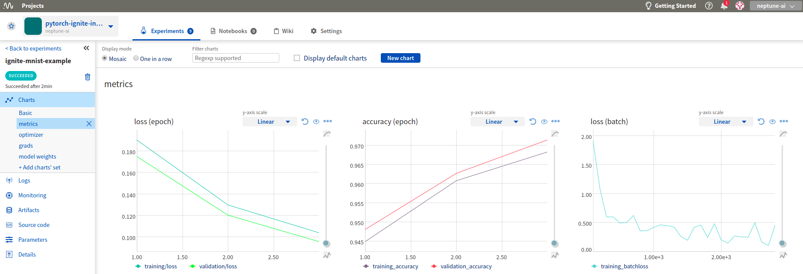
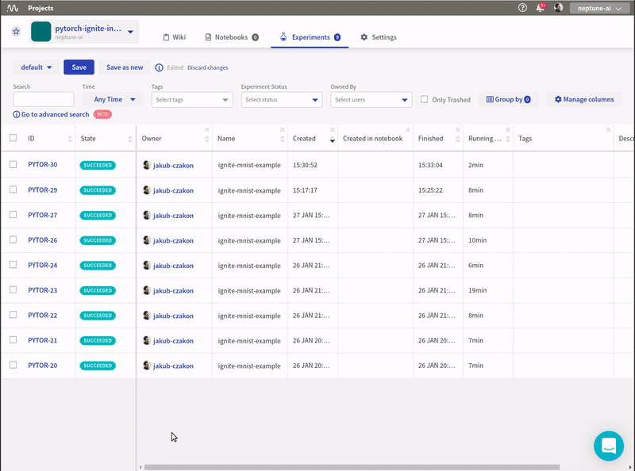

.. _integrations-pytorch-ignite:

Neptune-PyTorch Ignite Integration
==================================

The integration enables you to log |PyTorch Ignite| metrics to Neptune.

Requirements
------------
Integration with the PyTorch Ignite framework is enabled as part of the Neptune logging module, so all you need is to have |neptune-client| installed.

.. code-block:: bash

    pip install neptune-client

Create the **NeptuneLogger** with all the information you want to track
-----------------------------------------------------------------------
.. code-block:: python3

    from ignite.contrib.handlers.neptune_logger import *

    npt_logger = NeptuneLogger(api_token="ANONYMOUS",
                               project_name='shared/pytorch-ignite-integration',
                               name='ignite-mnist-example',
                               params={'train_batch_size': train_batch_size,
                                       'val_batch_size': val_batch_size,
                                       'epochs': epochs,
                                       'lr': lr,
                                       'momentum': momentum})

Attach handlers to **npt_logger**
---------------------------------

There are many handlers that you can attach to track your training. The following showcase some capabilities:

- ``OutputHandler`` tracks losses and metrics:

.. code-block:: python3

    npt_logger.attach(trainer,
                      log_handler=OutputHandler(tag="training",
                                                output_transform=lambda loss: {'batchloss': loss},
                                                metric_names='all'),
                      event_name=Events.ITERATION_COMPLETED(every=100))

    npt_logger.attach(train_evaluator,
                      log_handler=OutputHandler(tag="training",
                                                metric_names=["loss", "accuracy"],
                                                another_engine=trainer),
                      event_name=Events.EPOCH_COMPLETED)

    npt_logger.attach(validation_evaluator,
                      log_handler=OutputHandler(tag="validation",
                                                metric_names=["loss", "accuracy"],
                                                another_engine=trainer),
                      event_name=Events.EPOCH_COMPLETED)

- ``OptimizerParamsHandler`` for tracking optimizer parameters like learning rate and momentum:

.. code-block:: python3

    npt_logger.attach(trainer,
                      log_handler=OptimizerParamsHandler(optimizer),
                      event_name=Events.ITERATION_COMPLETED(every=100))

- ``WeightsScalarHandler`` for tracking the norm of model weights per layer:

.. code-block:: python3

    npt_logger.attach(trainer,
                      log_handler=WeightsScalarHandler(model),
                      event_name=Events.ITERATION_COMPLETED(every=100))

- ``GradsScalarHandler`` for tracking the norm of gradients per layer:

.. code-block:: python3

    npt_logger.attach(trainer,
                      log_handler=GradsScalarHandler(model),
                      event_name=Events.ITERATION_COMPLETED(every=100))

- ``NeptuneSaver`` for logging model checkpoints during training:

.. code-block:: python3

    from ignite.handlers import Checkpoint

    def score_function(engine):
        return engine.state.metrics['accuracy']

    to_save = {'model': model}
    handler = Checkpoint(to_save, NeptuneSaver(npt_logger), n_saved=2,
                         filename_prefix='best', score_function=score_function,
                         score_name="validation_accuracy",
                         global_step_transform=global_step_from_engine(trainer))
    validation_evaluator.add_event_handler(Events.COMPLETED, handler)

Run trainer
-----------
.. code-block:: python3

    trainer.run(train_loader, max_epochs=epochs)

Log additional information
--------------------------

You can log any additional information directly to neptune experiment.
It can be accessed via ``npt_logger.experiment``.

.. code-block:: python3

    torch.save(model.state_dict(), 'model.pth')
    npt_logger.experiment.log_artifact('model.pth')

Close the logger after you have finished tracking
-------------------------------------------------
.. code-block:: python3

    npt_logger.close()

Monitor your PyTorch Ignite training in Neptune
-----------------------------------------------
Now you can watch your pytorch-ignite model training in Neptune!

Check this |example experiment|.

Full PyTorch Ignite monitor script
----------------------------------
Simply copy and paste it to ``ignite_example.py`` and run.
Remember to change your credentials in the ``NeptuneLogger``:

.. code-block:: python3

    npt_logger = NeptuneLogger(api_token=os.getenv('NEPTUNE_API_TOKEN'), # put your api token in environment variable
                               project_name='neptune-ai/pytorch-ignite-integration', # change it to your project
                               ...)

.. code-block:: python3

    import torch
    from torch.utils.data import DataLoader
    from torch import nn
    import torch.nn.functional as F
    from torch.optim import SGD
    from torchvision.datasets import MNIST
    from torchvision.transforms import Compose, ToTensor, Normalize

    from ignite.engine import Events, create_supervised_trainer, create_supervised_evaluator
    from ignite.metrics import Accuracy, Loss

    from ignite.contrib.handlers.neptune_logger import *

    LOG_INTERVAL = 10

    class Net(nn.Module):
        def __init__(self):
            super(Net, self).__init__()
            self.conv1 = nn.Conv2d(1, 10, kernel_size=5)
            self.conv2 = nn.Conv2d(10, 20, kernel_size=5)
            self.conv2_drop = nn.Dropout2d()
            self.fc1 = nn.Linear(320, 50)
            self.fc2 = nn.Linear(50, 10)

        def forward(self, x):
            x = F.relu(F.max_pool2d(self.conv1(x), 2))
            x = F.relu(F.max_pool2d(self.conv2_drop(self.conv2(x)), 2))
            x = x.view(-1, 320)
            x = F.relu(self.fc1(x))
            x = F.dropout(x, training=self.training)
            x = self.fc2(x)
            return F.log_softmax(x, dim=-1)

    def get_data_loaders(train_batch_size, val_batch_size):
        data_transform = Compose([ToTensor(), Normalize((0.1307,), (0.3081,))])

        train_loader = DataLoader(MNIST(download=True, root=".", transform=data_transform, train=True),
                                  batch_size=train_batch_size, shuffle=True)

        val_loader = DataLoader(MNIST(download=False, root=".", transform=data_transform, train=False),
                                batch_size=val_batch_size, shuffle=False)
        return train_loader, val_loader

    train_batch_size = 64
    val_batch_size = 1000
    epochs = 10
    lr = 0.01
    momentum = 0.5

    train_loader, val_loader = get_data_loaders(train_batch_size, val_batch_size)
    model = Net()
    device = 'cpu'

    if torch.cuda.is_available():
        device = 'cuda'

    optimizer = SGD(model.parameters(), lr=lr, momentum=momentum)
    criterion = nn.CrossEntropyLoss()
    trainer = create_supervised_trainer(model, optimizer, criterion, device=device)

    metrics = {
        'accuracy': Accuracy(),
        'loss': Loss(criterion)
    }

    train_evaluator = create_supervised_evaluator(model, metrics=metrics, device=device)
    validation_evaluator = create_supervised_evaluator(model, metrics=metrics, device=device)

    @trainer.on(Events.EPOCH_COMPLETED)
    def compute_metrics(engine):
        train_evaluator.run(train_loader)
        validation_evaluator.run(val_loader)

    npt_logger = NeptuneLogger(api_token=None,
                               project_name="neptune-ai/pytorch-ignite-integration",
                               name='ignite-mnist-example',
                               params={'train_batch_size': train_batch_size,
                                       'val_batch_size': val_batch_size,
                                       'epochs': epochs,
                                       'lr': lr,
                                       'momentum': momentum})

    npt_logger.attach(trainer,
                      log_handler=OutputHandler(tag="training",
                                                output_transform=lambda loss: {'batchloss': loss},
                                                metric_names='all'),
                      event_name=Events.ITERATION_COMPLETED(every=100))

    npt_logger.attach(train_evaluator,
                      log_handler=OutputHandler(tag="training",
                                                metric_names=["loss", "accuracy"],
                                                another_engine=trainer),
                      event_name=Events.EPOCH_COMPLETED)

    npt_logger.attach(validation_evaluator,
                      log_handler=OutputHandler(tag="validation",
                                                metric_names=["loss", "accuracy"],
                                                another_engine=trainer),
                      event_name=Events.EPOCH_COMPLETED)

    npt_logger.attach(trainer,
                      log_handler=OptimizerParamsHandler(optimizer),
                      event_name=Events.ITERATION_COMPLETED(every=100))

    npt_logger.attach(trainer,
                      log_handler=WeightsScalarHandler(model),
                      event_name=Events.ITERATION_COMPLETED(every=100))

    npt_logger.attach(trainer,
                      log_handler=GradsScalarHandler(model),
                      event_name=Events.ITERATION_COMPLETED(every=100))

    # kick everything off
    trainer.run(train_loader, max_epochs=epochs)

    # log additional information
    torch.save(model.state_dict(), 'model.pth')
    npt_logger.experiment.log_artifact('model.pth')

    npt_logger.close()

.. External links

.. |PyTorch Ignite| raw:: html

    <a href="https://github.com/pytorch/ignite" target="_blank">PyTorch Ignite</a>

.. |example experiment| raw:: html

    <a href="https://ui.neptune.ai/o/neptune-ai/org/pytorch-ignite-integration/e/PYTOR-30/charts" target="_blank">example experiment</a>

.. |neptune-client| raw:: html

    <a href="https://github.com/neptune-ai/neptune-client" target="_blank">neptune-client</a>
