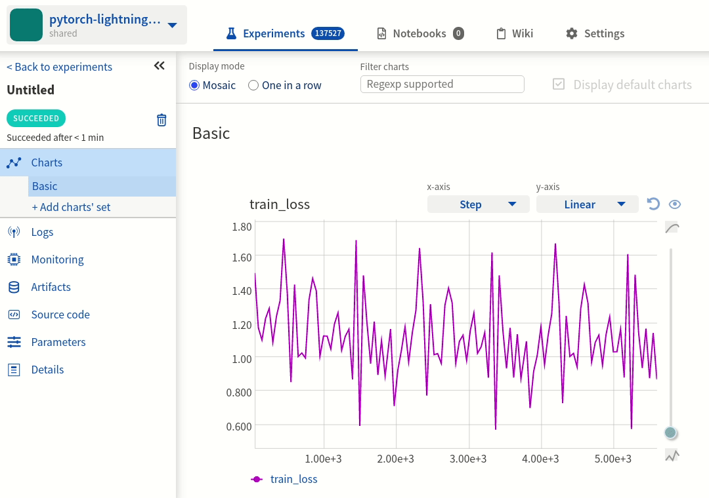
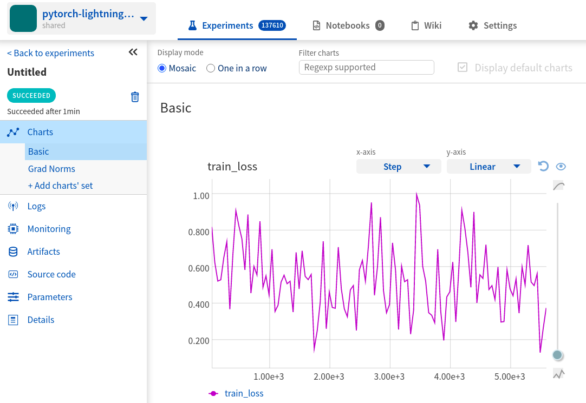
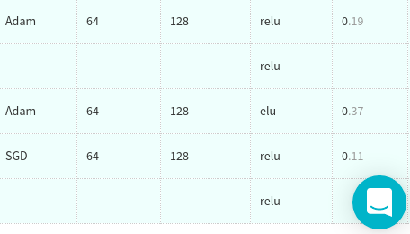

PyTorch Lightning Integration
=============================

What will you get?
------------------

PyTorch Lightning is a lightweight PyTorch wrapper for high-performance AI research. With Neptune integration you can:

* see experiment as it is running,
* log training and testing metrics, and visualize them in Neptune UI,
* log experiment parameters,
* monitor hardware usage,
* log any additional metrics of your choice,
* log performance charts,
* save model checkpoints.

.. note::

    This integration is tested with ``pytorch-lightning==0.9.0``. See 'Troubleshoot' section for information about other versions.

Quickstart
----------
This quickstart will show you how to log PyTorch Lightning experiments to Neptune using ``NeptuneLogger`` (part of the pytorch-lightning library).

Check this public project with example experiments: |project|.

.. tip::

    Follow whatever is most convenient to you:

    1. This page for detailed explanations,
    2. Open quickstart code in Colab Notebook (badge-link below) and run it as a "`neptuner`" user - zero setup, it just works,
    3. View quickstart code as Python script on |script|.

|Run on Colab|

Before you start
^^^^^^^^^^^^^^^^
**Prerequisites**

* Python 3,
* Neptune account |register|,
* ``pytorch-lightning==0.9.0`` and ``torchvision`` installed (lightning |lightning-install|),
* Minimal familiarity with the PyTorch Lightning.

Installation
^^^^^^^^^^^^
**Install neptune-client**

From PyPI:

.. code-block:: bash

    pip install neptune-client -U

From Conda:

.. code-block:: bash

    conda install neptune-client -c conda-forge

Now, you have all dependencies installed. Let's move to the actual integration.

Step 1: Import Libraries
^^^^^^^^^^^^^^^^^^^^^^^^
Import necessary libraries.

.. code-block:: python3

    import os

    import torch
    from torch.nn import functional as F
    from torch.utils.data import DataLoader
    from torchvision.datasets import MNIST
    from torchvision import transforms

    import pytorch_lightning as pl

Notice ``pytorch_lightning`` at the bottom.

Step 2: Define Hyper-Parameters
^^^^^^^^^^^^^^^^^^^^^^^^^^^^^^^
Define hyper-parameters for model training.

.. code-block:: python3

    PARAMS = {'max_epochs': 3,
              'learning_rate': 0.005,
              'batch_size': 32}

Hyper-parameters are passed in the regular Python dictionary. You will see them logged in Neptune parameters tab.

Step 3: Define LightningModule and DataLoader
^^^^^^^^^^^^^^^^^^^^^^^^^^^^^^^^^^^^^^^^^^^^^
Implement minimal example of the ``pl.LightningModule`` and simple ``DataLoader``.

.. code-block:: python3

    # pl.LightningModule
    class LitModel(pl.LightningModule):
        def __init__(self):
            super().__init__()
            self.l1 = torch.nn.Linear(28 * 28, 10)

        def forward(self, x):
            return torch.relu(self.l1(x.view(x.size(0), -1)))

        def training_step(self, batch, batch_idx):
            x, y = batch
            y_hat = self(x)
            loss = F.cross_entropy(y_hat, y)
            result = pl.TrainResult(minimize=loss)
            result.log('train_loss', loss)
            return result

        def configure_optimizers(self):
            return torch.optim.Adam(self.parameters(), lr=PARAMS['learning_rate'])

    # DataLoader
    train_loader = DataLoader(MNIST(os.getcwd(), download=True, transform=transforms.ToTensor()),
                              batch_size=PARAMS['batch_size'])

Cross Entropy loss in the ``training_step`` method will be logged to Neptune in every training step. ``DataLoader`` is a purely PyTorch object. Notice, that you pass ``learning_rate`` and ``batch_size`` from the ``PARAMS`` dictionary - all params will be logged as experiment parameters.

Step 4: Create NeptuneLogger
^^^^^^^^^^^^^^^^^^^^^^^^^^^^
Instantiate ``NeptuneLogger`` with necessary parameters.

.. code-block:: python3

    from pytorch_lightning.loggers.neptune import NeptuneLogger

    neptune_logger = NeptuneLogger(
        api_key="ANONYMOUS",
        project_name="shared/pytorch-lightning-integration",
        params=PARAMS)

``NeptuneLogger`` is an object that integrates Neptune with PyTorch Lightning allowing you to track experiments. It's a part of the lightning library. In this minimalist example we use public user `"neptuner"`, who has public token: `"ANONYMOUS"`.

.. tip::

    Make sure to use your API token in your projects. Read more about how to |token|.

Step 5: Pass NeptuneLogger to the Trainer
^^^^^^^^^^^^^^^^^^^^^^^^^^^^^^^^^^^^^^^^^
Pass instantiated ``NeptuneLogger`` to the ``pl.Trainer``.

.. code-block:: python3

    trainer = pl.Trainer(max_epochs=PARAMS['max_epochs'],
                         logger=neptune_logger)

Simply pass ``neptune_logger`` to the ``Trainer``, so that lightning will use this logger. Notice, that ``max_epochs`` is from the ``PARAMS`` dictionary.

Step 6: Run experiment
^^^^^^^^^^^^^^^^^^^^^^
Fit model to the data.

.. code-block:: python3

    model = LitModel()

    trainer.fit(model, train_loader)

At this point you are all set to fit the model. Neptune logger will collect metrics and show them in the UI.

Explore Results
^^^^^^^^^^^^^^^
You just learned how to start logging PyTorch Lightning experiments to Neptune, by using Neptune logger which is part of the lightning library.

Above training is logged to Neptune in near real-time. Click on the link that was outputted to the console or |go-here| to explore an experiment similar to yours. In particular check:

#. |metrics|,
#. |params|,
#. |hardware|,
#. |metadata| including git summary info.

Check this experiment |exp-link|.

|Run on Colab|

Advanced options
----------------

Log test metrics
^^^^^^^^^^^^^^^^

Log additional metrics
^^^^^^^^^^^^^^^^^^^^^^

Log performance charts
^^^^^^^^^^^^^^^^^^^^^^

Save model checkpoints
^^^^^^^^^^^^^^^^^^^^^^

Troubleshooting
---------------

Common problems
^^^^^^^^^^^^^^^

How to ask for help?
^^^^^^^^^^^^^^^^^^^^
The fastest way is to simply chat with us. Chat icon is located directly in-app, in the lower right corner. Use it!

For more general questions go to our |forum|.

Other integrations you may like
-------------------------------
Here are other integrations with libraries from the PyTorch ecosystem:

#. |PyTorch|
#. |PyTorch Ignite|
#. |Catalyst|
#. |skorch|

You may also like these two integrations:

#. |optuna|
#. |plotly|

.. External links

.. |register| raw:: html

    <a href="https://neptune.ai/register" target="_blank">register here</a>

.. |project| raw:: html

    <a href="https://ui.neptune.ai/o/shared/org/pytorch-lightning-integration/experiments?viewId=8080df27-e2d7-48e7-a04d-5fab2d2c6fd2" target="_blank">PyTorch Lightning integration</a>

.. |Run on Colab| raw:: html

    

.. |script| raw:: html

    <a href="https://github.com/neptune-ai/neptune-examples/blob/master/integrations/pytorch-lightning/docs/Neptune-PyTorch-Ligthning-basic.py" target="_blank">GitHub</a>

.. |token| raw:: html

    <a href="https://docs.neptune.ai/security-and-privacy/api-tokens/how-to-find-and-set-neptune-api-token.html#how-to-find-and-set-neptune-api-token" target="_blank">securely set Neptune API token</a>

.. |forum| raw:: html

    <a href="https://community.neptune.ai/" target="_blank">forum</a>

.. |PyTorch| raw:: html

    <a href="https://docs.neptune.ai/integrations/pytorch.html" target="_blank">PyTorch</a>

.. |PyTorch Ignite| raw:: html

    <a href="https://docs.neptune.ai/integrations/pytorch_ignite.html" target="_blank">PyTorch Ignite</a>

.. |Catalyst| raw:: html

    <a href="https://docs.neptune.ai/integrations/catalyst.html" target="_blank">Catalyst</a>

.. |skorch| raw:: html

    <a href="https://docs.neptune.ai/integrations/skorch.html" target="_blank">skorch</a>

.. |optuna| raw:: html

    <a href="https://docs.neptune.ai/integrations/optuna.html" target="_blank">optuna</a>

.. |plotly| raw:: html

    <a href="https://docs.neptune.ai/integrations/plotly.html" target="_blank">plotly</a>

.. |metrics| raw:: html

    <a href="https://ui.neptune.ai/o/shared/org/pytorch-lightning-integration/e/PYTOR-137793/charts" target="_blank">metrics</a>

.. |params| raw:: html

    <a href="https://ui.neptune.ai/o/shared/org/pytorch-lightning-integration/e/PYTOR-137793/parameters" target="_blank">logged parameters</a>

.. |hardware| raw:: html

    <a href="https://ui.neptune.ai/o/shared/org/pytorch-lightning-integration/e/PYTOR-137793/monitoring" target="_blank">hardware usage statistics</a>

.. |metadata| raw:: html

    <a href="https://ui.neptune.ai/o/shared/org/pytorch-lightning-integration/e/PYTOR-137793/details" target="_blank">metadata information</a>

.. |go-here| raw:: html

    <a href="https://ui.neptune.ai/o/shared/org/pytorch-lightning-integration/e/PYTOR-137793/charts" target="_blank">go here</a>

.. |exp-link| raw:: html

    <a href="https://ui.neptune.ai/o/shared/org/pytorch-lightning-integration/e/PYTOR-137793/charts" target="_blank">here</a>

.. |lightning-install| raw:: html

    <a href="https://pytorch-lightning.readthedocs.io/en/0.9.0/introduction_guide.html#installing-lightning" target="_blank">installation guide</a>
