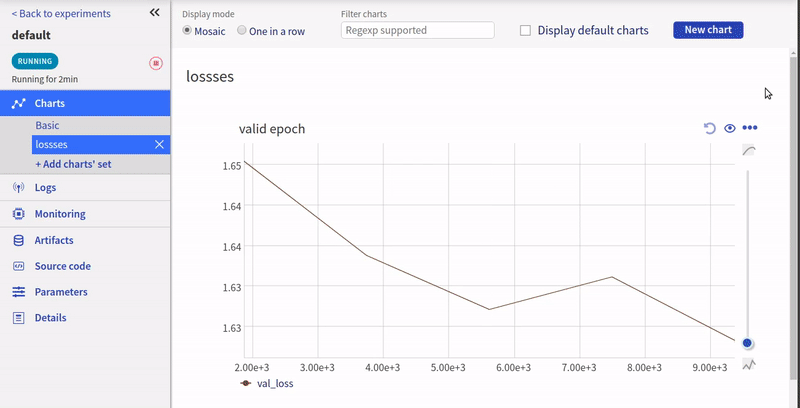

Log PyTorchLightning metrics to neptune
=======================================

Prerequisites
-------------
Integration with |PyTorchLightning| framework is introduced as a part of logging module so just need to have |neptune-client| installed.

.. code-block:: bash

    pip install neptune-client

Create the **LightningModule**
------------------------------
.. code-block:: python3

    import os

    import torch
    from torch.nn import functional as F
    from torch.utils.data import DataLoader
    from torchvision.datasets import MNIST
    from torchvision import transforms

    import pytorch_lightning as pl

    class CoolSystem(pl.LightningModule):

        def __init__(self):
            super(CoolSystem, self).__init__()
            # not the best model...
            self.l1 = torch.nn.Linear(28 * 28, 10)

        def forward(self, x):
            return torch.relu(self.l1(x.view(x.size(0), -1)))

        def training_step(self, batch, batch_idx):
            # REQUIRED
            x, y = batch
            y_hat = self.forward(x)
            loss = F.cross_entropy(y_hat, y)
            tensorboard_logs = {'train_loss': loss}
            return {'loss': loss, 'log': tensorboard_logs}

        def validation_step(self, batch, batch_idx):
            # OPTIONAL
            x, y = batch
            y_hat = self.forward(x)
            return {'val_loss': F.cross_entropy(y_hat, y)}

        def validation_end(self, outputs):
            # OPTIONAL
            avg_loss = torch.stack([x['val_loss'] for x in outputs]).mean()
            tensorboard_logs = {'val_loss': avg_loss}
            return {'avg_val_loss': avg_loss, 'log': tensorboard_logs}

        def configure_optimizers(self):
            # REQUIRED
            # can return multiple optimizers and learning_rate schedulers
            # (LBFGS it is automatically supported, no need for closure function)
            return torch.optim.Adam(self.parameters(), lr=0.02)

        @pl.data_loader
        def train_dataloader(self):
            # REQUIRED
            return DataLoader(MNIST(os.getcwd(), train=True, download=True, transform=transforms.ToTensor()), batch_size=32)

        @pl.data_loader
        def val_dataloader(self):
            # OPTIONAL
            return DataLoader(MNIST(os.getcwd(), train=True, download=True, transform=transforms.ToTensor()), batch_size=32)

Create the **NeptuneLogger** with all the information you want to track
------------------------------------------------------------------------
.. code-block:: python3

    from pytorch_lightning.logging.neptune import NeptuneLogger

    neptune_logger = NeptuneLogger(
        api_key=os.environ["NEPTUNE_API_TOKEN"],
        project_name="jakub-czakon/examples",
        experiment_name="default",  # Optional,
        params={"max_epochs": 10,
                "batch_size": 32},  # Optional,
        tags=["pytorch-lightning", "mlp"]  # Optional,
    )

Create the **Trainer** and pass **neptune_logger** to logger
------------------------------------------------------------
.. code-block:: python3

    from pytorch_lightning import Trainer

    trainer = Trainer(max_epochs=10, logger=neptune_logger)
    trainer.fit(CoolSystem())

Monitor your PyTorchLightning training in Neptune
--------------------------------------------------
Now you can watch your pytorch-lightning model training in neptune!

Full PyTorchLightning monitor script
------------------------------------
Simply copy and paste it to ``pytorch_lightning_example.py`` and run.
Remember to change your credentials in the **NeptuneLogger**:

.. code-block:: python3

    neptune_logger = NeptuneLogger(
        api_key=os.environ["NEPTUNE_API_TOKEN"],
        project_name="USERNAME/PROJECT_NAME",
        ...
        )

.. code-block:: python3

    import os

    import torch
    from torch.nn import functional as F
    from torch.utils.data import DataLoader
    from torchvision.datasets import MNIST
    from torchvision import transforms

    import pytorch_lightning as pl

    class CoolSystem(pl.LightningModule):

        def __init__(self):
            super(CoolSystem, self).__init__()
            # not the best model...
            self.l1 = torch.nn.Linear(28 * 28, 10)

        def forward(self, x):
            return torch.relu(self.l1(x.view(x.size(0), -1)))

        def training_step(self, batch, batch_idx):
            # REQUIRED
            x, y = batch
            y_hat = self.forward(x)
            loss = F.cross_entropy(y_hat, y)
            tensorboard_logs = {'train_loss': loss}
            return {'loss': loss, 'log': tensorboard_logs}

        def validation_step(self, batch, batch_idx):
            # OPTIONAL
            x, y = batch
            y_hat = self.forward(x)
            return {'val_loss': F.cross_entropy(y_hat, y)}

        def validation_end(self, outputs):
            # OPTIONAL
            avg_loss = torch.stack([x['val_loss'] for x in outputs]).mean()
            tensorboard_logs = {'val_loss': avg_loss}
            return {'avg_val_loss': avg_loss, 'log': tensorboard_logs}

        def configure_optimizers(self):
            # REQUIRED
            # can return multiple optimizers and learning_rate schedulers
            # (LBFGS it is automatically supported, no need for closure function)
            return torch.optim.Adam(self.parameters(), lr=0.02)

        @pl.data_loader
        def train_dataloader(self):
            # REQUIRED
            return DataLoader(MNIST(os.getcwd(), train=True, download=True, transform=transforms.ToTensor()), batch_size=32)

        @pl.data_loader
        def val_dataloader(self):
            # OPTIONAL
            return DataLoader(MNIST(os.getcwd(), train=True, download=True, transform=transforms.ToTensor()), batch_size=32)

    from pytorch_lightning.logging.neptune import NeptuneLogger

    neptune_logger = NeptuneLogger(
        api_key=os.environ["NEPTUNE_API_TOKEN"],
        project_name="USERNAME/PROJECT_NAME",
        experiment_name="default",  # Optional,
        params={"max_epochs": 4,
                "batch_size": 32},  # Optional,
        tags=["pytorch-lightning", "mlp"]  # Optional,
    )

    from pytorch_lightning import Trainer

    trainer = Trainer(max_epochs=4, logger=neptune_logger)
    trainer.fit(CoolSystem())

.. External links

.. |PyTorchLightning| raw:: html

    <a href="https://github.com/PyTorchLightning/pytorch-lightning" target="_blank">PyTorchLightning</a>

.. |neptune-client| raw:: html

    <a href="https://github.com/neptune-ai/neptune-client" target="_blank">neptune-client</a>