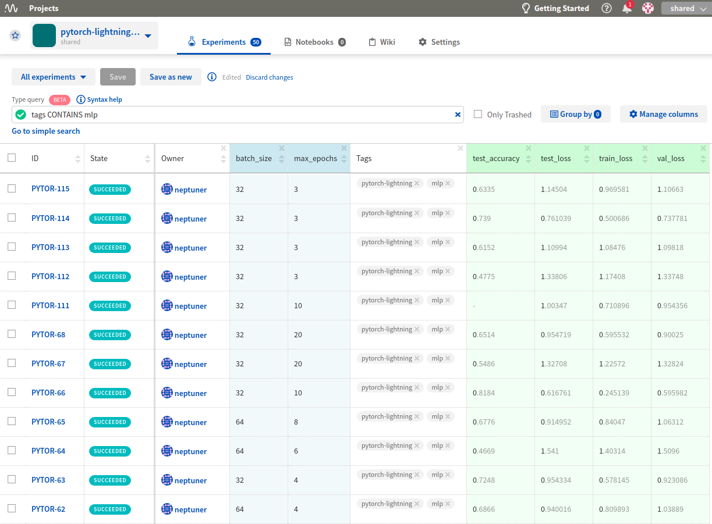
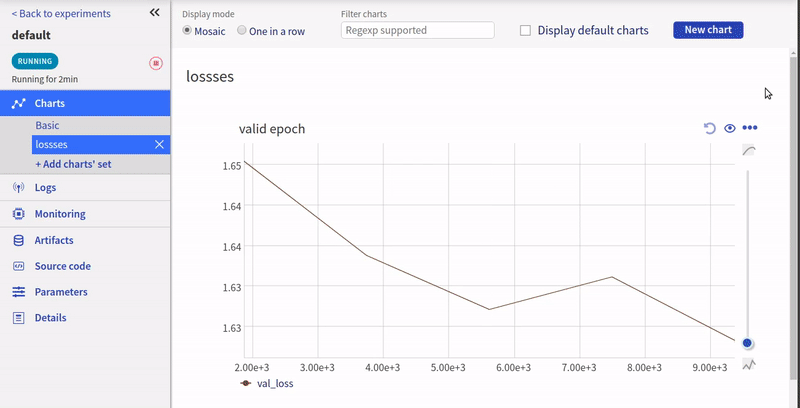

.. _integrations-pytorch-lightning:

Neptune-PyTorch Lightning Integration
=====================================

The integration enables you to log |PyTorch Lightning| metrics to Neptune.

Requirements
------------
This integration is enabled as part of PyTorch Ligthning loggers module, so all you need is to have |neptune-client| installed.

.. code-block:: bash

    pip install neptune-client

Create the **LightningModule**
------------------------------

Nothing changes here, just your typical ``LightningModule`` structure.

.. code-block:: python3

    class CoolSystem(pl.LightningModule):

        def __init__(self):
            ...

        def forward(self, x):
            ...

        def training_step(self, batch, batch_idx):
            ...

        def configure_optimizers(self):
            ...

        @pl.data_loader
        def train_dataloader(self):
            ...

        @pl.data_loader
        def val_dataloader(self):
            ...

Create the **NeptuneLogger** with all the information you want to track
-----------------------------------------------------------------------
.. code-block:: python3

    from pytorch_lightning.loggers.neptune import NeptuneLogger

    neptune_logger = NeptuneLogger(
        api_key="ANONYMOUS",
        project_name="shared/pytorch-lightning-integration",
        experiment_name="default",  # Optional,
        params={"max_epochs": 10,
                "batch_size": 32},  # Optional,
        tags=["pytorch-lightning", "mlp"]  # Optional,
    )

Create the **Trainer** and pass **neptune_logger** to logger
------------------------------------------------------------
.. code-block:: python3

    from pytorch_lightning import Trainer

    model = CoolSystem()
    trainer = Trainer(max_epochs=10, logger=neptune_logger)

    trainer.fit(model)

Log additional information after the **.fit** loop ends
-------------------------------------------------------

You can log additional metrics, images, model binaries or other things after the ``.fit`` loop is over.
You just need to specify ``close_after_fit=False`` in the ``NeptuneLogger`` initialization.

.. code-block:: python3

    neptune_logger = NeptuneLogger(
        api_key="ANONYMOUS",
        project_name="shared/pytorch-lightning-integration",
        close_after_fit=False,
        ...
    )

**Log test metrics**

.. code-block:: python3

    trainer.test(model)

**Log additional metrics**

.. code-block:: python3

    from sklearn.metrics import accuracy_score
    ...
    accuracy = accuracy_score(y_true, y_pred)

    neptune_logger.experiment.log_metric('test_accuracy', accuracy)

**Log performance charts**

.. code-block:: python3

    from scikitplot.metrics import plot_confusion_matrix
    import matplotlib.pyplot as plt
    ...
    fig, ax = plt.subplots(figsize=(16, 12))
    plot_confusion_matrix(y_true, y_pred, ax=ax)

    neptune_logger.experiment.log_image('confusion_matrix', fig)

**Save checkpoints folder after training**

.. code-block:: python3

    model_checkpoint = pl.callbacks.ModelCheckpoint(filepath='my/checkpoints')

    trainer = Trainer(logger=neptune_logger,
                      checkpoint_callback=model_checkpoint)
    trainer.fit(model)

    neptune_logger.experiment.log_artifact('my/checkpoints')

**Explicitly close the logger**

Closing is optional but you may want to close it and then do something afterwards.

.. code-block:: python3

    neptune_logger.experiment.stop()

Monitor your PyTorch Lightning training in Neptune
--------------------------------------------------
Now you can watch your pytorch-lightning model training in Neptune!

Check out this |example experiment|.

Full PyTorch Lightning monitor script
-------------------------------------
Simply copy and paste it to ``pytorch_lightning_example.py`` and run.
You can change your credentials in ``NeptuneLogger`` or run some tests as an anonymous user:

.. code-block:: python3

    neptune_logger = NeptuneLogger(
        api_key="ANONYMOUS",
        project_name="shared/pytorch-lightning-integration",
        ...
        )

.. code-block:: python3

    import os

    import torch
    from torch.nn import functional as F
    from torch.utils.data import DataLoader
    from torchvision.datasets import MNIST
    from torchvision import transforms

    import pytorch_lightning as pl

    MAX_EPOCHS=20
    LR=0.01
    BATCHSIZE=32
    CHECKPOINTS_DIR = 'my_models/checkpoints/7'

    class CoolSystem(pl.LightningModule):

        def __init__(self):
            super(CoolSystem, self).__init__()
            # not the best model...
            self.l1 = torch.nn.Linear(28 * 28, 10)

        def forward(self, x):
            return torch.relu(self.l1(x.view(x.size(0), -1)))

        def training_step(self, batch, batch_idx):
            # REQUIRED
            x, y = batch
            y_hat = self.forward(x)
            loss = F.cross_entropy(y_hat, y)
            tensorboard_logs = {'train_loss': loss}
            return {'loss': loss, 'log': tensorboard_logs}

        def validation_step(self, batch, batch_idx):
            # OPTIONAL
            x, y = batch
            y_hat = self.forward(x)
            return {'val_loss': F.cross_entropy(y_hat, y)}

        def validation_end(self, outputs):
            # OPTIONAL
            avg_loss = torch.stack([x['val_loss'] for x in outputs]).mean()
            tensorboard_logs = {'val_loss': avg_loss}
            return {'avg_val_loss': avg_loss, 'log': tensorboard_logs}

        def test_step(self, batch, batch_idx):
            # OPTIONAL
            x, y = batch
            y_hat = self.forward(x)
            return {'test_loss': F.cross_entropy(y_hat, y)}

        def test_end(self, outputs):
            # OPTIONAL
            avg_loss = torch.stack([x['test_loss'] for x in outputs]).mean()
            tensorboard_logs = {'test_loss': avg_loss}
            return {'avg_test_loss': avg_loss, 'log': tensorboard_logs}

        def configure_optimizers(self):
            # REQUIRED
            # can return multiple optimizers and learning_rate schedulers
            # (LBFGS it is automatically supported, no need for closure function)
            return torch.optim.Adam(self.parameters(), lr=LR)

        @pl.data_loader
        def train_dataloader(self):
            # REQUIRED
            return DataLoader(MNIST(os.getcwd(), train=True, download=True, transform=transforms.ToTensor()), batch_size=BATCHSIZE)

        @pl.data_loader
        def val_dataloader(self):
            # OPTIONAL
            return DataLoader(MNIST(os.getcwd(), train=True, download=True, transform=transforms.ToTensor()), batch_size=BATCHSIZE)

        @pl.data_loader
        def test_dataloader(self):
            # OPTIONAL
            return DataLoader(MNIST(os.getcwd(), train=False, download=True, transform=transforms.ToTensor()), batch_size=BATCHSIZE)

    from pytorch_lightning.loggers.neptune import NeptuneLogger

    neptune_logger = NeptuneLogger(
        api_key="ANONYMOUS",
        project_name="shared/pytorch-lightning-integration",
        close_after_fit=False,
        experiment_name="default",  # Optional,
        params={"max_epochs": MAX_EPOCHS,
                "batch_size": BATCHSIZE,
                "lr": LR}, # Optional,
        tags=["pytorch-lightning", "mlp"]  # Optional,
    )
    model_checkpoint = pl.callbacks.ModelCheckpoint(filepath=CHECKPOINTS_DIR)

    from pytorch_lightning import Trainer

    model = CoolSystem()
    trainer = Trainer(max_epochs=MAX_EPOCHS,
                      logger=neptune_logger,
                      checkpoint_callback=model_checkpoint,
                      )
    trainer.fit(model)
    trainer.test(model)

    # Get predictions on external test
    import numpy as np

    model.freeze()
    test_loader = DataLoader(MNIST(os.getcwd(), train=False, download=True, transform=transforms.ToTensor()), batch_size=256)

    y_true, y_pred = [],[]
    for i, (x, y) in enumerate(test_loader):
        y_hat = model.forward(x).argmax(axis=1).cpu().detach().numpy()
        y = y.cpu().detach().numpy()

        y_true.append(y)
        y_pred.append(y_hat)

        if i == len(test_loader):
            break
    y_true = np.hstack(y_true)
    y_pred = np.hstack(y_pred)

    # Log additional metrics
    from sklearn.metrics import accuracy_score

    accuracy = accuracy_score(y_true, y_pred)
    neptune_logger.experiment.log_metric('test_accuracy', accuracy)

    # Log charts
    from scikitplot.metrics import plot_confusion_matrix
    import matplotlib.pyplot as plt

    fig, ax = plt.subplots(figsize=(16, 12))
    plot_confusion_matrix(y_true, y_pred, ax=ax)
    neptune_logger.experiment.log_image('confusion_matrix', fig)

    # Save checkpoints folder
    neptune_logger.experiment.log_artifact(CHECKPOINTS_DIR)

    # You can stop the experiment
    neptune_logger.experiment.stop()

.. External links

.. |PyTorch Lightning| raw:: html

    <a href="https://github.com/PyTorchLightning/pytorch-lightning" target="_blank">PyTorch Lightning</a>

.. |example experiment| raw:: html

    <a href="https://ui.neptune.ai/o/shared/org/pytorch-lightning-integration/e/PYTOR-68/charts" target="_blank">example experiment</a>

.. |neptune-client| raw:: html

    <a href="https://github.com/neptune-ai/neptune-client" target="_blank">neptune-client</a>
