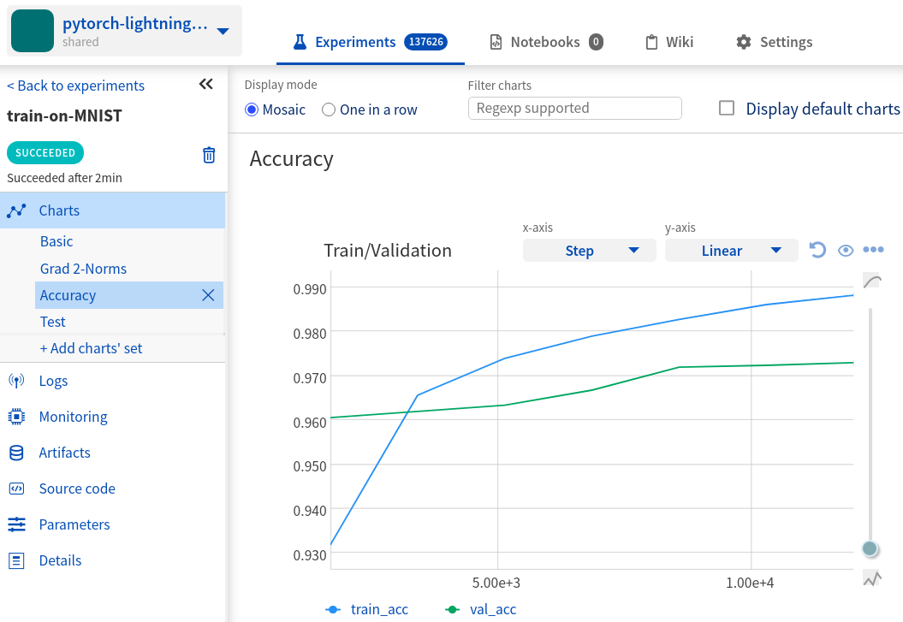

.. _integrations-pytorch-lightning:

Neptune-PyTorch Lightning Integration
=====================================

|Run on Colab|

What will you get with this integration?
----------------------------------------

|pytorch-lightning-tour|

PyTorch Lightning is a lightweight PyTorch wrapper for high-performance AI research. With Neptune integration you can:

* see experiment as it is running,
* log training, validation and testing metrics, and visualize them in Neptune UI,
* log experiment parameters,
* monitor hardware usage,
* log any additional metrics of your choice,
* log performance charts and images,
* save model checkpoints.

.. note::

    This integration is tested with ``pytorch-lightning==1.0.7``, and ``neptune-client==0.4.132``.

Where to start?
---------------
To get started with this integration, follow the :ref:`Quickstart <quickstart>` below. You can also skip the basics and take a look at the :ref:`advanced options <advanced-options>`.

If you want to try things out and focus only on the code you can either:

#. Open Colab notebook (badge-link below) with quickstart code and run it as an anonymous user "`neptuner`" - zero setup, it just works,
#. View quickstart code as a plain Python script on |script|.

You can also check this public project with example experiments: |project|.

.. _quickstart:

Quickstart
----------
This quickstart will show you how to log PyTorch Lightning experiments to Neptune using ``NeptuneLogger`` (part of the pytorch-lightning library).

As a result you will have an experiment logged to Neptune. It will have train loss and epoch (visualized as charts), parameters, hardware utilization charts and experiment metadata.

|Run on Colab|

.. _before-you-start-basic:

Before you start
^^^^^^^^^^^^^^^^
You have ``Python 3.x`` and following libraries installed:

* ``neptune-client`` or newer: See :ref:`neptune-client installation guide <installation-neptune-client>`.
* ``pytorch==1.6.0`` and ``torchvision==0.7.0``. See |pytorch-install|.
* ``pytorch-lightning==1.0.7`` or newer. See |lightning-install|.

You also need minimal familiarity with the PyTorch Lightning. Have a look at the "|lightning-guide|" guide to get started.

Step 1: Import Libraries
^^^^^^^^^^^^^^^^^^^^^^^^
Import necessary libraries.

.. code-block:: python3

    import os

    import torch
    from torch.nn import functional as F
    from torch.utils.data import DataLoader
    from torchvision.datasets import MNIST
    from torchvision import transforms

    import pytorch_lightning as pl

Notice ``pytorch_lightning`` at the bottom.

Step 2: Define Hyper-Parameters
^^^^^^^^^^^^^^^^^^^^^^^^^^^^^^^
Define Python dictionary with hyper-parameters for model training.

.. code-block:: python3

    PARAMS = {'max_epochs': 3,
              'learning_rate': 0.005,
              'batch_size': 32}

This dictionary will later be passed to the Neptune logger (you will see how to do it in :ref:`step 4 <create-neptune-logger>`), so that you will see hyper-parameters in experiment `Parameters` tab.

Step 3: Define LightningModule and DataLoader
^^^^^^^^^^^^^^^^^^^^^^^^^^^^^^^^^^^^^^^^^^^^^
Implement minimal example of the ``pl.LightningModule`` and simple ``DataLoader``.

.. code-block:: python3

    # pl.LightningModule
    class LitModel(pl.LightningModule):
        def __init__(self):
            super().__init__()
            self.l1 = torch.nn.Linear(28 * 28, 10)

        def forward(self, x):
            return torch.relu(self.l1(x.view(x.size(0), -1)))

        def training_step(self, batch, batch_idx):
            x, y = batch
            y_hat = self(x)
            loss = F.cross_entropy(y_hat, y)
            self.log('train_loss', loss)
            return loss

        def configure_optimizers(self):
            return torch.optim.Adam(self.parameters(), lr=PARAMS['learning_rate'])

    # DataLoader
    train_loader = DataLoader(MNIST(os.getcwd(), download=True, transform=transforms.ToTensor()),
                              batch_size=PARAMS['batch_size'])

Few explanations here:

* Cross entropy logging is defined in the ``training_step`` method in this way:

.. code-block:: python3

    self.log('train_loss', loss)

This loss will be logged to Neptune during training as a ``train_loss``. You will see it in the Experiment's `Charts` tab (as "train_loss" chart) and `Logs` tab (as raw numeric values).

* ``DataLoader`` is a pure PyTorch object.
* Notice, that you pass ``learning_rate`` and ``batch_size`` from the ``PARAMS`` dictionary - all params will be logged as experiment parameters.

.. _create-neptune-logger:

Step 4: Create NeptuneLogger
^^^^^^^^^^^^^^^^^^^^^^^^^^^^
Instantiate ``NeptuneLogger`` with necessary parameters.

.. code-block:: python3

    from pytorch_lightning.loggers.neptune import NeptuneLogger

    neptune_logger = NeptuneLogger(
        api_key="ANONYMOUS",
        project_name="shared/pytorch-lightning-integration",
        params=PARAMS)

``NeptuneLogger`` is an object that integrates Neptune with PyTorch Lightning allowing you to track experiments. It's a part of the lightning library. In this minimalist example we use public user `"neptuner"`, who has public token: `"ANONYMOUS"`.

.. tip::

    You can also use your API token. Read more about how to :ref:`securely set Neptune API token <how-to-setup-api-token>`.

Step 5: Pass NeptuneLogger to the Trainer
^^^^^^^^^^^^^^^^^^^^^^^^^^^^^^^^^^^^^^^^^
Pass instantiated ``NeptuneLogger`` to the ``pl.Trainer``.

.. code-block:: python3

    trainer = pl.Trainer(max_epochs=PARAMS['max_epochs'],
                         logger=neptune_logger)

Simply pass ``neptune_logger`` to the ``Trainer``, so that lightning will use this logger. Notice, that ``max_epochs`` is from the ``PARAMS`` dictionary.

Step 6: Run experiment
^^^^^^^^^^^^^^^^^^^^^^
Fit model to the data.

.. code-block:: python3

    model = LitModel()

    trainer.fit(model, train_loader)

At this point you are all set to fit the model. Neptune logger will collect metrics and show them in the UI.

Explore Results
^^^^^^^^^^^^^^^
You just learned how to start logging PyTorch Lightning experiments to Neptune, by using Neptune logger which is part of the lightning library.

Above training is logged to Neptune in near real-time. Click on the link that was outputted to the console or |go-here| to explore an experiment similar to yours. In particular check:

#. |metrics|,
#. |params|,
#. |hardware|,
#. |metadata| including git summary info.

Check this experiment |exp-link| or view quickstart code as a plain Python script on |script|.

|Run on Colab|

.. image:: ../_static/images/integrations/lightning_basic.png
   :target: ../_static/images/integrations/lightning_basic.png
   :alt: PyTorchLightning neptune.ai integration

----

.. _advanced-options:

Advanced options
----------------
To learn more about advanced options that Neptune logger has to offer, follow :ref:`sections <jump-to-option>` below as each describes one functionality.

If you want to try things out and focus only on the code you can either:

#. Open Colab notebook (badge-link below) and run advanced example as a "`neptuner`" user - zero setup, it just works,
#. View advanced example code as a plain Python script on |script-advanced|.

You can also check this public project with example experiments: |project|.

|Run on Colab Advanced|

Before you start
^^^^^^^^^^^^^^^^
In addition to the contents of the ":ref:`Before you start <before-you-start-basic>`" section in Quickstart, you also need to have ``scikit-learn`` and ``scikit-plot`` installed.

.. code-block:: bash

    pip install scikit-learn==0.23.2 scikit-plot==0.3.7

Check |scikit-learn| or |scikit-plot| for more info.

.. _jump-to-option:

Jump to your favorite option
""""""""""""""""""""""""""""
* :ref:`Advanced NeptuneLogger options <logger-options>`
* :ref:`Log loss during train, validation and test <Log-loss>`
* :ref:`Log accuracy score after train, validation and test epoch <log-accuracy-score>`
* :ref:`Log learning rate changes <log-lr>`
* :ref:`Log misclassified images for the test set <log-imgs>`
* :ref:`Log gradient norm <log-grad>`
* :ref:`Log model checkpoints <log-checkpoints>`
* :ref:`Log confusion matrix <log-confusion-matrix>`
* :ref:`Log auxiliary info <log-auxiliary>`

.. _logger-options:

Advanced NeptuneLogger options
^^^^^^^^^^^^^^^^^^^^^^^^^^^^^^
Create ``NeptuneLogger`` with advanced parameters.

.. code-block:: python3

    from pytorch_lightning.loggers.neptune import NeptuneLogger

    ALL_PARAMS = {...}

    neptune_logger = NeptuneLogger(
        api_key="ANONYMOUS",
        project_name="shared/pytorch-lightning-integration",
        close_after_fit=False,
        experiment_name="train-on-MNIST",
        params=ALL_PARAMS,
        tags=['1.x', 'advanced'],
    )

In the NeptuneLogger - besides required ``api_key`` and ``project_name``, you can specify other options, notably:

* params - are passed as Python dict, see example experiment |adv-parameters|.
* ``experiment_name`` and ``tags`` are set. You will use them later in the UI for experiment searching and filtering.
* ``close_after_fit=False`` -> that will let us log more data after ``Trainer.fit()`` and ``Trainer.test()`` methods.

.. tip::

    Use ``neptune_logger.experiment.ABC`` to call methods that you would use, when working with neptune client, for example:

        * ``neptune_logger.experiment.log_metric``
        * ``neptune_logger.experiment.log_image``
        * ``neptune_logger.experiment.set_property``

    Check more methods here: |experiment-methods|.

.. _Log-loss:

Log loss during train, validation and test
^^^^^^^^^^^^^^^^^^^^^^^^^^^^^^^^^^^^^^^^^^
In the ``pl.LightningModule`` loss logging for train, validation and test.

.. code-block:: python3

    class LitModel(pl.LightningModule):
        (...)

        def training_step(self, batch, batch_idx):
            (...)
            loss = ...
            self.log('train_loss', loss, prog_bar=False)

        def validation_step(self, batch, batch_idx):
            (...)
            loss = ...
            self.log('val_loss', loss, prog_bar=False)

        def test_step(self, batch, batch_idx):
            (...)
            loss = ...
            self.log('test_loss', loss, prog_bar=False)

Loss values will be tracked in Neptune automatically.

.. tip::

    ``Trainer`` parameter: ``log_every_n_steps`` controls how frequent the logging is. Keep this parameter relatively high, say >100 for longer experiments.

.. image:: ../_static/images/integrations/lightning_basic.png
   :target: ../_static/images/integrations/lightning_basic.png
   :alt: PyTorch Lightning train and validation loss

.. _log-accuracy-score:

Log accuracy score after train, validation and test epoch
^^^^^^^^^^^^^^^^^^^^^^^^^^^^^^^^^^^^^^^^^^^^^^^^^^^^^^^^^
In the ``pl.LightningModule`` implement accuracy score and log it.

.. code-block:: python3

    class LitModel(pl.LightningModule):
        (...)

        def training_epoch_end(self, outputs):
            for output in outputs:
                (...)
            acc = accuracy_score(y_true, y_pred)
            self.log('train_acc', acc)

        def validation_epoch_end(self, outputs):
            for output in outputs:
                (...)
            acc = accuracy_score(y_true, y_pred)
            self.log('val_acc', acc)

        def test_epoch_end(self, outputs):
            for output in outputs:
                (...)
            acc = accuracy_score(y_true, y_pred)
            self.log('test_acc', acc)

Accuracy score will be calculated and logged after every train, validation and test epoch.

.. tip::

    You can find full implementation of all metrics logging in this |script-advanced| or in |Run on Colab Advanced|.

.. _log-lr:

Log learning rate changes
^^^^^^^^^^^^^^^^^^^^^^^^^
Implement learning rate monitor as Callback

.. code-block:: python3

    from pytorch_lightning.callbacks import LearningRateMonitor

    # Add scheduler to the optimizer
    class LitModel(pl.LightningModule):
        (...)

        def configure_optimizers(self):
            optimizer = torch.optim.Adam(self.parameters(), lr=self.learning_rate)
            scheduler = LambdaLR(optimizer, lambda epoch: self.decay_factor ** epoch)
            return [optimizer], [scheduler]

    # Instantiate LearningRateMonitor Callback
    lr_logger = LearningRateMonitor(logging_interval='epoch')

    # Pass lr_logger to the pl.Trainer as callback
    trainer = pl.Trainer(logger=neptune_logger,
                         callbacks=[lr_logger])

Learning rate scheduler is defined in the ``configure_optimizers``. It will change lr values after each epoch. These values will be tracked to Neptune automatically.

.. _log-imgs:

Log misclassified images for the test set
^^^^^^^^^^^^^^^^^^^^^^^^^^^^^^^^^^^^^^^^^
In the ``pl.LightningModule`` implement logic for identifying and logging misclassified images.

.. code-block:: python3

    class LitModel(pl.LightningModule):
        (...)

        def test_step(self, batch, batch_idx):
            x, y = batch
            (...)
            y_true = ...
            y_pred = ...
            for j in np.where(np.not_equal(y_true, y_pred))[0]:
                img = np.squeeze(x[j].cpu().detach().numpy())
                img[img < 0] = 0
                img = (img / img.max()) * 256
                neptune_logger.experiment.log_image(
                    'test_misclassified_images',
                    img,
                    description='y_pred={}, y_true={}'.format(y_pred[j], y_true[j]))

* As a result you will automatically log misclassified images to Neptune during test.
* Take a look at these |adv-misclassified-images| - look for the ``'test_misclassified_images'`` tile.

.. _log-grad:

Log gradient norm
^^^^^^^^^^^^^^^^^
Set ``pl.Trainer`` to log gradient norm.

.. code-block:: python3

    trainer = pl.Trainer(logger=neptune_logger,
                         track_grad_norm=2)

Neptune will visualize gradient norm automatically.

.. tip::

    When you use ``track_grad_norm`` it's recommended to also set ``log_every_n_steps`` to something >100, so that you will avoid logging large amount of data.

.. _log-checkpoints:

Log model checkpoints
^^^^^^^^^^^^^^^^^^^^^
Use ``ModelCheckpoint`` to make checkpoint during training, then log saved checkpoints to Neptune.

.. code-block:: python3

    from pytorch_lightning.callbacks import ModelCheckpoint

    # Instantiate ModelCheckpoint
    model_checkpoint = ModelCheckpoint(filepath='my_model/checkpoints/{epoch:02d}-{val_loss:.2f}',
                                       save_weights_only=True,
                                       save_top_k=3,
                                       monitor='val_loss',
                                       period=1)

    # Pass it to the pl.Trainer
    trainer = pl.Trainer(logger=neptune_logger,
                         checkpoint_callback=model_checkpoint)

    # Log model checkpoint to Neptune
    for k in model_checkpoint.best_k_models.keys():
        model_name = 'checkpoints/' + k.split('/')[-1]
        neptune_logger.experiment.log_artifact(k, model_name)

    # Log score of the best model checkpoint.
    neptune_logger.experiment.set_property('best_model_score', model_checkpoint.best_model_score.tolist())

* ``model_checkpoint`` will keep top three model according to the ``'val_loss'`` metric.
* When train and test are done, simply upload model checkpoints to Neptune to keep them with an experiment.
* Score of the best model checkpoint is in the |adv-details| tab.

.. tip::

    You can find full example implementation in this |script-advanced| or in |Run on Colab Advanced|.

.. _log-confusion-matrix:

Log confusion matrix
^^^^^^^^^^^^^^^^^^^^
Log confusion metrics after test time.

.. code-block:: python3

    import matplotlib.pyplot as plt
    from scikitplot.metrics import plot_confusion_matrix

    model.freeze()
    test_data = dm.test_dataloader()
    y_true = np.array([])
    y_pred = np.array([])

    for i, (x, y) in enumerate(test_data):
        y = y.cpu().detach().numpy()
        y_hat = model.forward(x).argmax(axis=1).cpu().detach().numpy()

        y_true = np.append(y_true, y)
        y_pred = np.append(y_pred, y_hat)

    fig, ax = plt.subplots(figsize=(16, 12))
    plot_confusion_matrix(y_true, y_pred, ax=ax)
    neptune_logger.experiment.log_image('confusion_matrix', fig)

.. _log-auxiliary:

Log auxiliary info
^^^^^^^^^^^^^^^^^^
Log model summary and number of GPUs used in the experiment.

.. code-block:: python3

    # Log model summary
    for chunk in [x for x in str(model).split('\n')]:
        neptune_logger.experiment.log_text('model_summary', str(chunk))

    # Log number of GPU units used
    neptune_logger.experiment.set_property('num_gpus', trainer.num_gpus)

* You will find |adv-model-summary| in the `Logs` tab, ``num_gpus`` in the |adv-details| tab.
* In similar way you can log more information that you feel is relevant to your experimentation.

Stop Neptune logger (Notebooks only)
^^^^^^^^^^^^^^^^^^^^^^^^^^^^^^^^^^^^
Close Neptune logger and experiment once everything is logged.

.. code-block:: python3

    neptune_logger.experiment.stop()

``NeptuneLogger`` was created with ``close_after_fit=False``, so we need to close Neptune experiment explicitly at the end. Again, this is only for Notebooks, as in scripts logger is closed automatically at the end of the script execution.

Explore Results
^^^^^^^^^^^^^^^
You just learned how to log PyTorch Lightning experiments to Neptune, by using Neptune logger which is part of the lightning library.

Above training is logged to Neptune in near real-time. Click on the link that was outputted to the console or |adv-go-here| to explore an experiment similar to yours.

In particular check:

* train, validation and test metrics visualized as |adv-charts|,
* |adv-parameters|,
* |adv-hardware|,
* |adv-details| including git summary info, best model score, number of GPU units used in experiment.
* |adv-misclassified-images|
* |adv-confusion-matrix|
* |adv-model-checkpoints|
* |adv-model-summary|

Check this experiment (|adv-go-here|) or view above code snippets as a plain Python script on |script-advanced|.

|Run on Colab Advanced|

How to ask for help?
--------------------
Please visit the :ref:`Getting help <getting-help>` page. Everything regarding support is there.

Other integrations you may like
-------------------------------
Here are other integrations with libraries from the PyTorch ecosystem:

- :ref:`PyTorch <integrations-pytorch>`
- :ref:`Fastai and Fastai2 <integrations-fastai>`
- :ref:`PyTorch Ignite <integrations-pytorch-ignite>`
- :ref:`Catalyst <integrations-catalyst>`
- :ref:`Skorch <integrations-skorch>`

You may also like these two integrations:

- :ref:`Optuna <integrations-optuna>`
- :ref:`Plotly <integrations-plotly>`

.. External links

.. |register| raw:: html

    <a href="https://neptune.ai/register" target="_blank">register here</a>

.. |project| raw:: html

    <a href="https://ui.neptune.ai/o/shared/org/pytorch-lightning-integration/experiments?viewId=202dcc88-c213-4da2-9720-7edc49b31665" target="_blank">PyTorch Lightning integration</a>

.. |Run on Colab| raw:: html

    

        

        <a target="_blank" href="https://github.com/neptune-ai/neptune-examples/blob/master/integrations/pytorch-lightning/docs/Neptune-PyTorch-Lightning-basic.py">
            
            View source on GitHub
        </a>
        <a target="_blank" href="https://ui.neptune.ai/o/shared/org/pytorch-lightning-integration/experiments?viewId=202dcc88-c213-4da2-9720-7edc49b31665">
            
            See example in Neptune
        </a>
    

.. |script| raw:: html

    <a href="https://github.com/neptune-ai/neptune-examples/blob/master/integrations/pytorch-lightning/docs/Neptune-PyTorch-Lightning-basic.py" target="_blank">GitHub</a>

.. |metrics| raw:: html

    <a href="https://ui.neptune.ai/o/shared/org/pytorch-lightning-integration/e/PYTOR-137883/charts" target="_blank">metrics</a>

.. |params| raw:: html

    <a href="https://ui.neptune.ai/o/shared/org/pytorch-lightning-integration/e/PYTOR-137883/parameters" target="_blank">logged parameters</a>

.. |hardware| raw:: html

    <a href="https://ui.neptune.ai/o/shared/org/pytorch-lightning-integration/e/PYTOR-137883/monitoring" target="_blank">hardware usage statistics</a>

.. |metadata| raw:: html

    <a href="https://ui.neptune.ai/o/shared/org/pytorch-lightning-integration/e/PYTOR-137883/details" target="_blank">metadata information</a>

.. |go-here| raw:: html

    <a href="https://ui.neptune.ai/o/shared/org/pytorch-lightning-integration/e/PYTOR-137883/charts" target="_blank">go here</a>

.. |exp-link| raw:: html

    <a href="https://ui.neptune.ai/o/shared/org/pytorch-lightning-integration/e/PYTOR-137883/charts" target="_blank">here</a>

.. |lightning-install| raw:: html

    <a href="https://pytorch-lightning.readthedocs.io/en/latest/new-project.html#step-0-install-pytorch-lightning" target="_blank">PyTorch Lightning installation guide</a>

.. |lightning-guide| raw:: html

    <a href="https://pytorch-lightning.readthedocs.io/en/latest/new-project.html" target="_blank">Lightning in 2 steps</a>

.. |pytorch-install| raw:: html

    <a href="https://pytorch.org/get-started/locally/" target="_blank">PyTorch installation guide</a>

.. |script-advanced| raw:: html

    <a href="https://github.com/neptune-ai/neptune-examples/blob/master/integrations/pytorch-lightning/docs/Neptune-PyTorch-Lightning-advanced.py" target="_blank">GitHub</a>

.. |Run on Colab Advanced| raw:: html

    

        

        <a target="_blank" href="https://github.com/neptune-ai/neptune-examples/blob/master/integrations/pytorch-lightning/docs/Neptune-PyTorch-Lightning-advanced.py">
            
            View source on GitHub
        </a>
        <a target="_blank" href="https://ui.neptune.ai/o/shared/org/pytorch-lightning-integration/experiments?viewId=202dcc88-c213-4da2-9720-7edc49b31665&tags=%5B%22advanced%22%5D&sortBy=%5B%22train_loss%22%5D&sortFieldType=%5B%22numericChannels%22%5D&sortFieldAggregationMode=%5B%22last%22%5D&sortDirection=%5B%22ascending%22%5D&trashed=false&suggestionsEnabled=true&lbViewUnpacked=true">
            
            See example in Neptune
        </a>
    

.. |scikit-learn| raw:: html

    <a href="https://scikit-learn.org/stable/install.html" target="_blank">scikit-learn installation guide</a>

.. |scikit-plot| raw:: html

    <a href="https://github.com/reiinakano/scikit-plot" target="_blank">scikit-plot github project</a>

.. |adv-charts| raw:: html

    <a href="https://ui.neptune.ai/o/shared/org/pytorch-lightning-integration/e/PYTOR-137930/charts" target="_blank">charts</a>

.. |adv-parameters| raw:: html

    <a href="https://ui.neptune.ai/o/shared/org/pytorch-lightning-integration/e/PYTOR-137930/parameters" target="_blank">parameters</a>

.. |adv-hardware| raw:: html

    <a href="https://ui.neptune.ai/o/shared/org/pytorch-lightning-integration/e/PYTOR-137930/monitoring" target="_blank">hardware</a>

.. |adv-details| raw:: html

    <a href="https://ui.neptune.ai/o/shared/org/pytorch-lightning-integration/e/PYTOR-137930/details" target="_blank">details</a>

.. |adv-misclassified-images| raw:: html

    <a href="https://ui.neptune.ai/o/shared/org/pytorch-lightning-integration/e/PYTOR-137930/logs" target="_blank">misclassified images</a>

.. |adv-confusion-matrix| raw:: html

    <a href="https://ui.neptune.ai/o/shared/org/pytorch-lightning-integration/e/PYTOR-137930/logs" target="_blank">confusion matrix</a>

.. |adv-model-checkpoints| raw:: html

    <a href="https://ui.neptune.ai/o/shared/org/pytorch-lightning-integration/e/PYTOR-137930/artifacts?path=checkpoints%2F" target="_blank">model checkpoints</a>

.. |adv-model-summary| raw:: html

    <a href="https://ui.neptune.ai/o/shared/org/pytorch-lightning-integration/e/PYTOR-137930/logs" target="_blank">model summary</a>

.. |adv-go-here| raw:: html

    <a href="https://ui.neptune.ai/o/shared/org/pytorch-lightning-integration/e/PYTOR-137930/charts" target="_blank">charts</a>

.. |experiment-methods| raw:: html

    <a href="https://docs.neptune.ai/api-reference/neptune/experiments/index.html#neptune.experiments.Experiment" target="_blank">experiment methods</a>

.. |pytorch-lightning-tour| raw:: html

    <iframe width="720" height="420" src="https://www.youtube.com/embed/53xsUwc-e0o" frameborder="0" allow="accelerometer; autoplay; clipboard-write; encrypted-media; gyroscope; picture-in-picture" allowfullscreen></iframe>
