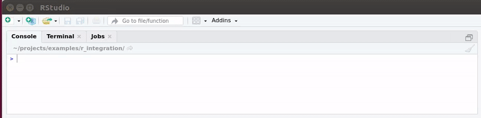
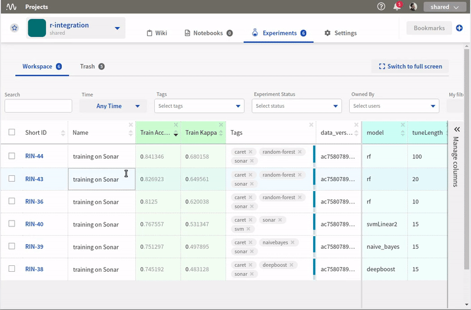
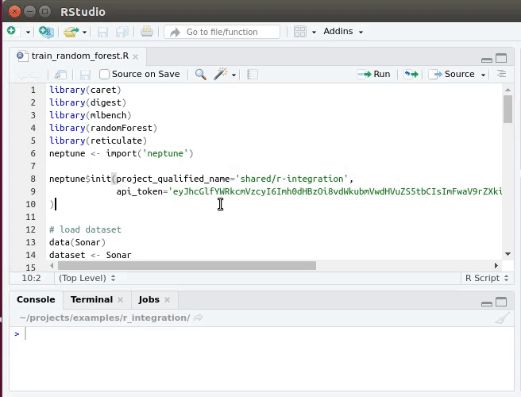
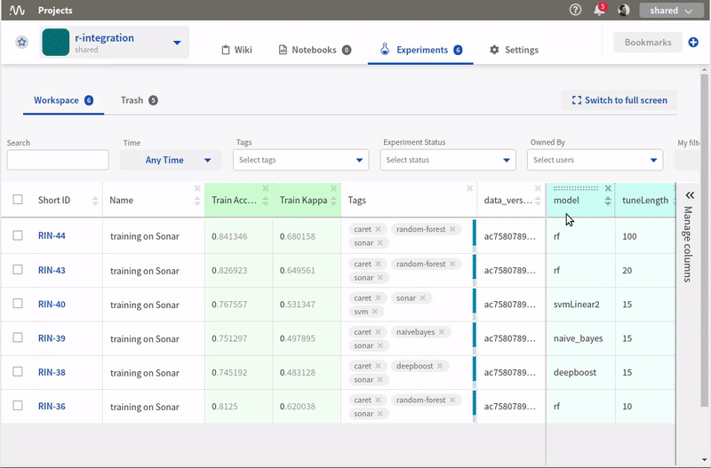
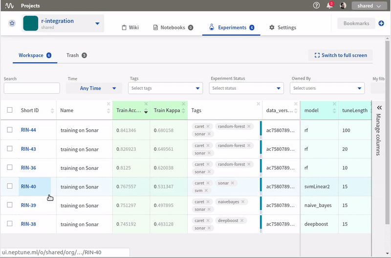
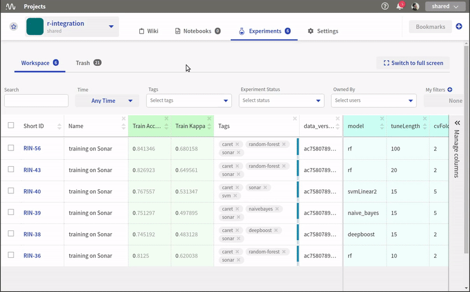

R support
=========

You can interact with Neptune from R without any trouble and get the same functionality that is available in Python.

Install packages
----------------
R ecosystem has this amazing library reticulate, which makes it possible to use neptune-client library from Python to log our experiments.
Go to your terminal and run:

.. code:: 

    pip install neptune-client --user

Go to your R console and install reticulate:

.. code:: R

    install.packages('reticulate')

Initialize Neptune
------------------
Toward the top of your script insert the following snippet.

.. code:: R

    library("reticulate")
    neptune <- import("neptune")
    neptune$init(project_qualified_name='shared/r-integration',
                 api_token='eyJhcGlfYWRkcmVzcyI6Imh0dHBz'
    )

It “connects” your script to neptune.ai hub. The first argument project_qualified_name specifies the project to which you want to log your experiments and the api_token is your login credentials.

.. warning:: Always keep your API token secret - it is like password to the application.

Put your API token in the environment variable and inject it to your R code when you need it.

.. code::

   Sys.setenv('NEPTUNE_API_TOKEN'='eyJhcGlfYWRkcmVzcyI6Imh0dHBz')

.. code:: R

    neptune$init(project_qualified_name='shared/r-integration',
                 api_token=Sys.getenv('NEPTUNE_API_TOKEN')
    )
   
Create experiment
-----------------

To start tracking you need to create an experiment. 
I like to name my experiments and add tags to them so that my work is organized and I can find relevant experiments quickly. 
Create an experiment by running:

.. code:: R

    neptune$create_experiment(name='training on Sonar', 
                              tags=c('random-forest','sonar', 'caret')
    )

When you are done tracking make sure to stop your experiment:

.. code:: R

    neptune$stop()

Track hyperparameters
---------------------

In order to track hyperparameters, you need to pass a named list to the create_experiment() method.

.. code:: R

    params = list(metric="Accuracy",
                  tuneLength=100,
                  model="rf", 
                  searchMethod="random",
                  cvMethod="repeatedcv",
                  cvFolds=2,
                  cvRepeats=1)
    
    # Create experiment
    neptune$create_experiment(params=paramsd)

When you do that, Neptune creates theparameters section in the app that let’s you see hyperparameters quickly and compare them between experiments.

.. image:: ../_static/images/r_support/r_integration_hyperparams.gif
   :target: ../_static/images/r_support/r_integration_hyperparams.gif
   :alt: image

Track data versions and other properties
----------------------------------------
Keeping track of your data is an important part of the job. With Neptune you can log a fingerprint (hash) of your data for every experiment. 
By doing so you will make sure that you are comparing apples to apples.

To do so, you need to add a property to your experiment. 
You can do it directly at in the neptune$create_experiment():

.. code:: R

    library(digest)

    # Load data
    data(Sonar)
    dataset <- Sonar

    # Create experiment
    neptune$create_experiment(properties=list(data_version=digest(dataset)))

or if you want to add a property (data version or other key:value pairs), when the experiment is running:

.. code:: R

    neptune$create_experiment()

    neptune$set_property('data_version', digest(dataset)))

Track code
----------
Neptune automatically tracks your .git version control if you have it in your project. But if you often forget to commit your code, or simply don’t feel like doing so, you can tell Neptune to make code snapshots for you! Just specify those files in the upload_source_files argument.

.. code:: R

    neptune$create_experiment(upload_source_files=list('train_random_forest.R')
    )

Now, you can explore your code in the app:

Track metrics
-------------
Tracking evaluation metrics is as simple as logging. 
You can track a single metric by using the neptune$send_metric() method. 
Just define your logging channel name and metric value. 
For example:

.. code:: R

    scores <- getTrainPerf(model)
    neptune$send_metric('Train Accuracy', scores$TrainAccuracy)
    neptune$send_metric('Train Kappa', scores$TrainKappa)

If you want to log multiple values to a single logging channel just call neptune$send_metric() method multiple times for the same channel name. 
Neptune will automatically create charts for you!

.. code:: R

    for (acc in model$results$Accuracy){
      neptune$send_metric('Accuracy', acc)
    }

    for (kappa in model$results$Kappa){
      neptune$send_metric('Kappa', kappa)
    }

You can sort your experiments by metrics you care about and take a look at the charts in the application:

Track artifacts
---------------
You can also save your model weights, pdf report files or other objects in Neptune. All you need to do is pass the filepath to the neptune$send_artifact() method and it will be attached to your experiment.

.. code:: R

    save(model, file="model.Rdata")
    neptune$send_artifact('model.Rdata')

Once it is logged, sharing it with your colleagues or collaborators is super easy.

Track images and charts
-----------------------
Logging images and charts to Neptune is very simple as well. Just use the neptune$send_image() method that takes the nameof the logging channel and a path to image as arguments. You can log more than one chart to the same channel to organize things, just send another image to the same channel.

.. code:: R

    ggplot(model) + geom_line(color='steelblue') + geom_point(color='steelblue', size=5)
    ggsave('param_plot.jpeg')
    neptune$send_image('parameter_search', 'param_plot.jpeg')

and you can view it in the app:

Full tracking script
--------------------

.. code:: R

    library(caret)
    library(digest)
    library(mlbench)
    library(randomForest)
    library(reticulate)
    neptune <- import('neptune')

    neptune$init(project_qualified_name='shared/r-integration',
                 api_token='eyJhcGlfYWRkcmVzcyI6Imh0dHBzOi8vdWkubmVwdHVuZS5tbCIsImFwaV9rZXkiOiJiNzA2YmM4Zi03NmY5LTRjMmUtOTM5ZC00YmEwMzZmOTMyZTQifQ=='
    )

    # load dataset
    data(Sonar)
    dataset <- Sonar
    x <- dataset[,1:60]   # predictors
    y <- dataset[,61]     # labels

    SEED=1234
    set.seed(SEED)
    params = list(metric="Accuracy",
                  tuneLength=100,
                  model="rf", 
                  searchMethod="random",
                  cvMethod="repeatedcv",
                  cvFolds=2,
                  cvRepeats=1)

    # Create experiment
    neptune$create_experiment(name='training on Sonar', 
                              params=params,
                              properties=list(seed=SEED,
                                              data_version=digest(dataset)),
                              tags=c('random-forest','sonar', 'caret'),
                              upload_source_files=list('train_random_forest.R')
    )

    control <- trainControl(method=params$cvMethod, 
                            number=params$cvFolds, 
                            repeats=params$cvRepeats, 
                            search=params$searchMethod)

    model <- train(Class ~ ., data=dataset, 
                   method=params$model, 
                   metric=params$metric, 
                   tuneLength=params$tuneLength, 
                   trControl=control)

    # Log metrics
    scores <- getTrainPerf(model)
    neptune$send_metric('Train Accuracy', scores$TrainAccuracy)
    neptune$send_metric('Train Kappa', scores$TrainKappa)

    for (name in names(model$bestTune)) {
      neptune$set_property(name, model$bestTune[[name]])
    }

    for (acc in model$results$Accuracy){
      neptune$send_metric('Accuracy', acc)
    }

    for (kappa in model$results$Kappa){
      neptune$send_metric('Kappa', kappa)
    }

    # Log artifact
    save(model, file="model.Rdata")
    neptune$send_artifact('model.Rdata')

    # Log image
    ggplot(model) + geom_line(color='steelblue') + geom_point(color='steelblue', size=5)
    ggsave('param_plot.jpeg')
    neptune$send_image('parameter_search', 'param_plot.jpeg')

    # Stop Experiment
    neptune$stop()
