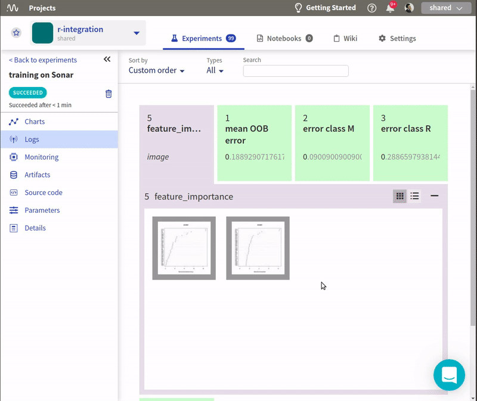

R support
=========

You can interact with Neptune from R without any trouble and get the same functionality that is available in Python.

Installation
------------

Neptune integration with R is available as a |CRAN package| and a |Github project|.
You can install it by running:

.. code:: R

    install.packages('neptune')

**Python environment setup**

Under the hood ``neptune`` is using ``reticulate`` which in turn calls Python.
That means you have to:

* install Python in your environment ('venv', 'conda', 'miniconda' and pure 'python' environments are supported)
* point to that environment when you initialize neptune (more on that in the next section)

Initialize Neptune
------------------
Toward the top of your script you need to import ``neptune`` library and initialize the connection with Neptune.

You need to specify:

* ``project_name``: which is the name of your project in Neptune
* ``api_token``: which is a key associated to your Neptune account

.. code:: R

    library('neptune')
    init_neptune(project_name = 'shared/r-integration',
                 api_token = 'ANONYMOUS')

Once this is added you can start logging your experiment data to Neptune.

.. note:: As an example we are using 'ANONYMOUS' user token and a public project 'shared/r-integration'.

.. warning:: The suggested way to pass your ``api_token`` is to store your key in environemnt variable and pass it via ``Sys.getenv('MY_NEPTUNE_KEY')``

    .. code:: R

        Sys.setenv('NEPTUNE_API_TOKEN'='eyJhcGlfYWRkcmVzcyI6Imh0dHBz')

    .. code:: R

        init_neptune(project_name = 'my_organization/my_project',
                     api_token = Sys.getenv('NEPTUNE_API_TOKEN')
                     )

**Specifying Python environment**

* Python

    init_neptune(project_name = 'shared/r-integration',
                 api_token = 'ANONYMOUS'
                 python='python',
                 python_path='/usr/bin/python3')

* venv

    init_neptune(project_name = 'shared/r-integration',
                 api_token = 'ANONYMOUS'
                 python='venv',
                 python_path='my_venv')

* conda

    init_neptune(project_name = 'shared/r-integration',
                 api_token = 'ANONYMOUS'
                 python='conda',
                 python_path='my_conda_env')

* miniconda

    init_neptune(project_name = 'shared/r-integration',
                 api_token = 'ANONYMOUS'
                 python='miniconda',
                 python_path='my_miniconda_env')

Create experiment
-----------------

To start tracking you need to create an experiment.

You can:

* name your experiments,
* tag them to keep your work organized
* specify params to keep track of hyperparameters of your experiments

For example:

.. code:: R

    create_experiment(name='training on Sonar',
                      tags=c('random-forest','sonar'),
                      params = list(ntree=100,
                                    mtry=10,
                                    maxnodes=20)
                      )

Track data versions and other properties
----------------------------------------
Keeping track of your data is an important part of the job. With Neptune you can log a fingerprint (hash) of your data for every experiment. 
By doing so you will make sure that you are comparing apples to apples.

To do so, you need to add a property to your experiment. 

.. code:: R

    library(digest)

    # Load data
    data(Sonar)
    dataset <- Sonar

    set_property(property = 'data-version', value = digest(dataset))

Track metrics
-------------
Tracking evaluation metrics is as simple as logging. 
You can track a single metric by using the ``log_metric()`` method.
Just define your logging channel name and metric value. 
For example:

.. code:: R

    log_metric('mean OOB error', mean(model$err.rate[,1]))
    log_metric('error class M', model$confusion[1,3])
    log_metric('error class R', model$confusion[2,3])

If you want to log multiple values to a single logging channel just call ``log_metric()`` method multiple times for the same channel name.
Neptune will automatically create charts for you!

.. code:: R

    for (err in (model$err.rate[,1])) {
      log_metric('OOB errors', err)
    }

You can sort your experiments by metrics you care about and take a look at the charts in the application.

Track artifacts
---------------
You can also save your model weights, pdf report files or other objects in Neptune. All you need to do is pass the filepath to the neptune$send_artifact() method and it will be attached to your experiment.

.. code:: R

    save(model, file="model.Rdata")
    log_artifact('model.Rdata')

Once it is logged, sharing it with your colleagues or collaborators is super easy.

Track images and charts
-----------------------
Logging images and charts to Neptune is very simple as well. Just use the neptune$send_image() method that takes the nameof the logging channel and a path to image as arguments. You can log more than one chart to the same channel to organize things, just send another image to the same channel.

.. code:: R

    for (t in c(1,2)){
      jpeg('importance_plot.jpeg')
      varImpPlot(model,type=t)
      dev.off()
      log_image('feature_importance', 'importance_plot.jpeg')
    }

Once it is logged you can view it in the app.

Stop experiment
---------------

Once you are finished tracking you should stop the experiment

.. code:: R

   stop_experiment()

Explore your experiment in Neptune
----------------------------------

Thanks to all the logging you've done you can now see all your experiments in the Neptune app.

Explore the |shared/r-integration public project| to see how it looks like.

Full tracking script
--------------------

**Install dependencies**

.. code:: R

    # install neptune
    install.packages('neptune', dependencies = TRUE)

    # install other packages for this tutorial
    install.packages(c('caret','digest', 'mlbench', 'randomForest'), dependencies = TRUE)

**Run experiment with tracking script**

.. code:: R

    # load libraries,
    library(neptune)
    library(digest)
    library(randomForest)

    SEED=1234
    set.seed(SEED)

    # load dataset
    data(Sonar)
    dataset <- Sonar
    x <- dataset[,1:60]   # predictors
    y <- dataset[,61]     # labels

    # Initialize Neptune
    init_neptune(project_name = 'shared/r-integration',
                 api_token = 'ANONYMOUS',
                 python='miniconda',
                 python_path='py_37'
                 )

    # Start an experiment and track hyperparameters

    params = list(ntree=625,
                  mtry=13,
                  maxnodes=50
                  )

    create_experiment(name='training on Sonar',
                      tags=c('random-forest','sonar'),
                      params = params
    )

    # track data version and SEED
    set_property(property = 'data-version', value = digest(dataset))
    set_property(property = 'seed', value = SEED)

    # train your model
    model <- randomForest(x = x, y = y,
      ntree=params$ntree, mtry = params$mtry, maxnodes = params$maxnodes,
      importance = TRUE
      )

    # Log metrics

    log_metric('mean OOB error', mean(model$err.rate[,1]))
    log_metric('error class M', model$confusion[1,3])
    log_metric('error class R', model$confusion[2,3])

    for (err in (model$err.rate[,1])) {
      log_metric('OOB errors', err)
    }

    # Log artifact
    save(model, file="model.Rdata")
    log_artifact('model.Rdata')

    # Log image
    for (t in c(1,2)){
      jpeg('importance_plot.jpeg')
      varImpPlot(model,type=t)
      dev.off()
      log_image('feature_importance', 'importance_plot.jpeg')
    }

    # Stop Experiment
    stop_experiment()

.. |shared/r-integration public project| raw:: html

    <a href="https://ui.neptune.ai/o/shared/org/r-integration/experiments?viewId=fa3b57a5-77fb-4edb-83fc-505014d3649d" target="_blank">shared/r-integration public project</a>

.. |CRAN package| raw:: html

    <a href="https://cran.r-project.org/web/packages/neptune/index.html" target="_blank">CRAN package</a>

.. |Github project| raw:: html

    <a href="https://github.com/neptune-ai/neptune-r" target="_blank">Github project</a>