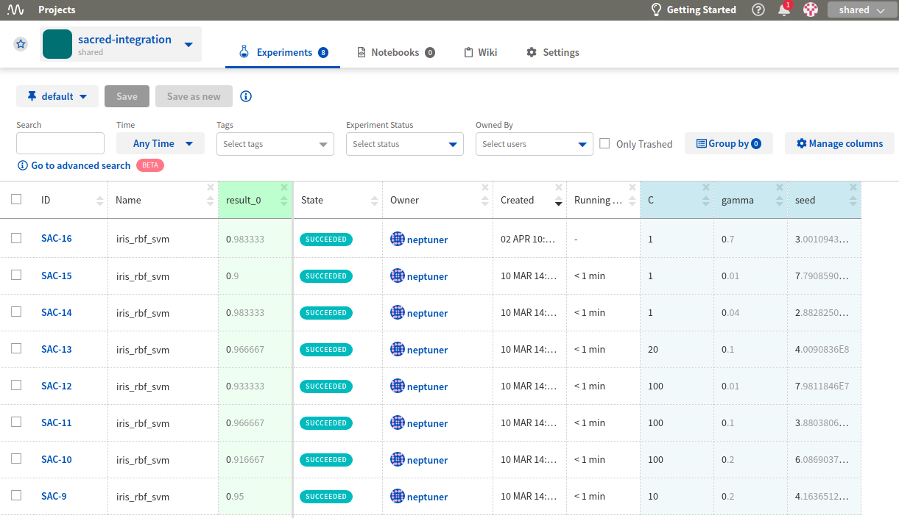
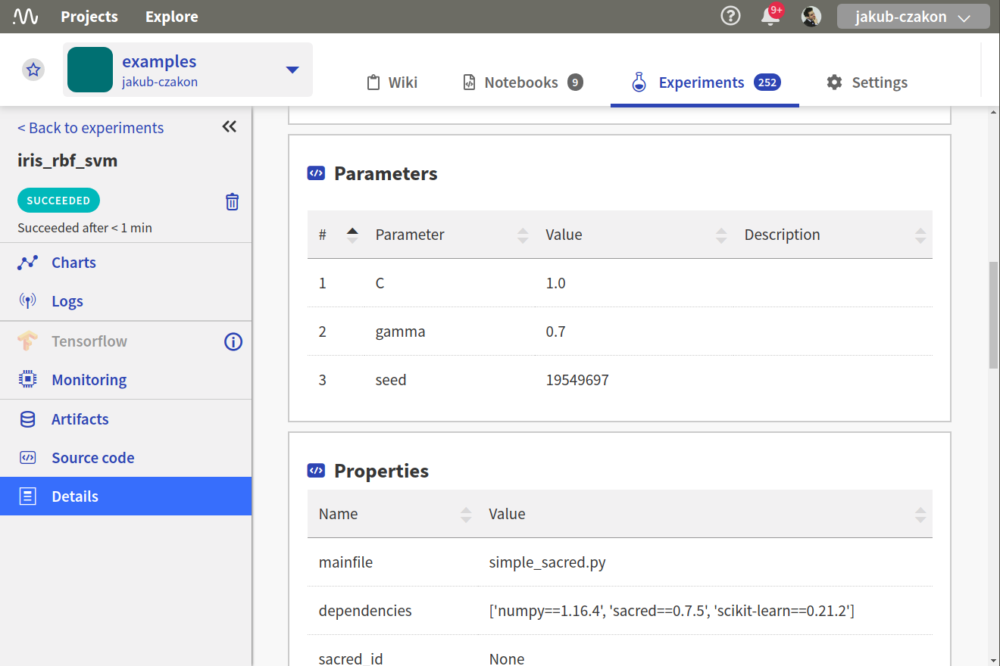

Neptune-Sacred Integration
==========================

The integration lets you log |Sacred| experiments to Neptune.

Requirements
------------
Integration with the Sacred framework is enabled as part of the logging module, so all you need is |neptune-client| to get started.

.. code-block:: bash

    pip install neptune-client

Create an **Experiment**
------------------------

.. note:: The code here uses a shared, anonymous token but you can change to your private ``NEPTUNE_API_TOKEN``.

.. code-block:: python3

    from numpy.random import permutation
    from sklearn import svm, datasets
    from sacred import Experiment

    ex = Experiment('iris_rbf_svm')

Append **NeptuneObserver**
--------------------------
Pass the experiment object as the first argument.

.. note:: The code uses the API token for the anonymous user neptuner. You can change it to your own or test it out on this public project.

.. code-block:: python3

    from neptunecontrib.monitoring.sacred import NeptuneObserver
    ex.observers.append(NeptuneObserver(api_token='ANONYMOUS',
                                        project_name='shared/sacred-integration'))

Run normally
------------
.. code-block:: python3

    @ex.config
    def cfg():
        C = 1.0
        gamma = 0.7

    @ex.automain
    def run(C, gamma, _run):
        iris = datasets.load_iris()
        per = permutation(iris.target.size)
        iris.data = iris.data[per]
        iris.target = iris.target[per]
        clf = svm.SVC(C, 'rbf', gamma=gamma)
        clf.fit(iris.data[:90],
                iris.target[:90])
        return clf.score(iris.data[90:],
                         iris.target[90:])

Monitor your Sacred experiments in Neptune
------------------------------------------
Now you can watch your Sacred experiments in Neptune!

Check out this |example experiment dashboard|.

Full Sacred monitoring script
-----------------------------
Simply copy and paste the script to ``sacred_example.py`` and run.
Remember to change your credentials in ``NeptuneObserver()``:

.. code-block:: python3

    ex.observers.append(NeptuneObserver(api_token='YOUR_API_TOKEN',
                                        project_name='USER_NAME/PROJECT_NAME'))

.. code-block:: python3

    from numpy.random import permutation
    from sklearn import svm, datasets
    from sacred import Experiment

    from neptunecontrib.monitoring.sacred import NeptuneObserver

    ex = Experiment('iris_rbf_svm')
    ex.observers.append(NeptuneObserver(api_token='ANONYMOUS',
                                        project_name='shared/sacred-integration'))

    @ex.config
    def cfg():
        C = 1.0
        gamma = 0.7

    @ex.automain
    def run(C, gamma, _run):

        iris = datasets.load_iris()
        per = permutation(iris.target.size)
        iris.data = iris.data[per]
        iris.target = iris.target[per]
        clf = svm.SVC(C, 'rbf', gamma=gamma)
        clf.fit(iris.data[:90],
                iris.target[:90])
        return clf.score(iris.data[90:],
                         iris.target[90:])

.. External links

.. |Sacred| raw:: html

    <a href="https://github.com/IDSIA/sacred" target="_blank">Sacred</a>

.. |example experiment dashboard| raw:: html

    <a href="https://ui.neptune.ai/o/shared/org/sacred-integration/experiments?viewId=336e565f-87fc-4050-8301-b67b91aa2b5e" target="_blank">example experiment dashboard</a>

.. |neptune-client| raw:: html

    <a href="https://github.com/neptune-ai/neptune-client" target="_blank">neptune-client</a>
