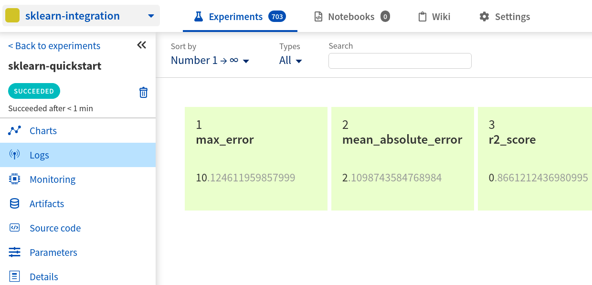
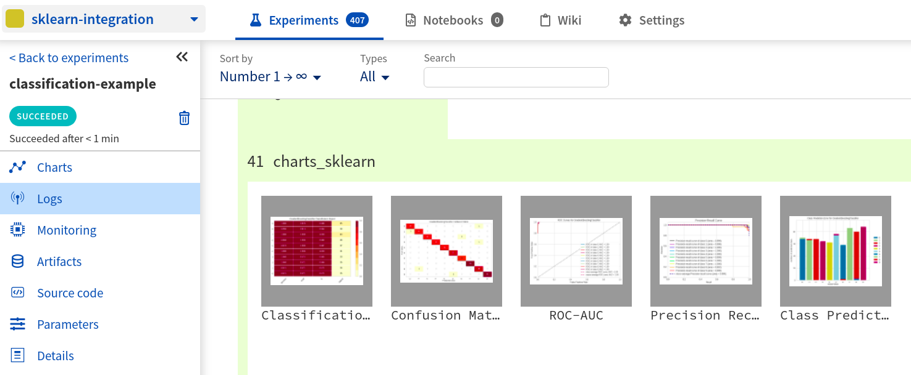
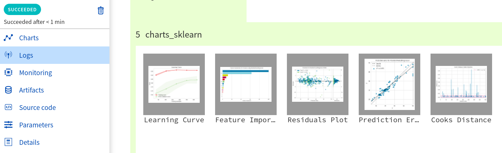
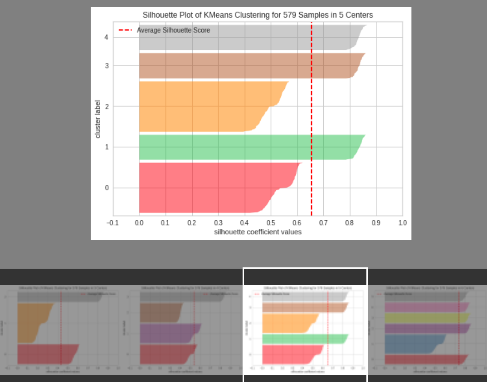
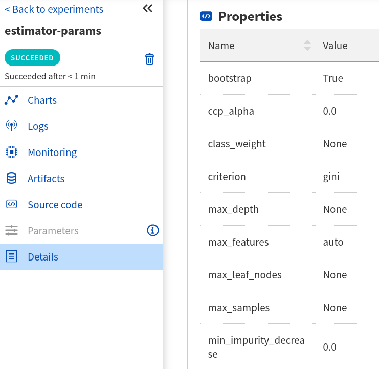
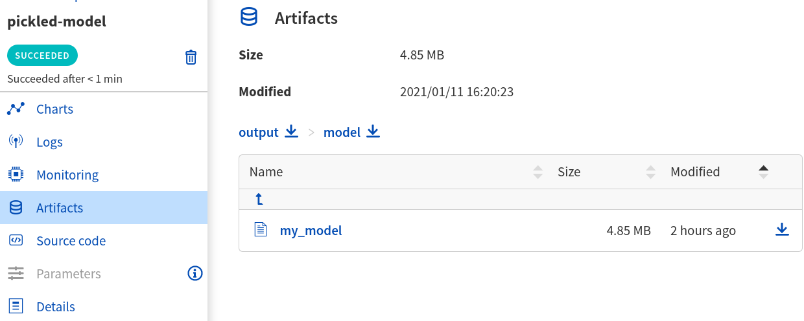
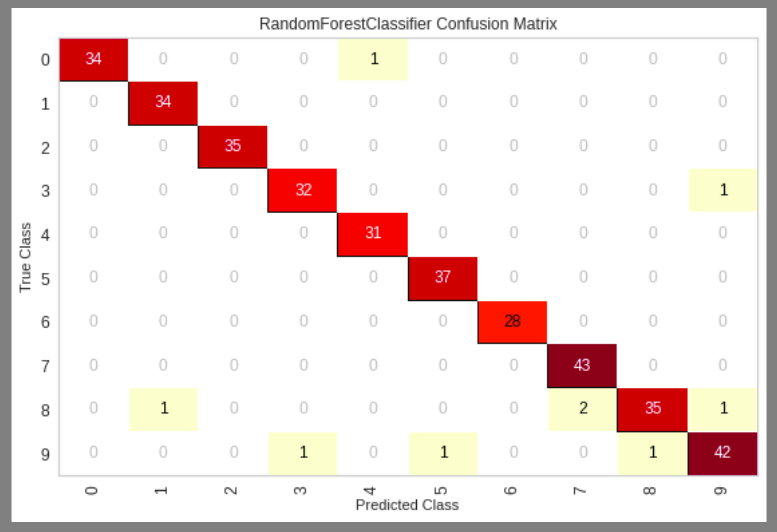

.. _integrations-sklearn:

Neptune-Sklearn Integration
===========================
|colab-script-neptune|

What will you get with this integration?
----------------------------------------
|sklearn-tour-loom|

|sklearn| is an open source machine learning framework commonly used for building predictive models. Neptune helps with keeping track of model training metadata.

With Neptune + Sklearn integration you can track your **classifiers**, **regressors** and **k-means** clustering results, specifically:

* log classifier and regressor parameters,
* log pickled model,
* log test predictions,
* log test predictions probabilities,
* log test scores,
* log classifier and regressor visualizations, like confusion matrix, precision-recall chart and feature importance chart,
* log KMeans cluster labels and clustering visualizations,
* log metadata including git summary info.

.. tip::
    You can log many other experiment metadata like interactive charts, video, audio and more.
    See the :ref:`full list <what-you-can-log>`.

.. note::

    This integration is tested with ``scikit-learn==0.23.2``, ``neptune-client==0.4.132``.

Where to start?
---------------
To get started with this integration follow the :ref:`quickstart <sklearn_quickstart>` below (recommended as a first step).

You can also go to the :ref:`demonstration of the functions <sklearn-more-options>` that log regressor, classifier or K-Means summary information to Neptune. Such summary includes parameters, pickled model, visualizations and much more:

* :ref:`classifier summary <sklearn-cls>`,
* :ref:`regressor summary <sklearn-reg>`,
* :ref:`k-means clustering summary <sklearn-k-means>`.

Finally if you want to log only specific information to Neptune you can make use of the convenience functions listed in the |reference-documentation|. Below are few examples:

* :ref:`log estimator parameters <sklearn-log-estimator-params>`,
* :ref:`log model <sklearn-log-model>`,
* :ref:`log confusion matrix <sklearn-log-confusion-matrix>`.

If you want to try things out and focus only on the code you can either:

|colab-script-neptune|

Before you start
----------------
You have ``Python 3.x`` and following libraries installed:

* ``neptune-client``. See :ref:`neptune-client installation guide <installation-neptune-client>`.

* ``scikit-learn``. See |scikit-install|.

.. code-block:: bash

    pip install scikit-learn

You also need minimal familiarity with scikit-learn. Have a look at this |scikit-guide| to get started.

.. _sklearn_quickstart:

Quickstart
----------
This quickstart will show you how to use Neptune with sklearn:

* Create the first experiment in project,
* Log estimator parameters and scores,
* Explore results in the Neptune UI.

Step 0: Create and fit example estimator
^^^^^^^^^^^^^^^^^^^^^^^^^^^^^^^^^^^^^^^^
Prepare fitted estimator that will be further used to log it's summary. Below snippet shows the idea:

.. code-block:: python3

    parameters = {'n_estimators': 120,
                  'learning_rate': 0.12,
                  'min_samples_split': 3,
                  'min_samples_leaf': 2}

    gbc = GradientBoostingClassifier(**parameters)

    X, y = load_digits(return_X_y=True)
    X_train, X_test, y_train, y_test = train_test_split(X, y, test_size=0.2)

    gbc.fit(X_train, y_train)

Step 1: Initialize Neptune
^^^^^^^^^^^^^^^^^^^^^^^^^^
Add the following snippet at the top of your script.

.. code-block:: python3

    import neptune

    neptune.init(api_token='ANONYMOUS', project_qualified_name='shared/sklearn-integration')

.. tip::

    You can also use your personal API token. Read more about how to :ref:`securely set the Neptune API token <how-to-setup-api-token>`.

Step 2: Create an experiment and log parameters
^^^^^^^^^^^^^^^^^^^^^^^^^^^^^^^^^^^^^^^^^^^^^^^
Run the code below to create a Neptune experiment:

.. code-block:: python3

    neptune.create_experiment(params=parameters,
                              name='sklearn-quickstart')

* This creates a link to the experiment. Open the link in a new tab.
* The experiment will currently be empty, but keep the window open. You will be able to see estimator summary there.
* This is how experiment's parameters are logged. You pass them to the :meth:`~neptune.projects.Project.create_experiment` method. You can later use them to :ref:`filter and compare experiments <guides-compare-experiments-ui>`.

When you create an experiment Neptune will look for the ``.git`` directory in your project and get the last commit information saved.

.. note::

    If you are using ``.py`` scripts for training Neptune will also log your training script automatically.

Step 3: Log estimator scores
^^^^^^^^^^^^^^^^^^^^^^^^^^^^
Log scores on the test data.

.. code-block:: python3

    y_pred = estimator.predict(X_test)

    neptune.log_metric('max_error', max_error(y_test, y_pred))
    neptune.log_metric('mean_absolute_error', mean_absolute_error(y_test, y_pred))
    neptune.log_metric('r2_score', r2_score(y_test, y_pred))

Here we use the :meth:`~neptune.experiments.Experiment.log_metric` method to log scores to the experiment.

Step 4: See results in Neptune
^^^^^^^^^^^^^^^^^^^^^^^^^^^^^^
Switch to the Neptune tab which you had opened previously to explore results.

|example-quickstart|

You can go to the |reference-documentation| to learn more. Remember that you can try it out with zero setup:

|colab-script-neptune|

.. _sklearn-more-options:

More Options
------------
Neptune-Scikit-learn integration also lets you log regressor, classifier or K-Means summary information to Neptune. Such summary includes parameters, pickled model, visualizations and much more:

* :ref:`classifier summary <sklearn-cls>`,
* :ref:`regressor summary <sklearn-reg>`,
* :ref:`k-means clustering summary <sklearn-k-means>`.

You can choose to log only specific information to Neptune. In such case use convenience functions listed in the |reference-documentation|. Below are few examples:

* :ref:`log estimator parameters <sklearn-log-estimator-params>`,
* :ref:`log model <sklearn-log-model>`,
* :ref:`log confusion matrix <sklearn-log-confusion-matrix>`.

.. _sklearn-cls:

Log classification summary
^^^^^^^^^^^^^^^^^^^^^^^^^^
You can log classification summary that includes:

* |cls-npt-parameters| logged at the experiment creation,
* |cls-parameters|,
* |cls-model|,
* |cls-test-preds|,
* |cls-test-preds-proba|,
* |cls-test-scores|,
* |cls-visualizations| - look for "charts_sklearn",
* |cls-metadata| including git summary info.

|example-charts-classification|

Step 0: Create and fit example classifier
+++++++++++++++++++++++++++++++++++++++++
Prepare fitted classifier that will be further used to log it's summary. Below snippet shows the idea:

.. code-block:: python3

    parameters = {'n_estimators': 120,
                  'learning_rate': 0.12,
                  'min_samples_split': 3,
                  'min_samples_leaf': 2}

    gbc = GradientBoostingClassifier(**parameters)

    X, y = load_digits(return_X_y=True)
    X_train, X_test, y_train, y_test = train_test_split(X, y, test_size=0.2)

    gbc.fit(X_train, y_train)

``gbc`` object will be later used to log various metadata to the experiment.

Step 1: Initialize Neptune
++++++++++++++++++++++++++
Add the following snippet at the top of your script.

.. code-block:: python3

    import neptune

    neptune.init(api_token='ANONYMOUS', project_qualified_name='shared/sklearn-integration')

.. tip::

    You can also use your personal API token. Read more about how to :ref:`securely set the Neptune API token <how-to-setup-api-token>`.

Step 2: Create an experiment
++++++++++++++++++++++++++++
Run the code below to create a Neptune experiment:

.. code-block:: python3

    neptune.create_experiment(params=parameters,
                              name='sklearn-quickstart')

* This creates a link to the experiment. Open the link in a new tab.
* The experiment will currently be empty, but keep the window open. You will be able to see estimator summary there.
* This is how experiment's parameters are logged. You pass them to the :meth:`~neptune.projects.Project.create_experiment` method. You can later use them to :ref:`filter and compare experiments <guides-compare-experiments-ui>`.

When you create an experiment Neptune will look for the ``.git`` directory in your project and get the last commit information saved.

.. note::

    If you are using ``.py`` scripts for training Neptune will also log your training script automatically.

Step 3: Log classifier summary
++++++++++++++++++++++++++++++
Log classifier summary to Neptune, by using :meth:`~neptunecontrib.monitoring.sklearn.log_classifier_summary`.

.. code-block:: python3

    from neptunecontrib.monitoring.sklearn import log_classifier_summary

    log_classifier_summary(gbc, X_train, X_test, y_train, y_test)

Step 4: See results in Neptune
++++++++++++++++++++++++++++++
Once data is logged you can switch to the Neptune tab which you had opened previously to explore results. You can check:

* |cls-npt-parameters| logged at the experiment creation,
* |cls-parameters|,
* |cls-model|,
* |cls-test-preds|,
* |cls-test-preds-proba|,
* |cls-test-scores|,
* |cls-visualizations| - look for "charts_sklearn",
* |cls-metadata| including git summary info.

|example-charts-classification|

You can go to the |reference-documentation| to learn more. Remember that you can try it out with zero setup:

|colab-script-neptune|

.. _sklearn-reg:

Log regression summary
^^^^^^^^^^^^^^^^^^^^^^
You can log regression summary that includes:

* |reg-npt-parameters| logged at the experiment creation,
* |reg-parameters| as properties,
* |reg-model|,
* |reg-test-preds|,
* |reg-test-scores|,
* |reg-visualizations| - look for "charts_sklearn",
* |reg-metadata| including git summary info.

|example-charts-regression|

Step 0: Create and fit example regressor
++++++++++++++++++++++++++++++++++++++++
Prepare fitted regressor that will be further used to log it's summary. Below snippet shows the idea:

.. code-block:: python3

    parameters = {'n_estimators': 70,
                  'max_depth': 7,
                  'min_samples_split': 3}

    rfr = RandomForestRegressor(**parameters)

    X, y = load_boston(return_X_y=True)
    X_train, X_test, y_train, y_test = train_test_split(X, y, test_size=0.2)

    rfr.fit(X_train, y_train)

``rfr`` object will be later used to log various metadata to the experiment.

Step 1: Initialize Neptune
++++++++++++++++++++++++++
Add the following snippet at the top of your script.

.. code-block:: python3

    import neptune

    neptune.init(api_token='ANONYMOUS', project_qualified_name='shared/sklearn-integration')

.. tip::

    You can also use your personal API token. Read more about how to :ref:`securely set the Neptune API token <how-to-setup-api-token>`.

Step 2: Create an experiment
++++++++++++++++++++++++++++
Run the code below to create a Neptune experiment:

.. code-block:: python3

    neptune.create_experiment(params=parameters,
                              name='sklearn-quickstart')

* This creates a link to the experiment. Open the link in a new tab.
* The experiment will currently be empty, but keep the window open. You will be able to see estimator summary there.
* This is how experiment's parameters are logged. You pass them to the :meth:`~neptune.projects.Project.create_experiment` method. You can later use them to :ref:`filter and compare experiments <guides-compare-experiments-ui>`.

When you create an experiment Neptune will look for the ``.git`` directory in your project and get the last commit information saved.

.. note::

    If you are using ``.py`` scripts for training Neptune will also log your training script automatically.

Step 3: Log regressor summary
+++++++++++++++++++++++++++++
Log regressor summary to Neptune, by using :meth:`~neptunecontrib.monitoring.sklearn.log_regressor_summary`.

.. code-block:: python3

    from neptunecontrib.monitoring.sklearn import log_regressor_summary

    log_regressor_summary(rfr, X_train, X_test, y_train, y_test)

Step 4: See results in Neptune
++++++++++++++++++++++++++++++
Once data is logged you can switch to the Neptune tab which you had opened previously to explore results. You can check:

* |reg-npt-parameters| logged at the experiment creation,
* |reg-parameters| as properties,
* |reg-model|,
* |reg-test-preds|,
* |reg-test-scores|,
* |reg-visualizations| - look for "charts_sklearn",
* |reg-metadata| including git summary info.

|example-charts-regression|

You can go to the |reference-documentation| to learn more. Remember that you can try it out with zero setup:

|colab-script-neptune|

.. _sklearn-k-means:

Log K-Means clustering summary
^^^^^^^^^^^^^^^^^^^^^^^^^^^^^^
You can log K-Means clustering summary that includes:

* |kmeans-npt-parameters| logged at the experiment creation,
* |kmeans-params| as properties,
* |kmeans-cluster-labels|,
* |kmeans-cluster-visuals|,
* |kmeans-metadata| including git summary info.

|example-charts-kmeans|

Step 0: Create K-Means clustering object and example data
+++++++++++++++++++++++++++++++++++++++++++++++++++++++++
Prepare K-Means object and example data. These will be later used in this quickstart. Below snippet show the idea:

.. code-block:: python3

    parameters = {'n_init': 11,
                  'max_iter': 270}

    km = KMeans(**parameters)

    X, y = make_blobs(n_samples=579, n_features=17, centers=7, random_state=28743)

Step 1: Initialize Neptune
++++++++++++++++++++++++++
Add the following snippet at the top of your script.

.. code-block:: python3

    import neptune

    neptune.init(api_token='ANONYMOUS', project_qualified_name='shared/sklearn-integration')

.. tip::

    You can also use your personal API token. Read more about how to :ref:`securely set the Neptune API token <how-to-setup-api-token>`.

Step 2: Create an experiment
++++++++++++++++++++++++++++
Run the code below to create a Neptune experiment:

.. code-block:: python3

    neptune.create_experiment(params=parameters,
                              name='clustering-example')

* This also creates a link to the experiment. Open the link in a new tab.
* The experiment will currently be empty, but keep the window open. You will be able to see estimator summary there.
* This is how experiment's parameters are logged. You pass them to the create_experiment method. You can later use them to filter and compare experiments.

When you create an experiment Neptune will look for the ``.git`` directory in your project and get the last commit information saved.

.. note::

    If you are using ``.py`` scripts for training Neptune will also log your training script automatically.

Step 3: Log KMeans clustering summary
+++++++++++++++++++++++++++++++++++++
Log K-Means clustering summary to Neptune, by using :meth:`~neptunecontrib.monitoring.sklearn.log_kmeans_clustering_summary`.

.. code-block:: python3

    from neptunecontrib.monitoring.sklearn import log_kmeans_clustering_summary

    log_kmeans_clustering_summary(km, X, n_clusters=17)

Step 4: See results in Neptune
++++++++++++++++++++++++++++++
Once data is logged you can switch to the Neptune tab which you had opened previously to explore results. You can check:

* |kmeans-npt-parameters| logged at the experiment creation,
* |kmeans-params| as properties,
* |kmeans-cluster-labels|,
* |kmeans-cluster-visuals|,
* |kmeans-metadata| including git summary info.

|example-charts-kmeans|

You can go to the |reference-documentation| to learn more. Remember that you can try it out with zero setup:

|colab-script-neptune|

.. _sklearn-log-estimator-params:

Log estimator parameters
^^^^^^^^^^^^^^^^^^^^^^^^
You can choose to only log estimator parameters.

.. code-block:: python3

    from neptunecontrib.monitoring.sklearn import log_estimator_params

    neptune.create_experiment(name='estimator-params')

    log_estimator_params(my_estimator) # log estimator parameters here

This methods logs all parameters of the 'my_estimator' as Neptune's properties. For example see |cls-npt-parameters|.

.. _sklearn-log-model:

Log model
^^^^^^^^^
You can choose to log fitted model as pickle file.

.. code-block:: python3

    from neptunecontrib.monitoring.sklearn import log_pickled_model

    neptune.create_experiment(name='pickled-model')

    log_pickled_model(my_estimator, 'my_model') # log pickled model parameters here.

* This methods logs 'my_estimator' to Neptune's artifacts.
* Path to file in the Neptune artifacts is ``model/<my_model>``. For example check this |cls-model|.

.. _sklearn-log-confusion-matrix:

Log confusion matrix
^^^^^^^^^^^^^^^^^^^^
You can choose to log confusion matrix chart.

.. code-block:: python3

    from neptunecontrib.monitoring.sklearn import log_confusion_matrix_chart

    neptune.create_experiment(name='confusion-matrix-chart')

    log_confusion_matrix_chart(my_estimator, X_train, X_test, y_train, y_test) # log confusion matrix chart

* This methods logs confusion matrix chart as image.

.. tip::

    Check |reference-documentation| for full list of available charts, including: learning curve, feature importance, ROC-AUC, precision-recall, silhouette chart and much more.

You can go to the |reference-documentation| to learn more. Remember that you can try it out with zero setup:

|colab-script-neptune|

How to ask for help?
--------------------
Please visit the :ref:`Getting help <getting-help>` page. Everything regarding support is there.

Other integrations you may like
-------------------------------
You may also like these two integrations:

* :ref:`Optuna <integrations-optuna>`
* :ref:`Plotly <integrations-plotly>`

.. External links

.. |sklearn| raw:: html

    <a href="https://scikit-learn.org/stable/" target="_blank">scikit-learn</a>

.. |scikit-install| raw:: html

    <a href="https://scikit-learn.org/stable/install.html" target="_blank">scikit-learn installation guide</a>

.. |scikit-guide| raw:: html

    <a href="https://scikit-learn.org/stable/user_guide.html" target="_blank">scikit-learn guide</a>

.. |cls-npt-parameters| raw:: html

    <a href="https://ui.neptune.ai/o/shared/org/sklearn-integration/e/SKLEARN-660/parameters" target="_blank">classifier parameters</a>

.. |cls-parameters| raw:: html

    <a href="https://ui.neptune.ai/o/shared/org/sklearn-integration/e/SKLEARN-312/details" target="_blank">all classifier parameters</a>

.. |cls-model| raw:: html

    <a href="https://ui.neptune.ai/o/shared/org/sklearn-integration/e/SKLEARN-312/artifacts?path=model%2F&file=estimator.skl" target="_blank">logged pickled model</a>

.. |cls-test-preds| raw:: html

    <a href="https://ui.neptune.ai/o/shared/org/sklearn-integration/e/SKLEARN-312/artifacts?path=csv%2F&file=test_predictions.csv" target="_blank">logged test predictions</a>

.. |cls-test-preds-proba| raw:: html

    <a href="https://ui.neptune.ai/o/shared/org/sklearn-integration/e/SKLEARN-312/artifacts?path=csv%2F&file=test_preds_proba.csv" target="_blank">logged test predictions probabilities</a>

.. |cls-test-scores| raw:: html

    <a href="https://ui.neptune.ai/o/shared/org/sklearn-integration/e/SKLEARN-312/charts" target="_blank">logged test scores</a>

.. |cls-visualizations| raw:: html

    <a href="https://ui.neptune.ai/o/shared/org/sklearn-integration/e/SKLEARN-312/logs" target="_blank">logged classifier visualizations</a>

.. |cls-metadata| raw:: html

    <a href="https://ui.neptune.ai/o/shared/org/sklearn-integration/e/SKLEARN-312/details" target="_blank">logged metadata</a>

.. |reg-npt-parameters| raw:: html

    <a href="https://ui.neptune.ai/o/shared/org/sklearn-integration/e/SKLEARN-659/parameters" target="_blank">regressor parameters</a>

.. |reg-parameters| raw:: html

    <a href="https://ui.neptune.ai/o/shared/org/sklearn-integration/e/SKLEARN-311/details" target="_blank">all regressor parameters</a>

.. |reg-model| raw:: html

    <a href="https://ui.neptune.ai/o/shared/org/sklearn-integration/e/SKLEARN-311/artifacts?path=model%2F&file=estimator.skl" target="_blank">logged pickled model</a>

.. |reg-test-preds| raw:: html

    <a href="https://ui.neptune.ai/o/shared/org/sklearn-integration/e/SKLEARN-311/artifacts?path=csv%2F&file=test_predictions.csv" target="_blank">logged test predictions</a>

.. |reg-test-scores| raw:: html

    <a href="https://ui.neptune.ai/o/shared/org/sklearn-integration/e/SKLEARN-311/charts" target="_blank">logged test scores</a>

.. |reg-visualizations| raw:: html

    <a href="https://ui.neptune.ai/o/shared/org/sklearn-integration/e/SKLEARN-311/logs" target="_blank">logged regressor visualizations</a>

.. |reg-metadata| raw:: html

    <a href="https://ui.neptune.ai/o/shared/org/sklearn-integration/e/SKLEARN-311/details" target="_blank">logged metadata</a>

.. |reference-documentation| raw:: html

    <a href="https://docs.neptune.ai/api-reference/neptunecontrib/monitoring/sklearn/index.html" target="_blank">reference documentation</a>

.. |kmeans-npt-parameters| raw:: html

    <a href="https://ui.neptune.ai/o/shared/org/sklearn-integration/e/SKLEARN-661/parameters">KMeans parameters</a>

.. |kmeans-params| raw:: html

    <a href="https://ui.neptune.ai/o/shared/org/sklearn-integration/e/SKLEARN-313/details">all KMeans parameters</a>

.. |kmeans-cluster-labels| raw:: html

    <a href="https://ui.neptune.ai/o/shared/org/sklearn-integration/e/SKLEARN-313/artifacts?path=csv%2F&file=cluster_labels.csv" target="_blank">logged cluster labels</a>

.. |kmeans-cluster-visuals| raw:: html

    <a href="https://ui.neptune.ai/o/shared/org/sklearn-integration/e/SKLEARN-313/logs" target="_blank">logged KMeans clustering visualizations</a>

.. |kmeans-metadata| raw:: html

    <a href="https://ui.neptune.ai/o/shared/org/sklearn-integration/e/SKLEARN-313/details" target="_blank">logged metadata</a>

.. Buttons

.. |example-quickstart| raw:: html

    

        <a target="_blank"  href="https://ui.neptune.ai/shared/sklearn-integration/e/SKLEARN-960">
            
            See example in Neptune
        </a>
    

.. |example-charts-classification| raw:: html

    

        <a target="_blank"  href="https://ui.neptune.ai/o/shared/org/sklearn-integration/e/SKLEARN-312/artifacts?path=csv%2F">
            
            See example in Neptune
        </a>
    

.. |example-charts-regression| raw:: html

    

        <a target="_blank"  href="https://ui.neptune.ai/o/shared/org/sklearn-integration/e/SKLEARN-311/logs">
            
            See example in Neptune
        </a>
    

.. |example-charts-kmeans| raw:: html

    

        <a target="_blank"  href="https://ui.neptune.ai/o/shared/org/sklearn-integration/e/SKLEARN-661/logs">
            
            See example in Neptune
        </a>
    

.. |colab-script-neptune| raw:: html

    

        

        <a target="_blank" href="https://github.com/neptune-ai/neptune-examples/blob/master/integrations/sklearn/docs/Neptune-Scikit-learn.py">
            
            View source on GitHub
        </a>
        <a target="_blank" href="https://ui.neptune.ai/o/shared/org/sklearn-integration/e/SKLEARN-632/charts">
            
            See example in Neptune
        </a>
    

.. Videos

.. |sklearn-tour-loom| raw:: html

    
<iframe src="https://www.loom.com/embed/3b2b03255f174223b4f3c55549892401" frameborder="0" webkitallowfullscreen mozallowfullscreen allowfullscreen style="position: absolute; top: 0; left: 0; width: 100%; height: 100%;"></iframe>

