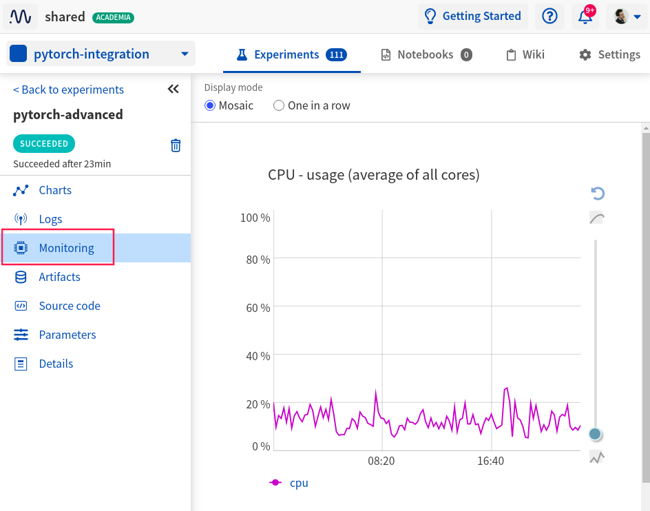
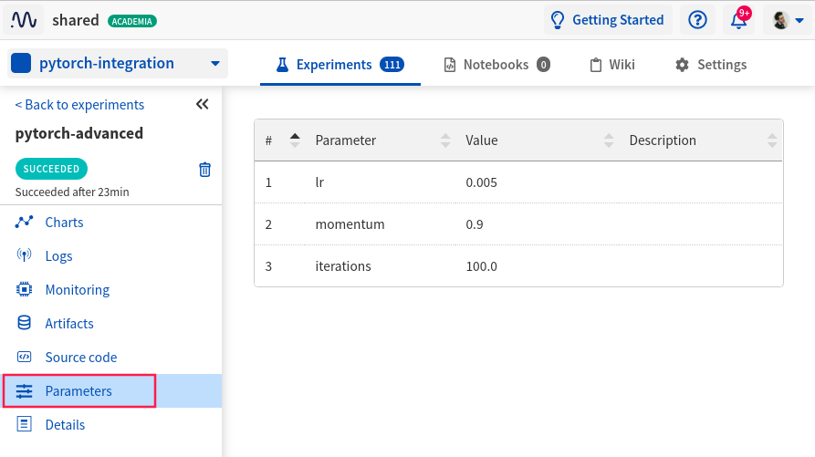
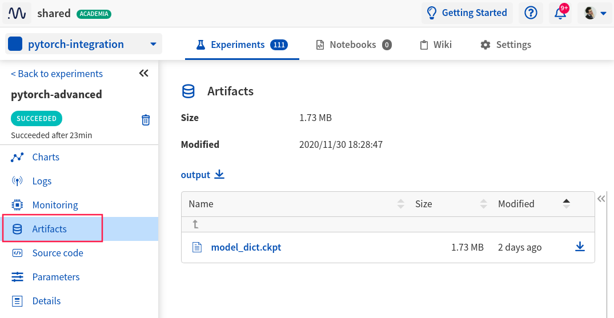
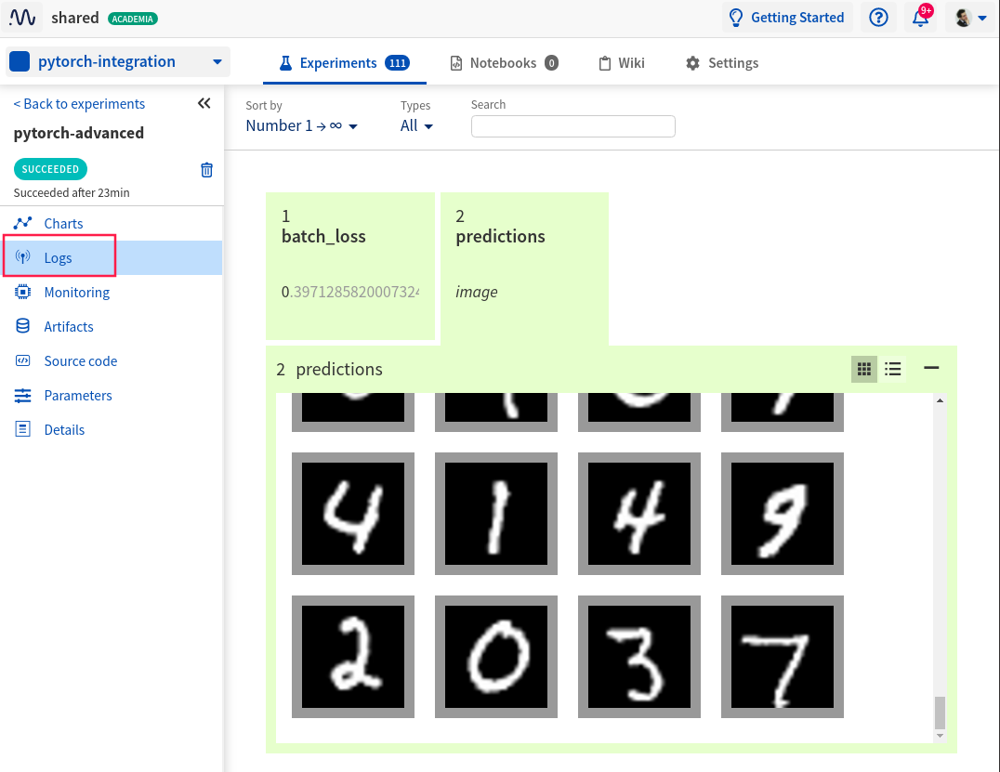

.. _integrations-sklearn:

Neptune-Sklearn Integration
===========================
|colab-script-neptune|

What will you get with this integration?
----------------------------------------
|sklearn-tour-loom|

|sklearn| is an open source machine learning framework commonly used for building predictive models. Neptune helps with keeping track of model training metadata.

With Neptune + Sklearn integration you can:

* log classifier and regressor parameters,
* log pickled model,
* log test predictions,
* log test predictions probabilities,
* log test scores,
* log classifier and regressor visualizations, like confusion matrix, precision-recall chart and feature importance chart,
* log KMeans cluster labels and clustering visualizations,
* log metadata including git summary info.

.. tip::
    You can log many other experiment metadata like interactive charts, video, audio and more.
    See the :ref:`full list <what-you-can-log>`.

.. note::

    This integration is tested with ``scikit-learn==0.23.2``, ``neptune-client==0.4.130``.

Where to start?
---------------
To get started with this integration, follow the :ref:`quickstart <sklearn-quickstart>` below.

You can also skip the basics and take a look at other convenience functions available in the :ref:`more options <sklearn-more-options>` section.

If you want to try things out and focus only on the code you can either:

|colab-script-neptune|

.. _sklearn-quickstart:

Quickstart
----------
This quickstart will show you how to:

* Install the necessary Neptune and scikit-learn packages,
* Create the first experiment in project,
* Log trained regressor or classifier summary info to Neptune,
* Explore results in the Neptune UI.

.. _sklearn-before-you-start-basic:

Before you start
^^^^^^^^^^^^^^^^
You have ``Python 3.x`` and following libraries installed:

* ``neptune-client``. See :ref:`neptune-client installation guide <installation-neptune-client>`.

* ``scikit-learn``. See |scikit-install|.

.. code-block:: bash

    pip install scikit-learn

You also need minimal familiarity with scikit-learn. Have a look at this |scikit-guide| to get started.

Step 0: Create and fit example regressor or classifier
^^^^^^^^^^^^^^^^^^^^^^^^^^^^^^^^^^^^^^^^^^^^^^^^^^^^^^
Prepare fitted regressor or classifier that will be further used in this quickstart. Below snippets show the idea:

**Classifier**
.. code-block:: python3

    gbc = GradientBoostingClassifier()

    X, y = load_digits(return_X_y=True)
    X_train, X_test, y_train, y_test = train_test_split(X, y, test_size=0.2)

    gbc.fit(X_train, y_train)

**Regressor**
.. code-block:: python3

    rfr = RandomForestRegressor()

    X, y = load_boston(return_X_y=True)
    X_train, X_test, y_train, y_test = train_test_split(X, y, test_size=0.2)

    rfr.fit(X_train, y_train)

Both ``gbc`` and ``rfr`` will be later used to log various metadata to the experiment.

Step 1: Initialize Neptune
^^^^^^^^^^^^^^^^^^^^^^^^^^
Add the following snippet at the top of your script.

.. code-block:: python3

    import neptune

    neptune.init(api_token='ANONYMOUS', project_qualified_name='shared/sklearn-integration')

.. tip::

    You can also use your personal API token. Read more about how to :ref:`securely set the Neptune API token <how-to-setup-api-token>`.

Step 2: Create an experiment
^^^^^^^^^^^^^^^^^^^^^^^^^^^^
Run the code below to create a Neptune experiment:

.. code-block:: python3

    neptune.create_experiment('sklearn-quickstart')

This also creates a link to the experiment. Open the link in a new tab.
The experiment will currently be empty, but keep the window open. You will be able to see estimator summary there.

When you create an experiment Neptune will look for the ``.git`` directory in your project and get the last commit information saved.

.. note::

    If you are using ``.py`` scripts for training Neptune will also log your training script automatically.

Step 3: Log estimator summary
^^^^^^^^^^^^^^^^^^^^^^^^^^^^^
Log classifier or regressor summary Neptune, by using

.. code-block:: python3

    from neptunecontrib.monitoring.sklearn import log_classifier_summary

    log_classifier_summary(gbc, X_train, X_test, y_train, y_test)

.. note::

    You can log epoch metric and losses by calling :meth:`~neptune.experiments.Experiment.log_metric` at the epoch level.

Step 4: Run your training script
^^^^^^^^^^^^^^^^^^^^^^^^^^^^^^^^
Run your script as you normally would:

.. code-block:: bash

    python train.py

Step 5: Monitor your PyTorch training in Neptune
^^^^^^^^^^^^^^^^^^^^^^^^^^^^^^^^^^^^^^^^^^^^^^^^
Now you can switch to the Neptune tab which you had opened previously to watch the training live!

.. image:: ../_static/images/integrations/pytorch-charts.png
   :target: ../_static/images/integrations/pytorch-charts.png
   :alt: PyTorch learning curve charts

|example-charts|

.. _sklearn-more-options:

More Options
------------

Log hardware consumption and stderr/stdout
^^^^^^^^^^^^^^^^^^^^^^^^^^^^^^^^^^^^^^^^^^
Neptune can automatically log your CPU and GPU consumption during training as well as stderr and stdout from your console.
To do that you just need to install |psutil|.

.. code-block:: bash

    pip install psutil

|example-hardware|

Log hyperparameters
^^^^^^^^^^^^^^^^^^^
You can log training and model hyperparameters.

To do that just pass the parameter dictionary to :meth:`~neptune.projects.Project.create_experiment` method:

.. code-block:: python3

    PARAMS = {'lr':0.005,
              'momentum':0.9,
              'iterations':100}

    optimizer = optim.SGD(model.parameters(), PARAMS['lr'], PARAMS['momentum'])

    # log params
    neptune.create_experiment('pytorch-advanced', params=PARAMS)

|example-hyperparameters|

Log model weights
^^^^^^^^^^^^^^^^^
You can log model weights to Neptune both during and after training.

To do that just use a :meth:`~neptune.experiments.Experiment.log_artifact` method on the saved model file.

.. code-block:: python3

    torch.save(model.state_dict(), 'model_dict.ckpt')

    # log model
    neptune.log_artifact('model_dict.ckpt')

|example-weights|

Log image predictions
^^^^^^^^^^^^^^^^^^^^^
You can log tensors as images to Neptune with some additional descriptions.

.. code-block:: python3

    for batch_idx, (data, target) in enumerate(train_loader):

        optimizer.zero_grad()
        outputs = model(data)
        loss = F.nll_loss(outputs, target)

        loss.backward()
        optimizer.step()

        # log loss
        neptune.log_metric('batch_loss', loss)

        # log predicted images
        if batch_idx % 50 == 1:
            for image, prediction in zip(data, outputs):
                description = '\n'.join(['class {}: {}'.format(i, pred)
                                         for i, pred in enumerate(F.softmax(prediction))])
                neptune.log_image('predictions',
                                  image.squeeze(),
                                  description=description)

        if batch_idx == 100:
            break

|example-images|

.. note::

    You can log many other experiment metadata like interactive charts, video, audio and more.
    See the :ref:`full list <what-you-can-log>`.

Remember that you can try it out with zero setup:

|colab-script-neptune|

How to ask for help?
--------------------
Please visit the :ref:`Getting help <getting-help>` page. Everything regarding support is there.

Other integrations you may like
-------------------------------
Here are other integrations with libraries from the PyTorch ecosystem:

- :ref:`PyTorch Lightning<integrations-pytorch-lightning>`
- :ref:`Fastai and Fastai2 <integrations-fastai>`
- :ref:`PyTorch Ignite <integrations-pytorch-ignite>`
- :ref:`Catalyst <integrations-catalyst>`
- :ref:`Skorch <integrations-skorch>`

You may also like these two integrations:

- :ref:`Optuna <integrations-optuna>`
- :ref:`Plotly <integrations-plotly>`

.. External links

.. |sklearn| raw:: html

    <a href="https://scikit-learn.org/stable/" target="_blank">scikit-learn</a>

.. |pytorch-integration| raw:: html

    <a href="https://ui.neptune.ai/shared/pytorch-integration/experiments" target="_blank">pytorch-integration</a>

.. |scikit-install| raw:: html

    <a href="https://scikit-learn.org/stable/install.html" target="_blank">scikit-learn installation guide</a>

.. |scikit-guide| raw:: html

    <a href="https://scikit-learn.org/stable/user_guide.html" target="_blank">scikit-learn guide</a>

.. |example quickstart experiment| raw:: html

    <a href="https://ui.neptune.ai/o/shared/org/pytorch-integration/e/PYTORCH-16/charts" target="_blank">PyTorch guide</a>

.. |example-project| raw:: html

    

        <a target="_blank"  href="https://ui.neptune.ai/o/shared/org/pytorch-integration/experiments?viewId=5bf0532a-c0f3-454e-be97-fa24899a82fe">
            
            See example in Neptune
        </a>
    

.. |example-charts| raw:: html

    

        <a target="_blank"  href="https://ui.neptune.ai/o/shared/org/pytorch-integration/e/PYTORCH-16/charts">
            
            See example in Neptune
        </a>
    

.. |example-hardware| raw:: html

    

        <a target="_blank"  href="https://ui.neptune.ai/o/shared/org/pytorch-integration/e/PYTORCH-17/monitoring">
            
            See example in Neptune
        </a>
    

.. |example-hyperparameters| raw:: html

    

        <a target="_blank"  href="https://ui.neptune.ai/o/shared/org/pytorch-integration/e/PYTORCH-17/parameters">
            
            See example in Neptune
        </a>
    

.. |example-images| raw:: html

    

        <a target="_blank"  href="https://ui.neptune.ai/o/shared/org/pytorch-integration/e/PYTORCH-17/logs">
            
            See example in Neptune
        </a>
    

.. |example-weights| raw:: html

    

        <a target="_blank"  href="https://ui.neptune.ai/o/shared/org/pytorch-integration/e/PYTORCH-17/artifacts">
            
            See example in Neptune
        </a>
    

.. |colab-script-neptune| raw:: html

    

        

        <a target="_blank" href="https://github.com/neptune-ai/neptune-examples/blob/master/integrations/sklearn/docs/Neptune-Scikit-learn.py">
            
            View source on GitHub
        </a>
        <a target="_blank" href="https://ui.neptune.ai/o/shared/org/sklearn-integration/e/SKLEARN-632/charts">
            
            See example in Neptune
        </a>
    

.. |sklearn-tour-loom| raw:: html

    
<iframe src="https://www.loom.com/embed/3b2b03255f174223b4f3c55549892401" frameborder="0" webkitallowfullscreen mozallowfullscreen allowfullscreen style="position: absolute; top: 0; left: 0; width: 100%; height: 100%;"></iframe>

.. |psutil| raw:: html

    <a href="https://psutil.readthedocs.io/en/latest/" target="_blank">psutil</a>
