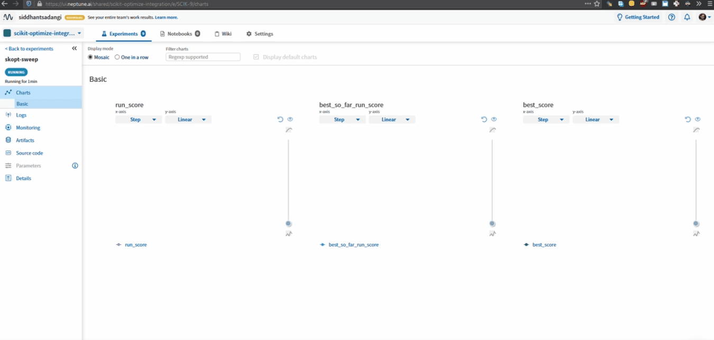

.. _integrations-scikit-optimize:

Neptune - Scikit-Optimize Integration
=====================================

|Run on Colab|

What will you get with this integration?
----------------------------------------

|skopt-tour|

|Scikit-Optimize|, or skopt, is a simple and efficient library to minimize (very) expensive and noisy black-box functions. It is often used to Machine Learning model hyperparameter optimization.

With Neptune integration, you can:

- visualize the runs as they are running,
- see charts of logged run scores,
- log the parameters tried at every run,
- log figures from plots module: plot_evaluations, plot_convergence, plot_objective, and plot_regret,
- monitor hardware consumption during the run,
- save the pickled results object.

.. tip::
    You can log many other experiment metadata like interactive charts, video, audio, and more.
    See the :ref:`full list <what-you-can-log>`.
	
.. note::

    This integration is tested with ``neptune-client==0.4.132``, ``neptune-contrib==0.25.0``, and ``scikit-optimize==0.8.1``

Where to start?
---------------
To get started with this integration, follow the :ref:`quickstart <skopt-quickstart>` below.

You can also see how to log ``BayesSearchCV`` parameter sweeps in the :ref:`more options <skopt-more-options>` section.

If you want to try things out and focus only on the code you can either:

|Run on Colab|

.. _skopt-quickstart:

Quickstart
----------
This quickstart will show you how to:

* Install the necessary neptune packages
* Connect Neptune to your Skopt hyperparameter tuning code and create the first experiment
* Log run metrics and parameters for every search configuration
* Log best metric and best parameter configuration
* Log diagnostic plots: convergence plot, evaluations plot, and objective plot from ``skopt.plotting``
* Explore them in the Neptune UI.

.. _skopt-before-you-start-basic:

Before you start
^^^^^^^^^^^^^^^^
You have ``Python 3.x`` and following libraries installed:

* ``neptune-client``, and ``neptune-contrib``. See :ref:`neptune-client installation guide <installation-neptune-client>`.
* ``scikit-optimize==0.8.1``. See |skopt-install|.

You also need minimal familiarity with skopt. Have a look at the |skopt-guide| guide to get started.

.. code-block:: bash
	
   pip install --quiet scikit-optimize==0.8.1 neptune-client neptune-contrib['monitoring']

Step 1: Initialize Neptune
^^^^^^^^^^^^^^^^^^^^^^^^^^
.. code-block:: python3

    import neptune

    neptune.init(api_token='ANONYMOUS',
                 project_qualified_name='shared/scikit-optimize-integration')
				 
.. tip::

    You can also use your personal API token. Read more about how to :ref:`securely set the Neptune API token <how-to-setup-api-token>`.
	
Step 2: Create an Experiment
^^^^^^^^^^^^^^^^^^^^^^^^^^^^
.. code-block:: python3

    neptune.create_experiment(name='skopt sweep')

This also creates a link to the experiment. Open the link in a new tab. 
The charts will currently be empty, but keep the window open. You will be able to see live metrics once logging starts.

Step 3: Run skopt with the Neptune Callback
^^^^^^^^^^^^^^^^^^^^^^^^^^^^^^^^^^^^^^^^^^^
:meth:`~neptunecontrib.monitoring.skopt.NeptuneCallback` will log the run metrics, run parameters and results pickle after every iteration.
Everything can be inspected live.

.. code-block:: python3
	
    # Create Neptune Callback
    import neptunecontrib.monitoring.skopt as skopt_utils
    neptune_callback = skopt_utils.NeptuneCallback()
	
    # Run the skopt minimize function with the Neptune Callback
    results = skopt.forest_minimize(objective,
                                    space,
                                    base_estimator='ET',
                                    n_calls=100,
                                    n_random_starts=10,
                                    callback=[neptune_callback],)

Step 4: Log best parameter configuration, best score and diagnostic plots
^^^^^^^^^^^^^^^^^^^^^^^^^^^^^^^^^^^^^^^^^^^^^^^^^^^^^^^^^^^^^^^^^^^^^^^^^
You can log additional information from skopt results after the tuning has completed with the :meth:`~neptunecontrib.monitoring.skopt.log_results` function.

This will log:

- Best score for the sweep as 'best_score' metric
- Best parameter set as 'best_parameters' property
- Fog figures from plots module: plot_evaluations, plot_convergence, plot_objective, and plot_regret to the 'diagnostics' log.

.. code-block:: python3

    skopt_utils.log_results(results)

.. note::

	You can change the Neptune experiment to which the results are logged with the ``experiment`` parameter, and choose whether or not you want to log plots and the pickle objects with the ``log_plots`` and ``log_pickle`` parameters.

Step 5: See your Skopt tuning in Neptune
^^^^^^^^^^^^^^^^^^^^^^^^^^^^^^^^^^^^^^^^
Now you can switch to the Neptune tab which you had opened previously to watch the tuning live!

.. _skopt-more-options:

More Options
------------

Use Neptune with BayesSearchCV
^^^^^^^^^^^^^^^^^^^^^^^^^^^^^^

Step 1: Initialize Neptune and create an experiment
***************************************************

.. code-block:: python3

    import neptune

    neptune.init(api_token='ANONYMOUS',
                 project_qualified_name='shared/scikit-optimize-integration')

    neptune.create_experiment(name='skopt sweep')

.. tip::

    You can also use your personal API token. Read more about how to :ref:`securely set the Neptune API token <how-to-setup-api-token>`.

Step 2: Initialize BayesSearchCV
********************************

.. code-block:: python3

    opt = BayesSearchCV(
        SVC(),
        {
            'C': Real(1e-6, 1e+6, prior='log-uniform'),
            'gamma': Real(1e-6, 1e+1, prior='log-uniform'),
            'degree': Integer(1,8),
            'kernel': Categorical(['linear', 'poly', 'rbf']),
        },
        n_iter=32,
        random_state=0
    )

Step 2: Pass Neptune callback to the ``.fit`` method
****************************************************

.. code-block:: python3

    import neptunecontrib.monitoring.skopt as skopt_utils

    opt.fit(X_train, y_train,
            callback=skopt_utils.NeptuneCallback())

Step 3: Log best parameter set and diagnostic plots to Neptune
**************************************************************
You can log best parameter, diagnostic plots and results pickle to Neptune with the :meth:`~neptunecontrib.monitoring.skopt.log_results` function.
To access the optimization results object you should use the ``._optim_results`` attribute of the ``BayesSearchCV`` object.

.. code-block:: python3

    skopt_utils.log_results(opt._optim_results[0])

Remember that you can try it out with zero setup:

|Run on Colab|

How to ask for help?
--------------------
Please visit the :ref:`Getting help <getting-help>` page. Everything regarding support is there.

Other pages you may like
------------------------

You may also find the following pages useful:

- :ref:`Full list of objects you can log and display in Neptune <what-you-can-log>`
- :ref:`Optuna integration <integrations-optuna>`
- :ref:`Logging Plotly/Bokeh/Altair/Matplotlib charts to Neptune <integrations-visualization-tools>`

.. External links

.. |Run on Colab| raw:: html

    

        

        <a target="_blank" href="https://github.com/neptune-ai/neptune-examples/blob/master/integrations/skopt/docs/Neptune-Skopt.py">
            
            View source on GitHub
        </a>
        <a target="_blank" href="https://ui.neptune.ai/shared/scikit-optimize-integration/e/SCIK-5">
            
            See example in Neptune
        </a>
    

.. |skopt-tour| raw:: html

	

		<iframe src="https://www.loom.com/embed/6662978437224d648b91cdac577b31fb" frameborder="0" webkitallowfullscreen mozallowfullscreen allowfullscreen style="position: absolute; top: 0; left: 0; width: 100%; height: 100%;">
		</iframe>
	

.. |Scikit-Optimize| raw:: html

    <a href="https://scikit-optimize.github.io/stable/" target="_blank">Scikit-Optimize</a>

.. |skopt-install| raw:: html

	<a href="https://pypi.org/project/scikit-optimize/" target="_blank">skopt installation guide</a>

.. |skopt-guide| raw:: html

	<a href="https://scikit-optimize.github.io/stable/getting_started.html" target="_blank">skopt</a>

.. |neptune-client| raw:: html

    <a href="https://github.com/neptune-ai/neptune-client" target="_blank">neptune-client</a>

.. |neptune-contrib| raw:: html

    <a href="https://github.com/neptune-ai/neptune-contrib" target="_blank">neptune-contrib</a>
	
.. |log_results| raw:: html

    <a href="https://docs.neptune.ai/api-reference/neptunecontrib/monitoring/skopt/index.html?highlight=skopt#neptunecontrib.monitoring.skopt.log_results" target="_blank">here</a>
